# agentd Service 详细设计文档

> 版本: v1.2
> 日期: 2026-03-27
> 更新: 简化状态图，移除独立 Gateway，Adapter 沙箱内运行

---

## 1. 概述

### 1.1 目标

构建一个 Agent 中间层服务，核心功能：
- 接收 Agent 模板，叠加模型配置
- 创建沙箱环境（支持 Docker、E2B、OpenSandbox 等多种运行时）
- 在沙箱中运行 Adapter + Agent（Adapter 运行在沙箱内部）
- 管理 Agent 生命周期和 Session
- 提供统一接口与 Agent 交互，下发消息并获取返回
- 持久化 Workspace，支持 Agent 暂停/恢复

### 1.2 设计原则

| 原则 | 说明 |
|------|------|
| 隐式沙箱 | 用户创建 Agent 时自动创建沙箱，无需显式管理 |
| 单 Agent 单沙箱 | 每个沙箱只运行一个 Agent + Adapter |
| Adapter 沙箱内运行 | Adapter 与 Agent 在同一沙箱内通信 |
| Workspace 持久化 | 只持久化 Workspace，Agent 自己管理 memory |
| 灵活存储 | 支持本地、MinIO、NFS 等多种存储后端 |
| 智能暂停 | 无定时任务时自动暂停以节省资源 |
| Agent 自管理 | 不同 agent 有不同的 memory 存储模式，由 agent 自己决定 |

---

## 2. 架构视图

### 2.1 系统架构图

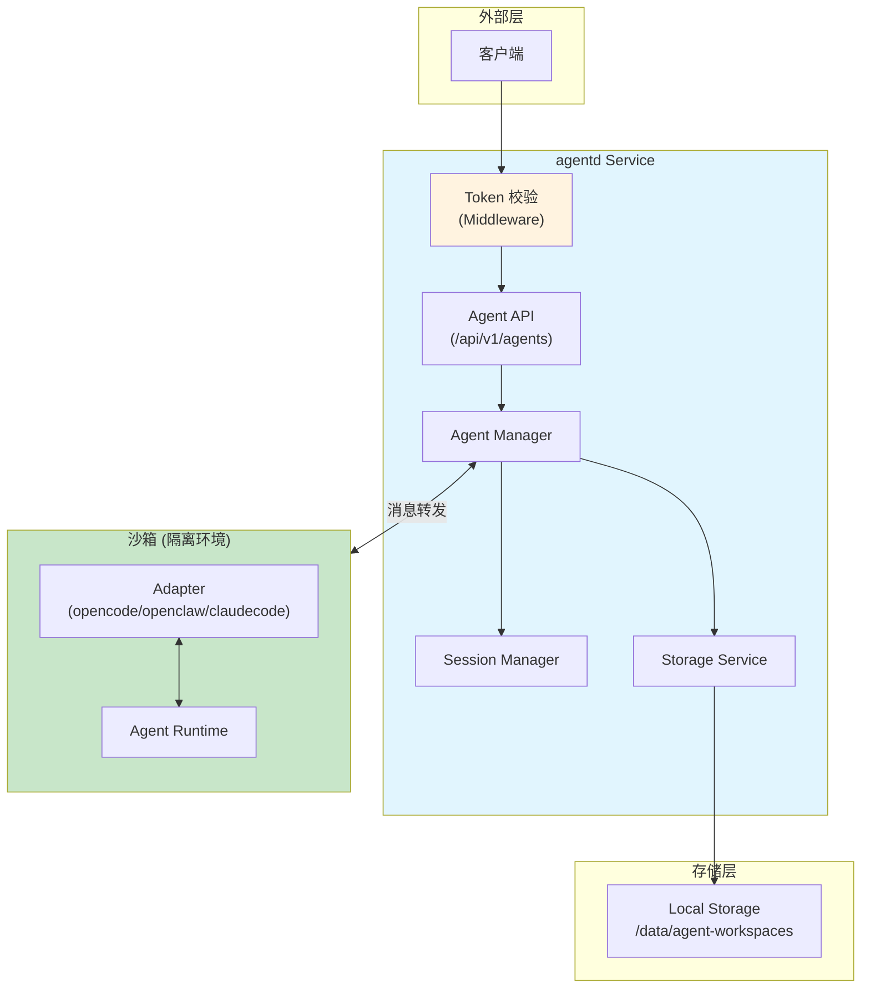
```mermaid
flowchart TB
    subgraph External["外部层"]
        Client["客户端"]
    end

    subgraph AgentService["agentd Service"]
        TokenMiddleware["Token 校验\n(Middleware)"]
        AgentAPI["Agent API\n(/api/v1/agents)"]
        AgentManager["Agent Manager"]
        SessionManager["Session Manager"]
        StorageService["Storage Service"]
    end

    subgraph Sandbox["沙箱 (隔离环境)"]
        direction TB
        Adapter["Adapter\n(opencode/openclaw/claudecode)"]
        AgentRuntime["Agent Runtime"]
        
        Adapter <--> AgentRuntime
    end

    subgraph Storage["存储层"]
        LocalStorage["Local Storage\n/data/agent-workspaces"]
    end

    Client --> TokenMiddleware
    TokenMiddleware --> AgentAPI
    AgentAPI --> AgentManager
    AgentManager --> SessionManager
    AgentManager --> StorageService
    AgentManager <-->|消息转发| Sandbox
    StorageService --> LocalStorage

    style Sandbox fill:#c8e6c9
    style AgentService fill:#e1f5fe
    style TokenMiddleware fill:#fff3e0
```

### 2.2 组件交互流程

#### 2.2.1 创建 Agent

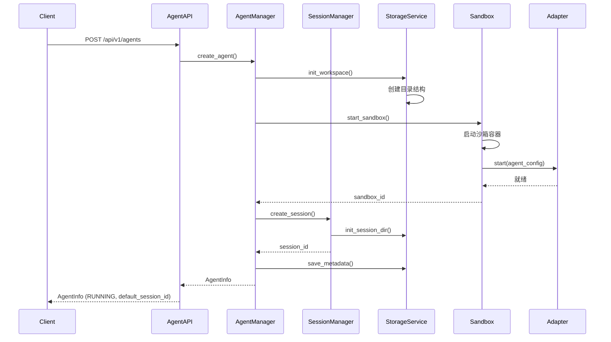
```mermaid
sequenceDiagram
    participant Client
    participant AgentAPI
    participant AgentManager
    participant SessionManager
    participant StorageService
    participant Sandbox
    participant Adapter

    Client->>AgentAPI: POST /api/v1/agents
    AgentAPI->>AgentManager: create_agent()
    AgentManager->>StorageService: init_workspace()
    StorageService->>StorageService: 创建目录结构
    AgentManager->>Sandbox: start_sandbox()
    Sandbox->>Sandbox: 启动沙箱容器
    Sandbox->>Adapter: start(agent_config)
    Adapter-->>Sandbox: 就绪
    Sandbox-->>AgentManager: sandbox_id
    AgentManager->>SessionManager: create_session()
    SessionManager->>StorageService: init_session_dir()
    SessionManager-->>AgentManager: session_id
    AgentManager->>StorageService: save_metadata()
    AgentManager-->>AgentAPI: AgentInfo
    AgentAPI-->>Client: AgentInfo (RUNNING, default_session_id)
```

#### 2.2.2 对话交互

**核心原则：** Adapter 负责从 workspace 读取上下文、注入给 Agent、将响应写回 workspace。

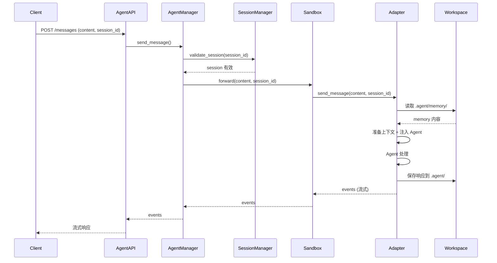
```mermaid
sequenceDiagram
    participant Client
    participant AgentAPI
    participant AgentManager
    participant SessionManager
    participant Sandbox
    participant Adapter
    participant Workspace

    Client->>AgentAPI: POST /messages (content, session_id)
    AgentAPI->>AgentManager: send_message()
    AgentManager->>SessionManager: validate_session(session_id)
    SessionManager-->>AgentManager: session 有效
    AgentManager->>Sandbox: forward(content, session_id)
    Sandbox->>Adapter: send_message(content, session_id)
    Adapter->>Workspace: 读取 .agent/memory/
    Workspace-->>Adapter: memory 内容
    Adapter->>Adapter: 准备上下文 + 注入 Agent
    Adapter->>Adapter: Agent 处理
    Adapter->>Workspace: 保存响应到 .agent/
    Adapter-->>Sandbox: events (流式)
    Sandbox-->>AgentManager: events
    AgentManager-->>AgentAPI: events
    AgentAPI-->>Client: 流式响应
```

#### 2.2.3 空闲超时暂停

**Workspace 已持久化，Agent 的 memory 已在 .agent/ 中，停止时只需停止进程。**

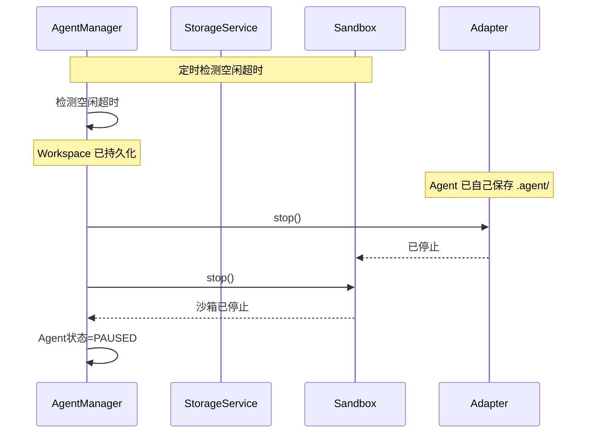
```mermaid
sequenceDiagram
    participant AgentManager
    participant StorageService
    participant Sandbox
    participant Adapter

    Note over AgentManager,Sandbox: 定时检测空闲超时
    AgentManager->>AgentManager: 检测空闲超时
    Note over AgentManager: Workspace 已持久化
    Note over Adapter: Agent 已自己保存 .agent/
    AgentManager->>Adapter: stop()
    Adapter-->>Sandbox: 已停止
    AgentManager->>Sandbox: stop()
    Sandbox-->>AgentManager: 沙箱已停止
    AgentManager->>AgentManager: Agent状态=PAUSED
```

#### 2.2.4 暂停后恢复对话

**Workspace 挂载后，Adapter 从 .agent/ 恢复上下文给 Agent。**

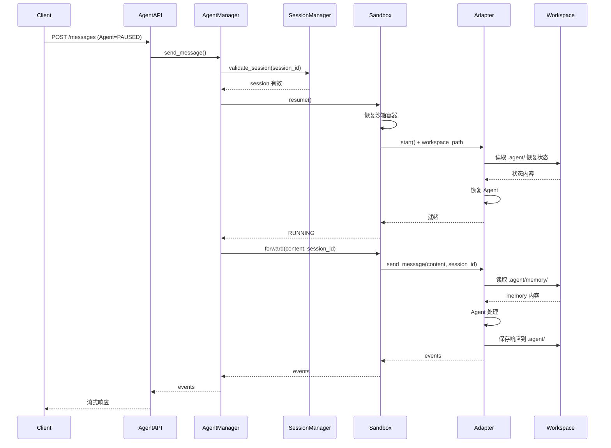
```mermaid
sequenceDiagram
    participant Client
    participant AgentAPI
    participant AgentManager
    participant SessionManager
    participant Sandbox
    participant Adapter
    participant Workspace

    Client->>AgentAPI: POST /messages (Agent=PAUSED)
    AgentAPI->>AgentManager: send_message()
    AgentManager->>SessionManager: validate_session(session_id)
    SessionManager-->>AgentManager: session 有效
    AgentManager->>Sandbox: resume()
    Sandbox->>Sandbox: 恢复沙箱容器
    Sandbox->>Adapter: start() + workspace_path
    Adapter->>Workspace: 读取 .agent/ 恢复状态
    Workspace-->>Adapter: 状态内容
    Adapter->>Adapter: 恢复 Agent
    Adapter-->>Sandbox: 就绪
    Sandbox-->>AgentManager: RUNNING
    AgentManager->>Sandbox: forward(content, session_id)
    Sandbox->>Adapter: send_message(content, session_id)
    Adapter->>Workspace: 读取 .agent/memory/
    Workspace-->>Adapter: memory 内容
    Adapter->>Adapter: Agent 处理
    Adapter->>Workspace: 保存响应到 .agent/
    Adapter-->>Sandbox: events
    Sandbox-->>AgentManager: events
    AgentManager-->>AgentAPI: events
    AgentAPI-->>Client: 流式响应
```

---

## 3. 用例视图

### 3.1 用例图

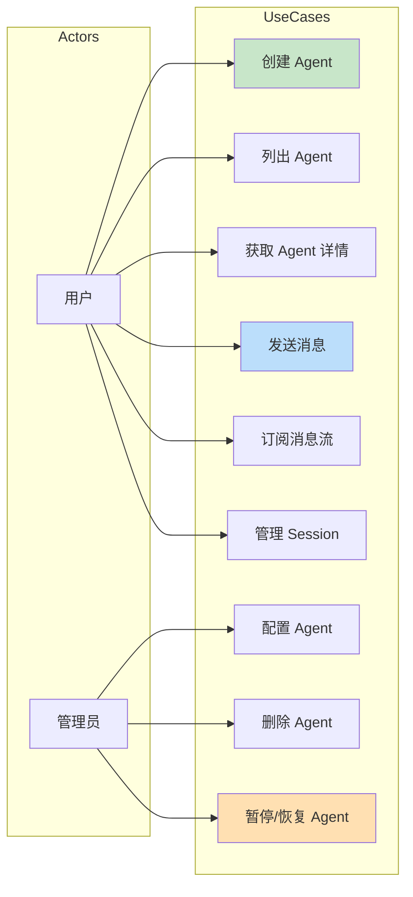
```mermaid
flowchart LR
    subgraph Actors
        User["用户"]
        Admin["管理员"]
    end

    subgraph UseCases
        UC1["创建 Agent"]
        UC2["列出 Agent"]
        UC3["获取 Agent 详情"]
        UC4["配置 Agent"]
        UC5["删除 Agent"]
        UC6["发送消息"]
        UC7["订阅消息流"]
        UC8["管理 Session"]
        UC9["暂停/恢复 Agent"]
    end

    User --> UC1
    User --> UC2
    User --> UC3
    User --> UC6
    User --> UC7
    User --> UC8
    Admin --> UC4
    Admin --> UC5
    Admin --> UC9

    style UC1 fill:#c8e6c9
    style UC6 fill:#bbdefb
    style UC9 fill:#ffe0b2
```

### 3.2 用例场景说明

本节描述核心用例场景，说明用户意图如何通过实体交互来实现。

#### UC1: 创建 Agent → 引出 Sandbox + Agent + Session 实体

**用户意图：** 快速启动一个可交互的 Agent 实例

**场景：** 用户需要一个能理解任务、执行代码、记住上下文的 Agent

**通过实体交互实现：**

```
用户请求
    ↓
┌─────────────────────────────────────────────────────────────┐
│  实体创建链路                                                │
├─────────────────────────────────────────────────────────────┤
│  1. AgentManager.create_agent()                             │
│     ↓                                                       │
│  2. StorageService.init_workspace()  → 创建 Workspace 目录 │
│     ↓                                                       │
│  3. SandboxFactory.start_sandbox()  → 创建隔离执行环境      │
│     ↓                                                       │
│  4. Adapter.start() 在沙箱内启动   → 适配 Agent 运行时      │
│     ↓                                                       │
│  5. SessionManager.create_session() → 创建默认对话会话      │
│     ↓                                                       │
│  6. 返回 AgentInfo (sandbox_id + default_session_id)       │
└─────────────────────────────────────────────────────────────┘
    ↓
用户获得: 可接收消息的 RUNNING Agent
```

**核心实体职责：**
| 实体 | 职责 | 关联 |
|------|------|------|
| **Agent** | 代理配置和生命周期 | 管理 Sandbox 和 Sessions |
| **Sandbox** | 隔离执行环境 | 承载 Adapter |
| **Session** | 对话上下文隔离 | 关联 Messages |

#### UC2: 发送消息 → 引出 Message + Adapter 交互

**用户意图：** 与 Agent 对话并获取响应

**场景：** 用户发送任务指令，Agent 理解、执行、返回结果

**通过实体交互实现：**

```
用户消息
    ↓
┌─────────────────────────────────────────────────────────────┐
│  消息处理链路                                                │
├─────────────────────────────────────────────────────────────┤
│  1. POST /messages {session_id, content}                    │
│     ↓                                                       │
│  2. SessionManager.validate_session() → 验证会话有效       │
│     ↓                                                       │
│  3. Agent 状态检查:                                         │
│     - RUNNING: 直接转发                                     │
│     - PAUSED: Sandbox.resume() → Adapter.restore()         │
│     ↓                                                       │
│  4. Sandbox.forward(content, session_id)                    │
│     ↓                                                       │
│  5. Adapter.send_message():                                │
│     - 读取 .agent/memory/历史                               │
│     - 注入上下文给 Agent                                    │
│     - 获取响应                                               │
│     - 写回 .agent/memory/                                   │
│     ↓                                                       │
│  6. 流式返回 AgentEvent                                      │
└─────────────────────────────────────────────────────────────┘
    ↓
用户获得: 包含 thinking/message/tool_use 的流式响应
```

**核心实体职责：**
| 实体 | 职责 | 关联 |
|------|------|------|
| **Message** | 对话消息记录 | 属于 Session |
| **Adapter** | Agent 与 Workspace 之间的数据桥梁 | 读写 .agent/ 目录 |

#### UC3: 订阅消息流 → WebSocket 连接维持

**用户意图：** 实时获取 Agent 执行进度

**场景：** Agent 执行长时间任务，用户需要看到中间状态

**通过实体交互实现：**

```
建立 WebSocket 连接
    ↓
┌─────────────────────────────────────────────────────────────┐
│  流式订阅链路                                                │
├─────────────────────────────────────────────────────────────┤
│  1. GET /agents/{agent_id}/ws                               │
│     ↓                                                       │
│  2. AgentManager 建立 WebSocket 通道                        │
│     ↓                                                       │
│  3. 消息通过 Sandbox → AgentManager → WebSocket 推送        │
│     ↓                                                       │
│  4. 事件类型: thinking / message / tool_use / done          │
└─────────────────────────────────────────────────────────────┘
    ↓
客户端实时接收: SSE/WebSocket 流式事件
```

#### UC4: 管理 Session → 多会话隔离

**用户意图：** 在不同上下文中与 Agent 交互

**场景：** 用户希望开多个独立对话线程，互不干扰

**通过实体交互实现：**

```
用户请求
    ↓
┌─────────────────────────────────────────────────────────────┐
│  Session 管理链路                                            │
├─────────────────────────────────────────────────────────────┤
│  创建会话:                                                   │
│    POST /agents/{agent_id}/sessions                         │
│    → SessionManager.create_session() → 返回 session_id      │
│                                                             │
│  列出会话:                                                   │
│    GET /agents/{agent_id}/sessions                          │
│    → SessionManager.list_sessions() → 返回所有会话列表       │
│                                                             │
│  删除会话:                                                   │
│    DELETE /agents/{agent_id}/sessions/{session_id}          │
│    → SessionManager.delete_session()                        │
│                                                             │
│  切换会话:                                                   │
│    发送消息时指定不同 session_id 即可切换上下文               │
└─────────────────────────────────────────────────────────────┘
    ↓
用户获得: 多个独立的对话上下文
```

#### UC5: 暂停/恢复 Agent → Sandbox 生命周期

**用户意图：** 节省资源，同时保留 Agent 状态

**场景：** Agent 空闲一段时间后自动暂停，快速恢复时能接着工作

**通过实体交互实现：**

```
空闲超时检测
    ↓
┌─────────────────────────────────────────────────────────────┐
│  暂停链路                                                    │
├─────────────────────────────────────────────────────────────┤
│  1. AgentManager 定时检测空闲超时                           │
│     ↓                                                       │
│  2. 检查 has_scheduled_tasks=false                         │
│     ↓                                                       │
│  3. Adapter.stop() → Agent 保存 .agent/ 状态               │
│     ↓                                                       │
│  4. Sandbox.stop() → 停止沙箱容器                          │
│     ↓                                                       │
│  5. AgentManager.status = PAUSED                           │
│     ↓                                                       │
│  6. Workspace 已持久化 (无需额外保存)                        │
└─────────────────────────────────────────────────────────────┘
    ↓
资源释放，状态已保存
```

```
恢复请求
    ↓
┌─────────────────────────────────────────────────────────────┐
│  恢复链路                                                    │
├─────────────────────────────────────────────────────────────┤
│  1. 收到消息且 Agent.status = PAUSED                        │
│     ↓                                                       │
│  2. Sandbox.resume() → 恢复沙箱容器                        │
│     ↓                                                       │
│  3. Adapter.start() + workspace_path                        │
│     ↓                                                       │
│  4. Adapter.restore_from_workspace() → 从 .agent/ 恢复     │
│     ↓                                                       │
│  5. AgentManager.status = RUNNING                           │
│     ↓                                                       │
│  6. 继续正常消息处理                                         │
└─────────────────────────────────────────────────────────────┘
    ↓
Agent 恢复运行，用户无感知
```

### 3.3 用例到实体的映射

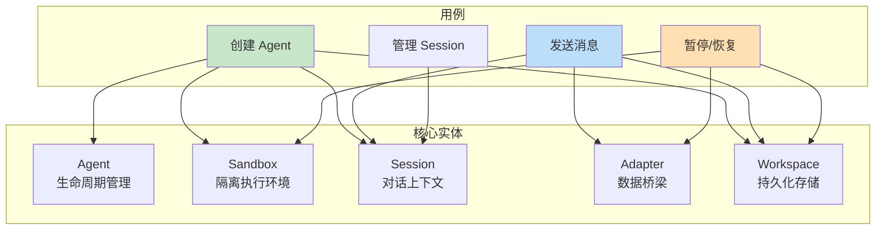
```mermaid
flowchart TB
    subgraph UseCases["用例"]
        UC1["创建 Agent"]
        UC6["发送消息"]
        UC8["管理 Session"]
        UC9["暂停/恢复"]
    end

    subgraph Entities["核心实体"]
        Agent["Agent\n生命周期管理"]
        Sandbox["Sandbox\n隔离执行环境"]
        Session["Session\n对话上下文"]
        Adapter["Adapter\n数据桥梁"]
        Workspace["Workspace\n持久化存储"]
    end

    UC1 --> Agent
    UC1 --> Sandbox
    UC1 --> Session
    UC1 --> Workspace

    UC6 --> Session
    UC6 --> Adapter
    UC6 --> Workspace

    UC8 --> Session

    UC9 --> Sandbox
    UC9 --> Adapter
    UC9 --> Workspace

    style UC1 fill:#c8e6c9
    style UC6 fill:#bbdefb
    style UC9 fill:#ffe0b2
```

## 4. 逻辑视图

### 4.1 数据模型

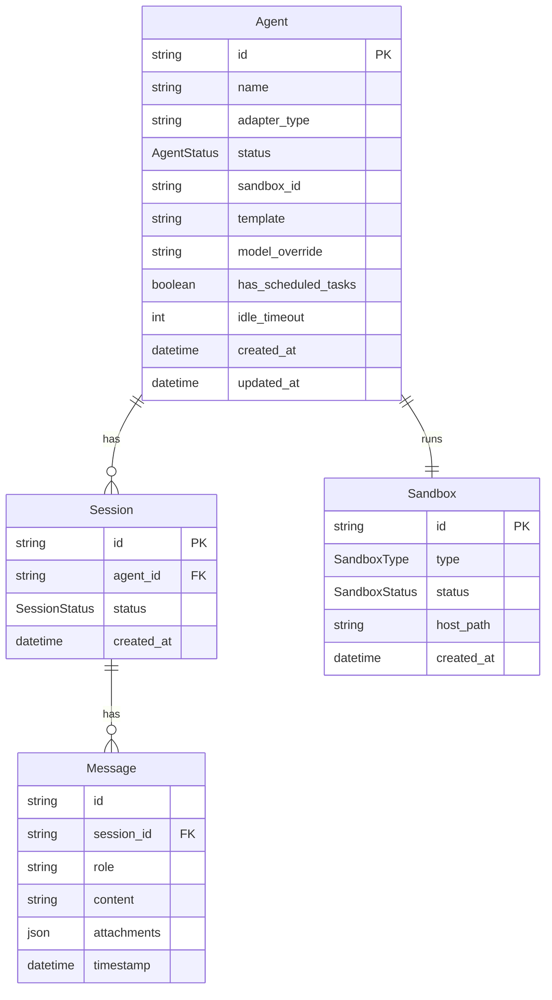
```mermaid
erDiagram
    Agent ||--o{ Session : has
    Agent ||--|| Sandbox : runs
    Agent {
        string id PK
        string name
        string adapter_type
        AgentStatus status
        string sandbox_id
        string template
        string model_override
        boolean has_scheduled_tasks
        int idle_timeout
        datetime created_at
        datetime updated_at
    }

    Session ||--o{ Message : has
    Session {
        string id PK
        string agent_id FK
        SessionStatus status
        datetime created_at
    }

    Message {
        string id
        string session_id FK
        string role
        string content
        json attachments
        datetime timestamp
    }

    Sandbox {
        string id PK
        SandboxType type
        SandboxStatus status
        string host_path
        datetime created_at
    }
```

### 4.2 核心类图

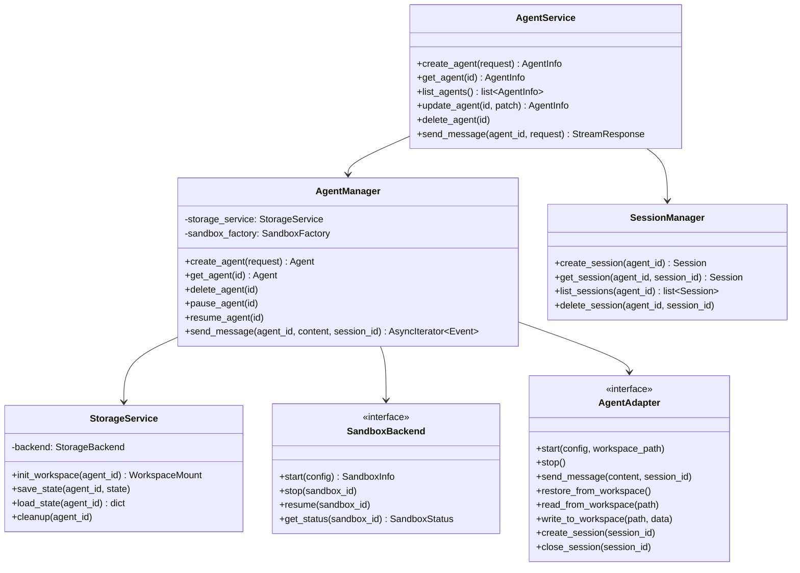
```mermaid
classDiagram
    class AgentService {
        +create_agent(request) AgentInfo
        +get_agent(id) AgentInfo
        +list_agents() list~AgentInfo~
        +update_agent(id, patch) AgentInfo
        +delete_agent(id)
        +send_message(agent_id, request) StreamResponse
    }

    class AgentManager {
        -storage_service: StorageService
        -sandbox_factory: SandboxFactory
        +create_agent(request) Agent
        +get_agent(id) Agent
        +delete_agent(id)
        +pause_agent(id)
        +resume_agent(id)
        +send_message(agent_id, content, session_id) AsyncIterator~Event~
    }

    class SessionManager {
        +create_session(agent_id) Session
        +get_session(agent_id, session_id) Session
        +list_sessions(agent_id) list~Session~
        +delete_session(agent_id, session_id)
    }

    class StorageService {
        -backend: StorageBackend
        +init_workspace(agent_id) WorkspaceMount
        +save_state(agent_id, state)
        +load_state(agent_id) dict
        +cleanup(agent_id)
    }

    class SandboxBackend {
        <<interface>>
        +start(config) SandboxInfo
        +stop(sandbox_id)
        +resume(sandbox_id)
        +get_status(sandbox_id) SandboxStatus
    }

    class AgentAdapter {
        <<interface>>
        +start(config, workspace_path)
        +stop()
        +send_message(content, session_id)
        +restore_from_workspace()
        +read_from_workspace(path)
        +write_to_workspace(path, data)
        +create_session(session_id)
        +close_session(session_id)
    }

    AgentService --> AgentManager
    AgentService --> SessionManager
    AgentManager --> StorageService
    AgentManager --> SandboxBackend
    AgentManager --> AgentAdapter
```

**设计说明：**
- SessionManager：管理 Session 的生命周期
- StorageService：负责 Workspace 持久化和目录结构
- AgentAdapter：**负责**从 Workspace 读取数据、注入给 Agent、将响应写回 Workspace

### 4.3 Workspace 存储结构

**核心原则：Workspace 是持久化的唯一单位，Agent 自己管理其内部结构。**

```
/data/agent-workspaces/{agent_id}/
├── metadata.json              # Agent 元信息（状态、配置）
├── agent.yaml                 # 原始模板配置
├── model_override.yaml         # 模型覆盖配置
│
└── workspace/                 # 工作目录（挂载到沙箱 /workspace）
    ├── .agent/               # Agent 私有数据（由 Agent 自己管理）
    │   ├── memory/          # Agent 的 memory（不同 agent 格式不同）
    │   ├── context/         # 上下文缓存
    │   └── state/           # Agent 自己的状态
    ├── code/                # 用户代码
    ├── input/               # 输入文件
    └── output/              # 生成输出
```

**说明：**
- Workspace 是持久化的最小单位
- `.agent/` 目录由 Agent 自己管理，不同 adapter 有不同的内部结构
- 系统只保证 workspace 的持久化和挂载，不关心 agent 内部如何组织 memory
- 恢复时，Agent 自己从 `.agent/` 目录中恢复状态

---

## 5. 运行视图

### 5.1 Agent 生命周期（5 状态）

参考 CPU 进程状态模型，简化设计为 5 个状态：

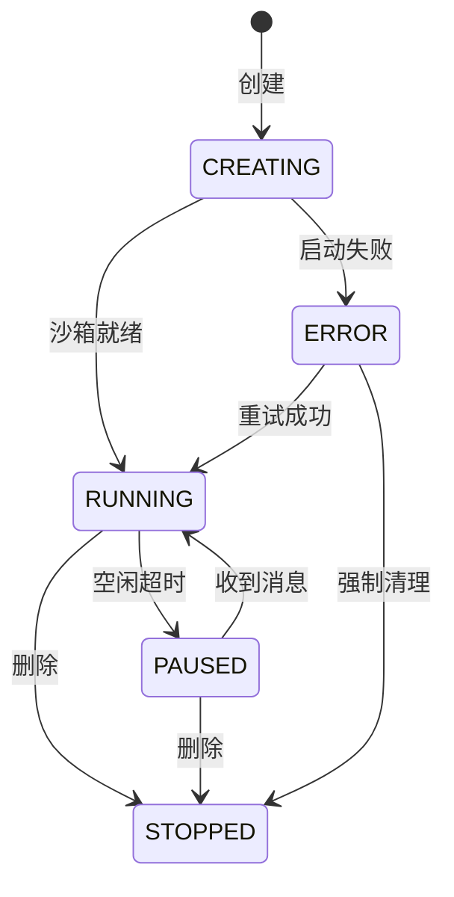
```mermaid
stateDiagram-v2
    [*] --> CREATING: 创建
    CREATING --> RUNNING: 沙箱就绪
    CREATING --> ERROR: 启动失败
    
    RUNNING --> PAUSED: 空闲超时
    PAUSED --> RUNNING: 收到消息
    
    RUNNING --> STOPPED: 删除
    PAUSED --> STOPPED: 删除
    
    ERROR --> RUNNING: 重试成功
    ERROR --> STOPPED: 强制清理
```

**状态说明：**

| 状态 | 说明 |
|------|------|
| CREATING | 正在创建 Agent 和启动沙箱 |
| RUNNING | 沙箱运行中，可处理消息 |
| PAUSED | 沙箱已停止，状态已保存，可快速恢复 |
| STOPPED | 已停止并清理 |
| ERROR | 发生错误，可重试或清理 |

### 5.2 消息处理流程

**优化后：消息直接发送，历史由 Agent 自己从 memory 读取**

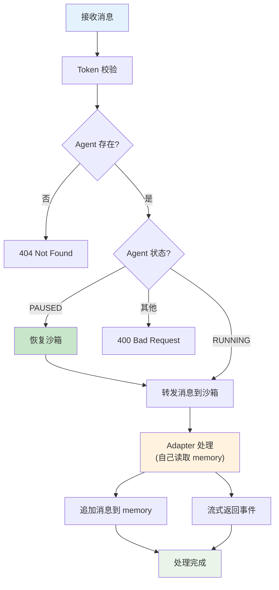
```mermaid
flowchart TD
    Start["接收消息"] --> Validate["Token 校验"]
    Validate --> CheckAgent{"Agent 存在?"}
    
    CheckAgent -->|否| Error1["404 Not Found"]
    CheckAgent -->|是| CheckStatus{"Agent 状态?"}
    
    CheckStatus -->|PAUSED| Resume["恢复沙箱"]
    Resume --> Forward
    CheckStatus -->|RUNNING| Forward
    
    CheckStatus -->|其他| Error2["400 Bad Request"]
    
    Forward["转发消息到沙箱"] --> Process["Adapter 处理\n(自己读取 memory)"]
    Process --> Write["追加消息到 memory"]
    Process --> Stream["流式返回事件"]
    Write --> Complete["处理完成"]
    Stream --> Complete

    style Start fill:#e3f2fd
    style Process fill:#fff3e0
    style Complete fill:#e8f5e8
    style Resume fill:#c8e6c9
```

### 5.3 空闲检测与暂停流程

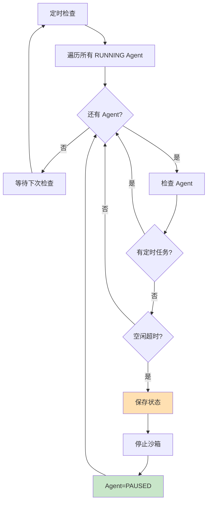
```mermaid
flowchart TD
    Start["定时检查"] --> CheckAll["遍历所有 RUNNING Agent"]
    CheckAll --> HasNext{"还有 Agent?"}
    
    HasNext -->|否| Wait["等待下次检查"]
    Wait --> Start
    
    HasNext -->|是| CheckAgent["检查 Agent"]
    CheckAgent --> HasTask{"有定时任务?"}
    
    HasTask -->|是| HasNext
    HasTask -->|否| IsIdle{"空闲超时?"}
    
    IsIdle -->|否| HasNext
    IsIdle -->|是| Pause["保存状态"]
    Pause --> StopSandbox["停止沙箱"]
    StopSandbox --> UpdateStatus["Agent=PAUSED"]
    UpdateStatus --> HasNext

    style Pause fill:#ffe0b2
    style UpdateStatus fill:#c8e6c9
```

---

## 6. 开发视图

### 6.1 项目结构

```
witty-service/openhands/
├── app_server/
│   ├── v1_router.py              # V1 路由入口
│   │
│   ├── agent/                    # 新增: Agent 相关
│   │   ├── __init__.py
│   │   ├── agent_router.py       # Agent API 路由
│   │   ├── agent_models.py       # Pydantic 模型
│   │   ├── agent_service.py      # 对外 API 服务
│   │   ├── agent_manager.py      # Agent 生命周期管理
│   │   ├── session_manager.py    # Session 管理
│   │   └── errors.py             # 错误定义
│   │
│   ├── adapter/                  # 新增: Adapter 层
│   │   ├── __init__.py
│   │   ├── base.py               # Adapter 基类和接口
│   │   ├── factory.py            # Adapter 工厂
│   │   ├── opencode_adapter.py   # OpenCode 实现
│   │   ├── openclaw_adapter.py   # OpenClaw 实现
│   │   └── claudecode_adapter.py # ClaudeCode 实现
│   │
│   ├── sandbox/                  # 沙箱层
│   │   ├── sandbox_service.py    # 沙箱服务基类
│   │   ├── docker_sandbox_service.py
│   │   ├── e2b_sandbox_service.py   # 新增
│   │   ├── opensandbox_service.py   # 新增
│   │   └── sandbox_factory.py    # 沙箱工厂
│   │
│   └── storage/                  # 存储层
│       ├── __init__.py
│       ├── base.py               # 存储后端接口
│       └── local_storage.py      # 本地存储实现
```

### 6.2 关键接口定义

#### StorageBackend 接口

```python
class StorageBackend(ABC):
    """存储后端抽象接口"""
    
    async def init_workspace(self, agent_id: str) -> WorkspaceMount:
        """初始化工作空间"""
        pass
    
    async def save_state(self, agent_id: str, state: dict) -> None:
        """保存 Agent 状态"""
        pass
    
    async def load_state(self, agent_id: str) -> dict | None:
        """加载 Agent 状态"""
        pass
    
    async def save_memory(
        self, agent_id: str, session_id: str, data: list[Message]
    ) -> None:
        """保存会话记忆"""
        pass
    
    async def load_memory(
        self, agent_id: str, session_id: str
    ) -> list[Message]:
        """加载会话记忆"""
        pass
    
    async def cleanup(self, agent_id: str) -> None:
        """清理工作空间"""
        pass
```

#### AgentAdapter 接口

**核心原则：Adapter 负责 Workspace 与 Agent 之间的数据传递。**

```python
class AgentAdapter(ABC):
    """Agent 适配器抽象接口（运行在沙箱内）"""
    
    async def start(self, config: AgentConfig, workspace_path: str) -> None:
        """启动 Adapter 和 Agent
        
        Args:
            config: Agent 配置
            workspace_path: workspace 挂载路径（如 /workspace）
        """
        pass
    
    async def stop(self) -> None:
        """停止 Adapter 和 Agent"""
        pass
    
    async def send_message(self, content: str, session_id: str) -> AsyncIterator[AgentEvent]:
        """发送消息给 Agent
        
        Adapter 职责：
        1. 从 workspace/.agent/ 读取 memory 和上下文
        2. 将上下文注入给 Agent
        3. 获取 Agent 响应
        4. 将响应保存回 workspace/.agent/
        """
        pass
    
    async def restore_from_workspace(self) -> None:
        """从 workspace 恢复 Agent 状态
        
        Adapter 从 workspace/.agent/ 读取状态，恢复 Agent
        """
        pass
    
    async def create_session(self, session_id: str) -> dict:
        """创建新 Session
        
        在 workspace/.agent/memory/ 目录下创建 session 文件
        每个 Session 有独立的 memory 文件用于存储对话历史
        
        Args:
            session_id: 唯一 Session ID
            
        Returns:
            Session 信息字典，包含 id 和 created_at
            
        Raises:
            ValueError: Session 已存在
        """
        pass
    
    async def close_session(self, session_id: str) -> None:
        """关闭 Session
        
        清理 workspace/.agent/memory/{session_id}.json 文件
        
        Args:
            session_id: 要关闭的 Session ID
            
        Raises:
            ValueError: Session 不存在
        """
        pass
```

#### SessionManager 接口

```python
class SessionManager:
    """Session 生命周期管理"""
    
    async def create_session(self, agent_id: str) -> Session:
        """创建新 Session"""
        pass
    
    async def get_session(self, agent_id: str, session_id: str) -> Session | None:
        """获取 Session 信息"""
        pass
    
    async def list_sessions(self, agent_id: str) -> list[Session]:
        """列出所有 Session"""
        pass
    
    async def delete_session(self, agent_id: str, session_id: str) -> None:
        """删除 Session"""
        pass
    
    async def validate_session(self, session_id: str) -> bool:
        """验证 Session 是否有效"""
        pass
```

#### SandboxBackend 接口

```python
class SandboxBackend(ABC):
    """沙箱后端抽象接口"""
    
    async def start(
        self, 
        sandbox_type: str,
        workspace_mount: WorkspaceMount,
        adapter_config: dict,
        options: dict
    ) -> SandboxInfo:
        """启动沙箱（在沙箱内启动 Adapter）"""
        pass
    
    async def stop(self, sandbox_id: str) -> None:
        """停止沙箱"""
        pass
    
    async def pause(self, sandbox_id: str) -> None:
        """暂停沙箱（不常用，简化为 stop）"""
        pass
    
    async def resume(self, sandbox_id: str) -> None:
        """恢复沙箱"""
        pass
```

### 6.3 Adapter 详细设计

#### 6.3.1 设计原则

**最小化接口 + 支持远程沙箱：**

- 中间层对外接口（Section 8）保持不变
- Adapter 作为沙箱内的服务，运行在本地或远程沙箱中
- 支持两种通信方式：本地（进程调用/REST）和远程（RESTful API）
- WebSocket 消息流通道必须保留

#### 6.3.2 Adapter 在系统中的位置

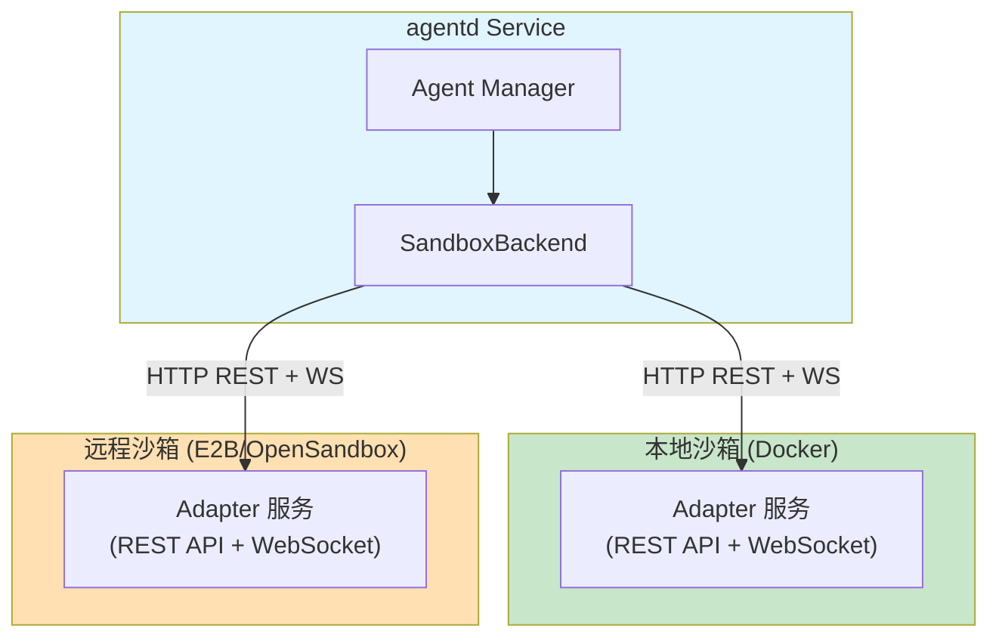
```mermaid
flowchart TB
    subgraph Middleware["agentd Service"]
        AgentManager["Agent Manager"]
        SandboxBackend["SandboxBackend"]
    end

    subgraph LocalSandbox["本地沙箱 (Docker)"]
        AdapterLocal["Adapter 服务\n(REST API + WebSocket)"]
    end

    subgraph RemoteSandbox["远程沙箱 (E2B/OpenSandbox)"]
        AdapterRemote["Adapter 服务\n(REST API + WebSocket)"]
    end

    AgentManager --> SandboxBackend
    SandboxBackend -->|HTTP REST + WS| AdapterLocal
    SandboxBackend -->|HTTP REST + WS| AdapterRemote
    
    style Middleware fill:#e1f5fe
    style LocalSandbox fill:#c8e6c9
    style RemoteSandbox fill:#ffe0b2
```

#### 6.3.3 中间层接口与 Adapter 接口的对应关系

| 中间层接口 (Section 8) | SandboxBackend 调用 | Adapter REST API | 说明 |
|------------------------|-------------------|-----------------|------|
| POST /api/v1/agents | POST /api/v1/agent/start | 启动 Agent | 创建 Agent 时启动沙箱和 Adapter |
| GET /api/v1/agents | - | - | 列出 Agent（纯管理操作，无需 Adapter） |
| GET /api/v1/agents/{agent_id} | GET /api/v1/agent/status | 获取 Agent 状态 | 从 Adapter 获取实时状态 |
| PATCH /api/v1/agents/{agent_id} | POST /api/v1/agent/config | 更新配置 | 调用 Adapter 更新配置 |
| DELETE /api/v1/agents/{agent_id} | POST /api/v1/agent/stop | 停止 Agent | 停止沙箱和 Adapter |
| POST /api/v1/agents/{agent_id}/pause | POST /api/v1/agent/stop | 暂停 Agent | 暂停时调用 stop |
| POST /api/v1/agents/{agent_id}/resume | POST /api/v1/agent/start?restore=true | 恢复 Agent | 恢复时带 restore=true |
| GET /api/v1/agents/{agent_id}/sessions | - | - | 列出 Session（纯管理操作） |
| POST /api/v1/agents/{agent_id}/sessions | POST /api/v1/agent/sessions | 创建 Session | 调用 Adapter 创建 session 文件 |
| GET /api/v1/agents/{agent_id}/sessions/{session_id} | - | - | 获取 Session 详情（纯管理操作） |
| DELETE /api/v1/agents/{agent_id}/sessions/{session_id} | DELETE /api/v1/agent/sessions/{session_id} | 删除 Session | 调用 Adapter 删除 session 文件 |
| POST /api/v1/agents/{agent_id}/sessions/{session_id}/messages | POST /api/v1/agent/messages | 发送消息（REST备选） | REST 方式发送消息，返回 SSE 流（可选实现） |
| WS /api/v1/agents/{agent_id}/ws | WS /api/v1/agent/ws?session_id=xxx | WebSocket（主通道） | 发送消息、接收事件、定时任务推送 |

#### 6.3.4 Adapter 通信接口

**通信方式：**
- **WebSocket（主通道）**：用于消息发送、事件接收、定时任务推送
- **REST API（备选）**：用于管理操作（启动/停止/配置等）

##### 6.4.4.1 WebSocket 接口

```
WS /api/v1/agent/ws?session_id=xxx
```

**WebSocket 消息格式（客户端→Adapter）：**

| 字段 | 类型 | 说明 |
|------|------|------|
| `type` | string | 消息类型：`message` / `create_session` / `close_session` |
| `content` | string | 消息内容（type=message 时） |
| `session_id` | string | Session ID |

```json
{"type": "message", "content": "帮我写一个排序函数", "session_id": "xxx"}
```

**WebSocket 消息格式（Adapter→客户端）：**

```json
{"type": "thinking", "content": "正在分析...", "timestamp": "..."}
{"type": "message", "content": "好的，我来...", "timestamp": "..."}
{"type": "tool_use", "name": "write", "input": {...}, "timestamp": "..."}
{"type": "done", "content": "", "timestamp": "..."}
```

##### 6.4.4.2 REST API 接口

Adapter 提供 RESTful API 供 SandboxBackend 调用：

##### 6.4.4.3 启动/恢复 Agent

```
POST /api/v1/agent/start
```

**请求：**

| 字段 | 类型 | 必填 | 说明 |
|------|------|------|------|
| `agent_id` | string | 是 | Agent 唯一标识 |
| `agent_type` | string | 是 | Agent 类型：opencode / openclaw / claude-code |
| `config` | object | 是 | Agent 配置 |
| `workspace_path` | string | 是 | Workspace 挂载路径 |
| `restore` | boolean | 否 | 是否恢复（默认 false） |

```json
{
    "agent_id": "agent-uuid-xxx",
    "agent_type": "opencode",
    "config": {
        "template": {...},
        "model_override": {...}
    },
    "workspace_path": "/workspace",
    "restore": false
}
```

**响应：**

```json
{
    "status": "READY",
    "sessions": [
        {"session_id": "xxx", "created_at": "..."}
    ]
}
```

##### 6.4.4.4 发送消息（SSE 备选）

```
POST /api/v1/agent/messages
```

**请求：**

| 字段 | 类型 | 必填 | 说明 |
|------|------|------|------|
| `content` | string | 是 | 消息内容 |
| `session_id` | string | 是 | 会话 ID |

```json
{
    "content": "帮我写一个排序函数",
    "session_id": "session-uuid-xxx"
}
```

**响应：Server-Sent Events (SSE) 流**

```
event: thinking
data: {"type": "thinking", "content": "正在思考...", "timestamp": "..."}

event: message
data: {"type": "message", "content": "好的，我来...", "timestamp": "..."}

event: tool_use
data: {"type": "tool_use", "name": "write", "input": {...}, "timestamp": "..."}

event: done
data: {"type": "done", "content": "", "timestamp": "..."}
```

##### 6.4.4.5 停止 Agent

```
POST /api/v1/agent/stop
```

**响应：**

```json
{
    "status": "STOPPED"
}
```

##### 6.4.4.6 更新配置

```
POST /api/v1/agent/config
```

**请求：**

```json
{
    "config": {
        "model_override": {
            "temperature": 0.9
        }
    }
}
```

**响应：**

```json
{
    "status": "UPDATED"
}
```

##### 6.4.4.7 获取状态

```
GET /api/v1/agent/status
```

**响应：**

```json
{
    "status": "READY",
    "agent_type": "opencode",
    "current_session_id": null,
    "started_at": "2026-03-27T10:00:00Z"
}
```

##### 6.4.4.8 创建 Session

```
POST /api/v1/agent/sessions
```

**请求：**

| 字段 | 类型 | 必填 | 说明 |
|------|------|------|------|
| `session_id` | string | 是 | Session 唯一标识 |

```json
{
    "session_id": "session-uuid-xxx"
}
```

**响应：**

```json
{
    "id": "session-uuid-xxx",
    "created_at": "2026-03-27T10:00:00Z"
}
```

**错误响应：**

```json
{
    "error": {
        "code": "SESSION_ALREADY_EXISTS",
        "message": "Session already exists: session-uuid-xxx"
    }
}
```

##### 6.4.4.9 关闭 Session

```
DELETE /api/v1/agent/sessions/{session_id}
```

**响应：**

```json
{
    "status": "CLOSED"
}
```

**错误响应：**

```json
{
    "error": {
        "code": "SESSION_NOT_FOUND",
        "message": "Session not found: session-uuid-xxx"
    }
}
```

##### 6.4.4.8 WebSocket 订阅

```
WS /api/v1/agent/ws?session_id=xxx
```

SandboxBackend 通过 WebSocket 连接到 Adapter，接收实时的流式事件。

**连接后接收：**

```json
{"type": "thinking", "content": "正在思考...", "timestamp": "..."}
{"type": "message", "content": "好的，我来...", "timestamp": "..."}
```

#### 6.3.5 WebSocket 消息流通道

时序图中的 WebSocket 通信路径：

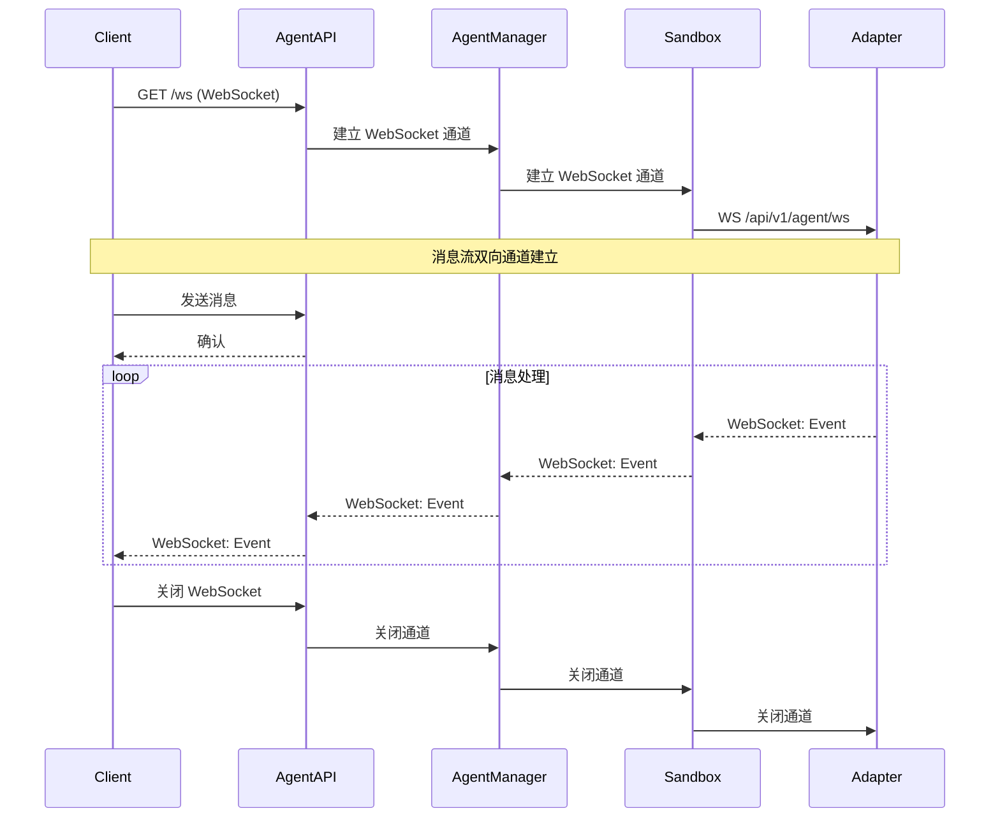
```mermaid
sequenceDiagram
    participant Client
    participant AgentAPI
    participant AgentManager
    participant Sandbox
    participant Adapter

    Client->>AgentAPI: GET /ws (WebSocket)
    AgentAPI->>AgentManager: 建立 WebSocket 通道
    AgentManager->>Sandbox: 建立 WebSocket 通道
    Sandbox->>Adapter: WS /api/v1/agent/ws
    
    Note over Client,Adapter: 消息流双向通道建立

    Client->>AgentAPI: 发送消息
    AgentAPI-->>Client: 确认

    loop 消息处理
        Adapter-->>Sandbox: WebSocket: Event
        Sandbox-->>AgentManager: WebSocket: Event
        AgentManager-->>AgentAPI: WebSocket: Event
        AgentAPI-->>Client: WebSocket: Event
    end

    Client->>AgentAPI: 关闭 WebSocket
    AgentAPI->>AgentManager: 关闭通道
    AgentManager->>Sandbox: 关闭通道
    Sandbox->>Adapter: 关闭通道
```

#### 6.3.6 本地沙箱 vs 远程沙箱

| 特性 | 本地沙箱 (Docker) | 远程沙箱 (E2B/OpenSandbox) |
|------|-------------------|--------------------------|
| **通信方式** | 进程调用 或 本地 REST | 远程 REST API |
| **WebSocket** | 本地 WebSocket | 远程 WebSocket |
| **文件挂载** | volume mount | 云存储挂载 |
| **启动速度** | 快 (1-3s) | 慢 (5-10s) |
| **成本** | 低 | 按使用计费 |
| **Adapter 位置** | 沙箱内 | 沙箱内（远程服务提供） |

#### 6.3.7 不同 Adapter 实现差异

| 功能 | OpenCode Adapter | OpenClaw Adapter | ClaudeCode Adapter |
|------|------------------|------------------|-------------------|
| **进程命令** | `opencode` | `openclaw` | `claude` |
| **配置注入** | 环境变量 + 配置文件 | 环境变量 + 配置文件 | 环境变量 + 配置文件 |
| **消息协议** | REST + SSE | REST + SSE | REST + SSE |
| **WebSocket** | 支持 | 支持 | 支持 |
| **Memory 位置** | `/workspace/.agent/memory/` | `/workspace/.agent/memory/` | `/workspace/.agent/memory/` |
| **State 位置** | `/workspace/.agent/state/` | `/workspace/.agent/state/` | `/workspace/.agent/state/` |

#### 6.3.8 错误处理

```json
{
    "error": {
        "code": "AGENT_CRASHED",
        "message": "Agent process crashed",
        "timestamp": "2026-03-27T10:00:00Z"
    }
}
```

| 错误码 | 说明 | 处理方式 |
|--------|------|----------|
| `AGENT_CRASHED` | Agent 进程崩溃 | SandboxBackend 决定是否重启 |
| `TIMEOUT` | 处理超时 | 返回超时错误事件 |
| `MEMORY_ERROR` | Memory 读写失败 | 使用空上下文继续 |
| `CONFIG_ERROR` | 配置更新失败 | 返回错误，保持原配置 |

#### 6.3.9 Workspace 数据结构

```
/workspace/                          # 挂载到沙箱的 workspace
├── .agent/                         # Agent 私有数据
│   ├── memory/                    # 对话记忆（JSON 文件）
│   │   └── {session_id}.json    # 每个 session 一个文件
│   ├── state/                     # Agent 状态
│   │   └── state.json            # Agent 内部状态
│   └── config/                    # 最终配置副本
│       └── agent.yaml
├── code/                          # 用户代码
├── input/                         # 输入文件
└── output/                        # 生成输出
```

---

## 7. 部署视图

### 7.1 部署架构

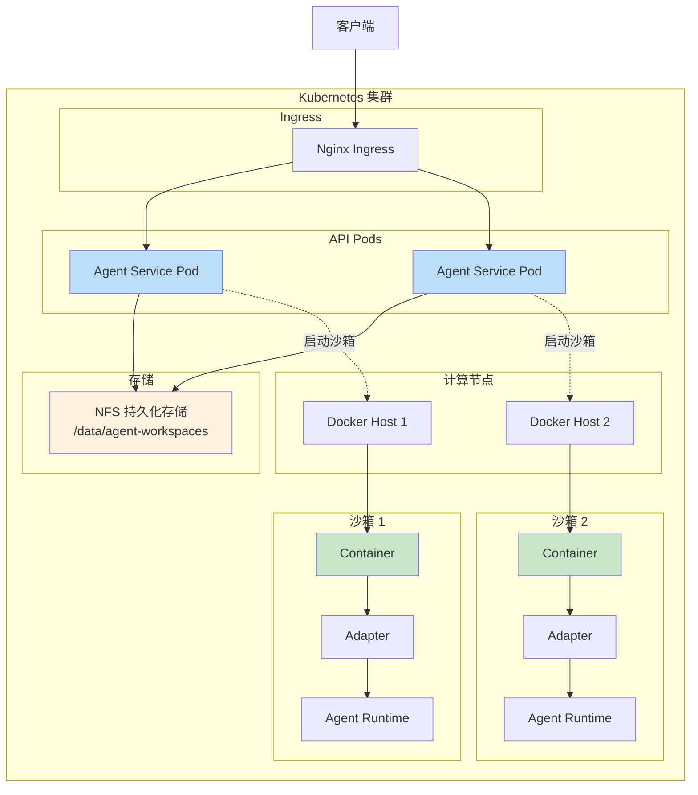
```mermaid
flowchart TB
    subgraph K8S["Kubernetes 集群"]
        subgraph Ingress["Ingress"]
            Nginx["Nginx Ingress"]
        end
        
        subgraph API["API Pods"]
            AgentService1["Agent Service Pod"]
            AgentService2["Agent Service Pod"]
        end
        
        subgraph Storage["存储"]
            NFS["NFS 持久化存储\n/data/agent-workspaces"]
        end
        
        subgraph Compute["计算节点"]
            DockerHost1["Docker Host 1"]
            DockerHost2["Docker Host 2"]
        end
        
        subgraph Sandbox1["沙箱 1"]
            Container1["Container"]
            Adapter1["Adapter"]
            Agent1["Agent Runtime"]
        end
        
        subgraph Sandbox2["沙箱 2"]
            Container2["Container"]
            Adapter2["Adapter"]
            Agent2["Agent Runtime"]
        end
    end

    Client["客户端"] --> Nginx
    Nginx --> AgentService1
    Nginx --> AgentService2
    
    AgentService1 --> NFS
    AgentService2 --> NFS
    
    AgentService1 -.->|启动沙箱| DockerHost1
    AgentService2 -.->|启动沙箱| DockerHost2
    
    DockerHost1 --> Container1
    Container1 --> Adapter1
    Adapter1 --> Agent1
    
    DockerHost2 --> Container2
    Container2 --> Adapter2
    Adapter2 --> Agent2

    style AgentService1 fill:#bbdefb
    style AgentService2 fill:#bbdefb
    style NFS fill:#fff3e0
    style Container1 fill:#c8e6c9
    style Container2 fill:#c8e6c9
```

### 7.2 沙箱内部结构

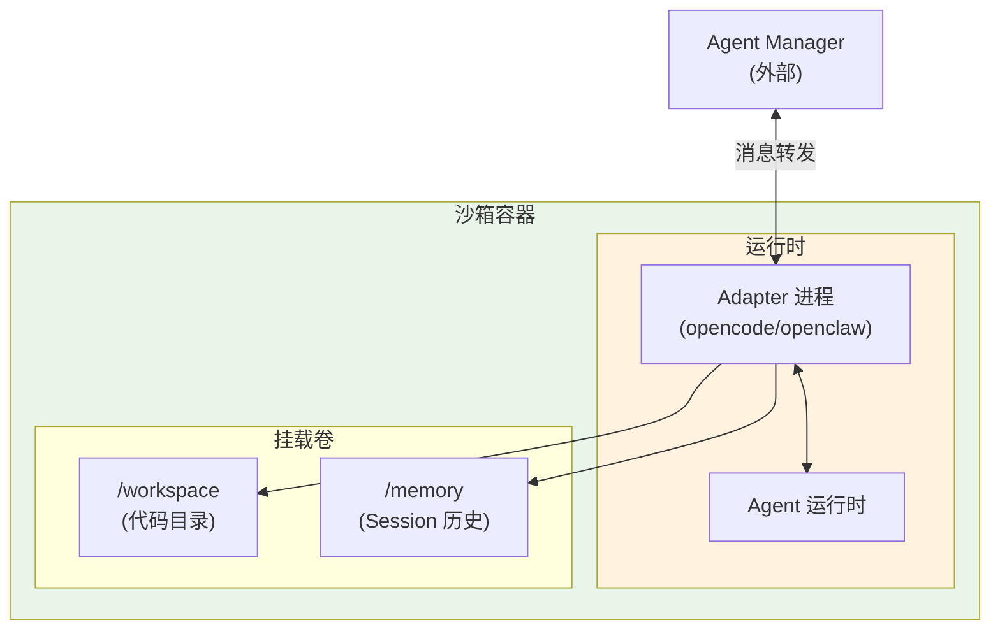
```mermaid
flowchart TB
    subgraph Sandbox["沙箱容器"]
        subgraph Runtime["运行时"]
            Adapter["Adapter 进程\n(opencode/openclaw)"]
            AgentRuntime["Agent 运行时"]
        end
        
        subgraph Volumes["挂载卷"]
            Workspace["/workspace\n(代码目录)"]
            Memory["/memory\n(Session 历史)"]
        end
        
        Adapter <--> AgentRuntime
        Adapter --> Workspace
        Adapter --> Memory
    end
    
    AgentManager["Agent Manager\n(外部)"] <-->|消息转发| Adapter
    
    style Sandbox fill:#e8f5e8
    style Runtime fill:#fff3e0
```

---

## 8. API 详细设计

### 8.1 API 路径总览

| 方法 | 路径 | 说明 |
|------|------|------|
| POST | `/api/v1/agents` | 创建 Agent |
| GET | `/api/v1/agents` | 列出 Agent |
| GET | `/api/v1/agents/{agent_id}` | 获取 Agent 详情 |
| PATCH | `/api/v1/agents/{agent_id}` | 更新 Agent 配置 |
| DELETE | `/api/v1/agents/{agent_id}` | 删除 Agent |
| POST | `/api/v1/agents/{agent_id}/pause` | 暂停 Agent（管理员操作） |
| POST | `/api/v1/agents/{agent_id}/resume` | 恢复 Agent（管理员操作） |
| GET | `/api/v1/agents/{agent_id}/sessions` | 列出 Session |
| POST | `/api/v1/agents/{agent_id}/sessions` | 创建 Session |
| GET | `/api/v1/agents/{agent_id}/sessions/{session_id}` | 获取 Session 详情 |
| DELETE | `/api/v1/agents/{agent_id}/sessions/{session_id}` | 删除 Session |
| POST | `/api/v1/agents/{agent_id}/sessions/{session_id}/messages` | 发送消息（REST 备选通道） |
| WS | `/api/v1/agents/{agent_id}/ws` | WebSocket（主通信通道） |
|  | 沙箱配置 |  |
|  | 模型配置 |  |
|  |  |  |

### 8.2 数据模型

#### AgentStatus 枚举（5 状态）

```python
class AgentStatus(str, Enum):
    CREATING = "CREATING"   # 创建中
    RUNNING = "RUNNING"     # 运行中，可处理消息
    PAUSED = "PAUSED"      # 已暂停，沙箱已停止，可快速恢复
    STOPPED = "STOPPED"     # 已停止
    ERROR = "ERROR"         # 错误
```

#### AdapterType 枚举

```python
class AdapterType(str, Enum):
    OPENCODE = "opencode"
    OPENCLAW = "openclaw"
    CLAUDECODE = "claude-code"
```

### 8.3 请求/响应模型

#### CreateAgentRequest

**输入字段：**

| 字段 | 类型 | 必填 | 说明 |
|------|------|------|------|
| `name` | string | 是 | Agent 名称，用于展示和识别 |
| `adapter_type` | string | 是 | 适配器类型：`opencode` / `openclaw` / `claude-code` |
| `template` | object | 是 | Agent 模板配置，参考 agent.yaml 结构 |
| `model_override` | object | 否 | 模型配置覆盖 |
| `model_override.provider` | string | 否 | 模型提供商：`anthropic` / `openai` / `google` |
| `model_override.name` | string | 否 | 模型名称，如 `claude-sonnet-4-20250514` |
| `model_override.temperature` | number | 否 | 温度参数，0.0-1.0 |
| `model_override.max_tokens` | number | 否 | 最大 token 数 |
| `sandbox_config` | object | 否 | 沙箱配置 |
| `sandbox_config.type` | string | 否 | 沙箱类型：`docker` / `e2b` / `opensandbox`，默认 `docker` |
| `sandbox_config.timeout` | number | 否 | 超时时间（秒），默认 3600 |
| `idle_timeout` | number | 否 | 空闲超时时间（秒），默认 300 |

```json
{
    "name": "my-agent",
    "adapter_type": "opencode",
    "template": {
        "agent": {
            "name": "my-agent",
            "prompt": {
                "system": "You are a helpful assistant."
            }
        }
    },
    "model_override": {
        "provider": "anthropic",
        "name": "claude-sonnet-4-20250514",
        "temperature": 0.7
    },
    "sandbox_config": {
        "type": "docker",
        "timeout": 3600
    },
    "idle_timeout": 300
}
```

#### CreateAgentResponse / AgentInfo

**输出字段：**

| 字段 | 类型 | 说明 |
|------|------|------|
| `id` | string | Agent 唯一标识符 (UUID) |
| `name` | string | Agent 名称 |
| `adapter_type` | string | 适配器类型 |
| `status` | string | Agent 状态：`CREATING` / `RUNNING` / `PAUSED` / `STOPPED` / `ERROR` |
| `sandbox_id` | string | 关联的沙箱 ID |
| `default_session_id` | string | 默认会话 ID |
| `has_scheduled_tasks` | boolean | 是否有定时任务 |
| `idle_timeout` | number | 空闲超时时间（秒） |
| `created_at` | string | 创建时间 (ISO 8601) |
| `updated_at` | string | 更新时间 (ISO 8601) |

```json
{
    "id": "agent-uuid-xxx",
    "name": "my-agent",
    "adapter_type": "opencode",
    "status": "RUNNING",
    "sandbox_id": "sandbox-uuid-xxx",
    "default_session_id": "session-uuid-xxx",
    "has_scheduled_tasks": false,
    "idle_timeout": 300,
    "created_at": "2026-03-27T10:00:00Z",
    "updated_at": "2026-03-27T10:05:00Z"
}
```

#### SendMessageRequest

**输入字段：**

| 字段 | 类型 | 必填 | 说明 |
|------|------|------|------|
| `session_id` | string | 是 | 目标会话 ID |
| `content` | string | 是 | 消息内容 |
| `attachments` | array | 否 | 附件列表，如文件路径 |

```json
{
    "session_id": "session-uuid-xxx",
    "content": "帮我写一个快速排序函数",
    "attachments": []
}
```

#### SendMessageResponse / WebSocket 事件

**输出字段（流式）：**

| 字段 | 类型 | 说明 |
|------|------|------|
| `type` | string | 事件类型：`thinking` / `message` / `tool_use` / `done` / `error` |
| `content` | string | 事件内容 |
| `timestamp` | string | 事件时间 (ISO 8601) |
| `name` | string | (tool_use 时) 工具名称 |
| `input` | object | (tool_use 时) 工具输入参数 |
| `tool_call_id` | string | (tool_use 时) 工具调用 ID |

```json
{"type": "thinking", "content": "正在思考...", "timestamp": "2026-03-27T10:00:01Z"}
{"type": "message", "content": "这是一个...", "timestamp": "2026-03-27T10:00:02Z"}
{"type": "tool_use", "name": "write", "input": {"path": "sort.py", "content": "..."}, "timestamp": "2026-03-27T10:00:03Z"}
{"type": "done", "content": "", "timestamp": "2026-03-27T10:00:04Z"}
```

#### SessionInfo

**输出字段：**

| 字段 | 类型 | 说明 |
|------|------|------|
| `id` | string | Session 唯一标识符 (UUID) |
| `agent_id` | string | 所属 Agent ID |
| `status` | string | Session 状态：`ACTIVE` / `STOPPED` |
| `created_at` | string | 创建时间 (ISO 8601) |

```json
{
    "id": "session-uuid-xxx",
    "agent_id": "agent-uuid-xxx",
    "status": "ACTIVE",
    "created_at": "2026-03-27T10:00:00Z"
}
```

#### UpdateAgentRequest

**输入字段：**

| 字段 | 类型 | 必填 | 说明 |
|------|------|------|------|
| `name` | string | 否 | 新名称 |
| `model_override` | object | 否 | 新的模型配置 |
| `idle_timeout` | number | 否 | 新的空闲超时时间 |

```json
{
    "name": "new-name",
    "model_override": {
        "temperature": 0.9
    },
    "idle_timeout": 600
}
```

### 8.4 接口时序图

#### 8.4.1 创建 Agent 时序

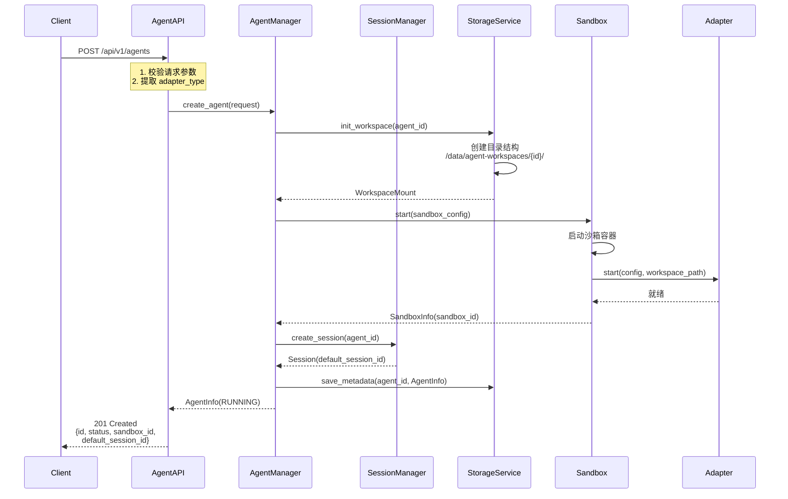
```mermaid
sequenceDiagram
    participant Client
    participant AgentAPI
    participant AgentManager
    participant SessionManager
    participant StorageService
    participant Sandbox
    participant Adapter

    Client->>AgentAPI: POST /api/v1/agents
    Note over AgentAPI: 1. 校验请求参数<br/>2. 提取 adapter_type

    AgentAPI->>AgentManager: create_agent(request)
    AgentManager->>StorageService: init_workspace(agent_id)
    StorageService->>StorageService: 创建目录结构<br/>/data/agent-workspaces/{id}/
    StorageService-->>AgentManager: WorkspaceMount

    AgentManager->>Sandbox: start(sandbox_config)
    Sandbox->>Sandbox: 启动沙箱容器
    Sandbox->>Adapter: start(config, workspace_path)
    Adapter-->>Sandbox: 就绪
    Sandbox-->>AgentManager: SandboxInfo(sandbox_id)

    AgentManager->>SessionManager: create_session(agent_id)
    SessionManager-->>AgentManager: Session(default_session_id)

    AgentManager->>StorageService: save_metadata(agent_id, AgentInfo)
    AgentManager-->>AgentAPI: AgentInfo(RUNNING)

    AgentAPI-->>Client: 201 Created<br/>{id, status, sandbox_id,<br/>default_session_id}
```

#### 8.4.2 发送消息时序

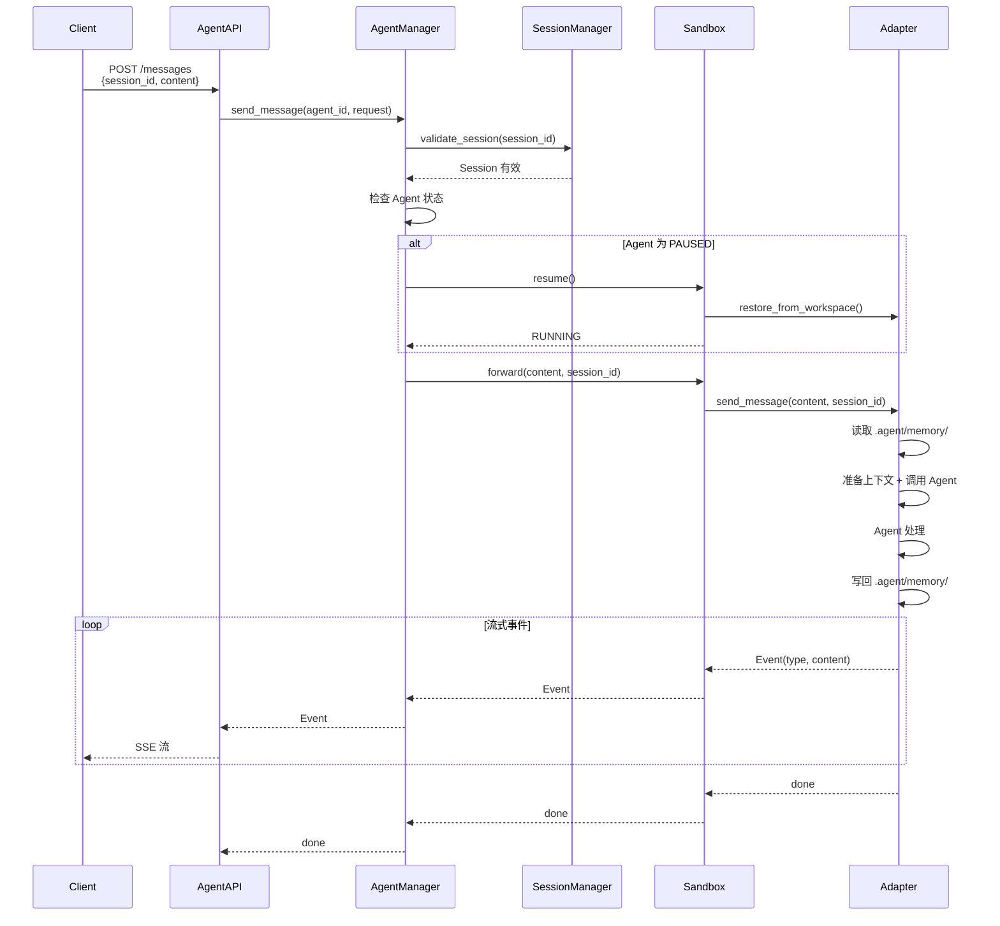
```mermaid
sequenceDiagram
    participant Client
    participant AgentAPI
    participant AgentManager
    participant SessionManager
    participant Sandbox
    participant Adapter

    Client->>AgentAPI: POST /messages<br/>{session_id, content}
    AgentAPI->>AgentManager: send_message(agent_id, request)

    AgentManager->>SessionManager: validate_session(session_id)
    SessionManager-->>AgentManager: Session 有效

    AgentManager->>AgentManager: 检查 Agent 状态
   alt Agent 为 PAUSED
        AgentManager->>Sandbox: resume()
        Sandbox->>Adapter: restore_from_workspace()
        Sandbox-->>AgentManager: RUNNING
    end

    AgentManager->>Sandbox: forward(content, session_id)
    Sandbox->>Adapter: send_message(content, session_id)

    Adapter->>Adapter: 读取 .agent/memory/
    Adapter->>Adapter: 准备上下文 + 调用 Agent
    Adapter->>Adapter: Agent 处理
    Adapter->>Adapter: 写回 .agent/memory/

    loop 流式事件
        Adapter-->>Sandbox: Event(type, content)
        Sandbox-->>AgentManager: Event
        AgentManager-->>AgentAPI: Event
        AgentAPI-->>Client: SSE 流
    end

    Adapter-->>Sandbox: done
    Sandbox-->>AgentManager: done
    AgentManager-->>AgentAPI: done
```

#### 8.4.3 暂停/恢复 Agent 时序

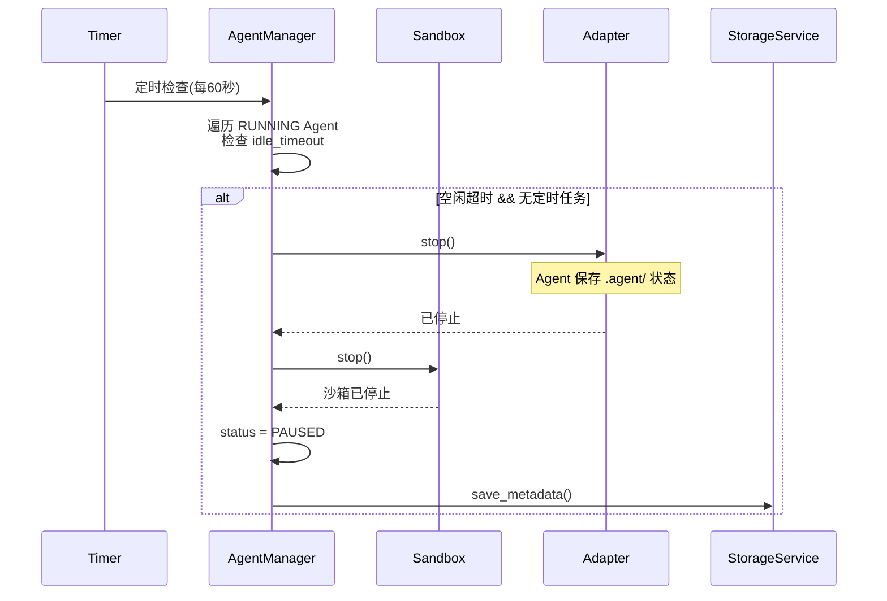
```mermaid
sequenceDiagram
    participant Timer
    participant AgentManager
    participant Sandbox
    participant Adapter
    participant StorageService

    Timer->>AgentManager: 定时检查(每60秒)
    AgentManager->>AgentManager: 遍历 RUNNING Agent<br/>检查 idle_timeout

    alt 空闲超时 && 无定时任务
        AgentManager->>Adapter: stop()
        Note over Adapter: Agent 保存 .agent/ 状态
        Adapter-->>AgentManager: 已停止

        AgentManager->>Sandbox: stop()
        Sandbox-->>AgentManager: 沙箱已停止

        AgentManager->>AgentManager: status = PAUSED
        AgentManager->>StorageService: save_metadata()
    end
```

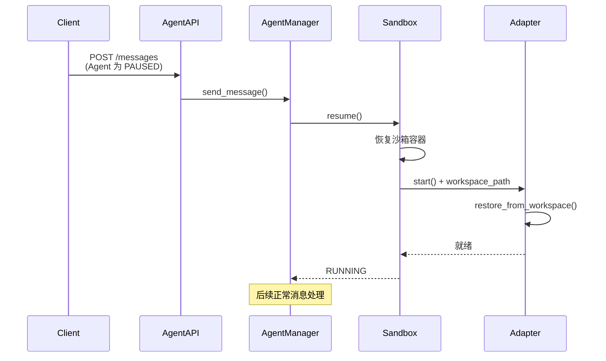
```mermaid
sequenceDiagram
    participant Client
    participant AgentAPI
    participant AgentManager
    participant Sandbox
    participant Adapter

    Client->>AgentAPI: POST /messages<br/>(Agent 为 PAUSED)
    AgentAPI->>AgentManager: send_message()

    AgentManager->>Sandbox: resume()
    Sandbox->>Sandbox: 恢复沙箱容器
    Sandbox->>Adapter: start() + workspace_path
    Adapter->>Adapter: restore_from_workspace()
    Adapter-->>Sandbox: 就绪
    Sandbox-->>AgentManager: RUNNING

    Note over AgentManager: 后续正常消息处理
```

#### 8.4.4 创建 Session 时序

```mermaid
sequenceDiagram
    participant Client
    participant AgentAPI
    participant AgentManager
    participant SessionManager

    Client->>AgentAPI: POST /sessions
    AgentAPI->>AgentManager: create_session(agent_id)
    AgentManager->>SessionManager: create_session(agent_id)
    SessionManager->>SessionManager: 生成 session_id<br/>初始化会话目录
    SessionManager-->>AgentManager: Session
    AgentManager-->>AgentAPI: Session
    AgentAPI-->>Client: 201 Created<br/>{id, status, created_at}
```

#### 8.4.5 WebSocket 订阅时序

```mermaid
sequenceDiagram
    participant Client
    participant AgentAPI
    participant AgentManager
    participant Sandbox
    participant Adapter

    Client->>AgentAPI: GET /ws
    AgentAPI->>AgentManager: establish_websocket(agent_id)
    AgentManager->>Sandbox: register_consumer()
    Sandbox-->>AgentManager: WebSocket 通道建立

    loop 消息处理期间
        Adapter-->>Sandbox: Event
        Sandbox-->>AgentManager: Event
        AgentManager-->>AgentAPI: Event
        AgentAPI-->>Client: WebSocket 推送
    end

    Note over Client,Sandbox: 连接维持直到:<br/>- Agent 处理完成 (done)<br/>- 客户端断开<br/>- 超时
```

### 8.5 API 调用示例

#### 8.5.1 创建 Agent

```bash
# 请求
curl -X POST http://localhost:18080/api/v1/agents \
  -H "Authorization: Bearer <token>" \
  -H "Content-Type: application/json" \
  -d '{
    "name": "code-assistant",
    "adapter_type": "opencode",
    "template": {
      "agent": {
        "name": "code-assistant",
        "prompt": {
          "system": "You are a senior software engineer."
        }
      }
    },
    "model_override": {
      "provider": "anthropic",
      "name": "claude-sonnet-4-20250514",
      "temperature": 0.7
    },
    "sandbox_config": {
      "type": "docker",
      "timeout": 3600
    },
    "idle_timeout": 300
  }'

# 响应 201 Created
{
  "id": "agent-uuid-xxx",
  "name": "code-assistant",
  "adapter_type": "opencode",
  "status": "RUNNING",
  "sandbox_id": "sandbox-uuid-xxx",
  "default_session_id": "session-uuid-xxx",
  "has_scheduled_tasks": false,
  "idle_timeout": 300,
  "created_at": "2026-03-27T10:00:00Z",
  "updated_at": "2026-03-27T10:00:00Z"
}
```

#### 8.5.2 列出 Agent

```bash
# 请求 - 列出当前用户的所有 Agent
curl -X GET http://localhost:18080/api/v1/agents \
  -H "Authorization: Bearer <token>"

# 请求 - 带分页和过滤
curl -X GET "http://localhost:18080/api/v1/agents?status=RUNNING&limit=10&offset=0" \
  -H "Authorization: Bearer <token>"

# 响应 200 OK
{
  "items": [
    {
      "id": "agent-uuid-xxx",
      "name": "code-assistant",
      "adapter_type": "opencode",
      "status": "RUNNING",
      "sandbox_id": "sandbox-uuid-xxx",
      "default_session_id": "session-uuid-xxx",
      "has_scheduled_tasks": false,
      "idle_timeout": 300,
      "created_at": "2026-03-27T10:00:00Z",
      "updated_at": "2026-03-27T10:05:00Z"
    }
  ],
  "total": 1,
  "limit": 10,
  "offset": 0
}
```

#### 8.5.3 获取 Agent 详情

```bash
# 请求
curl -X GET http://localhost:18080/api/v1/agents/agent-uuid-xxx \
  -H "Authorization: Bearer <token>"

# 响应 200 OK
{
  "id": "agent-uuid-xxx",
  "name": "code-assistant",
  "adapter_type": "opencode",
  "status": "RUNNING",
  "sandbox_id": "sandbox-uuid-xxx",
  "default_session_id": "session-uuid-xxx",
  "has_scheduled_tasks": false,
  "idle_timeout": 300,
  "created_at": "2026-03-27T10:00:00Z",
  "updated_at": "2026-03-27T10:05:00Z"
}
```

#### 8.5.4 更新 Agent 配置

```bash
# 请求
curl -X PATCH http://localhost:18080/api/v1/agents/agent-uuid-xxx \
  -H "Authorization: Bearer <token>" \
  -H "Content-Type: application/json" \
  -d '{
    "name": "new-name",
    "model_override": {
      "temperature": 0.9
    },
    "idle_timeout": 600
  }'

# 响应 200 OK
{
  "id": "agent-uuid-xxx",
  "name": "new-name",
  "adapter_type": "opencode",
  "status": "RUNNING",
  "sandbox_id": "sandbox-uuid-xxx",
  "default_session_id": "session-uuid-xxx",
  "has_scheduled_tasks": false,
  "idle_timeout": 600,
  "created_at": "2026-03-27T10:00:00Z",
  "updated_at": "2026-03-27T10:10:00Z"
}
```

#### 8.5.5 删除 Agent

```bash
# 请求
curl -X DELETE http://localhost:18080/api/v1/agents/agent-uuid-xxx \
  -H "Authorization: Bearer <token>"

# 响应 204 No Content
```

#### 8.5.6 暂停 Agent

```bash
# 请求
curl -X POST http://localhost:18080/api/v1/agents/agent-uuid-xxx/pause \
  -H "Authorization: Bearer <token>"

# 响应 200 OK
{
  "id": "agent-uuid-xxx",
  "name": "code-assistant",
  "adapter_type": "opencode",
  "status": "PAUSED",
  "sandbox_id": "sandbox-uuid-xxx",
  "default_session_id": "session-uuid-xxx",
  "has_scheduled_tasks": false,
  "idle_timeout": 300,
  "created_at": "2026-03-27T10:00:00Z",
  "updated_at": "2026-03-27T11:00:00Z"
}
```

#### 8.5.7 恢复 Agent

```bash
# 请求
curl -X POST http://localhost:18080/api/v1/agents/agent-uuid-xxx/resume \
  -H "Authorization: Bearer <token>"

# 响应 200 OK
{
  "id": "agent-uuid-xxx",
  "name": "code-assistant",
  "adapter_type": "opencode",
  "status": "RUNNING",
  "sandbox_id": "sandbox-uuid-xxx",
  "default_session_id": "session-uuid-xxx",
  "has_scheduled_tasks": false,
  "idle_timeout": 300,
  "created_at": "2026-03-27T10:00:00Z",
  "updated_at": "2026-03-27T11:05:00Z"
}
```

#### 8.5.8 发送消息

```bash
# 请求
curl -X POST http://localhost:18080/api/v1/agents/agent-uuid-xxx/messages \
  -H "Authorization: Bearer <token>" \
  -H "Content-Type: application/json" \
  -d '{
    "session_id": "session-uuid-xxx",
    "content": "帮我写一个快速排序函数",
    "attachments": []
  }'

# 响应 200 OK (SSE 流式)
event: thinking
data: {"type": "thinking", "content": "正在思考如何实现...", "timestamp": "2026-03-27T10:00:01Z"}

event: message
data: {"type": "message", "content": "好的，我来实现一个快速排序算法。", "timestamp": "2026-03-27T10:00:02Z"}

event: tool_use
data: {"type": "tool_use", "name": "write", "input": {"path": "quicksort.py", "content": "def quicksort(arr):\n    if len(arr) <= 1:\n        return arr\n    pivot = arr[len(arr) // 2]\n    left = [x for x in arr if x < pivot]\n    middle = [x for x in arr if x == pivot]\n    right = [x for x in arr if x > pivot]\n    return quicksort(left) + middle + quicksort(right)"}, "timestamp": "2026-03-27T10:00:03Z"}

event: done
data: {"type": "done", "content": "", "timestamp": "2026-03-27T10:00:04Z"}
```

#### 8.5.9 创建 Session

```bash
# 请求
curl -X POST http://localhost:18080/api/v1/agents/agent-uuid-xxx/sessions \
  -H "Authorization: Bearer <token>" \
  -H "Content-Type: application/json" \
  -d '{}'

# 响应 201 Created
{
  "id": "new-session-uuid-xxx",
  "agent_id": "agent-uuid-xxx",
  "status": "ACTIVE",
  "created_at": "2026-03-27T12:00:00Z"
}
```

#### 8.5.10 列出 Session

```bash
# 请求
curl -X GET http://localhost:18080/api/v1/agents/agent-uuid-xxx/sessions \
  -H "Authorization: Bearer <token>"

# 响应 200 OK
{
  "items": [
    {
      "id": "session-uuid-xxx",
      "agent_id": "agent-uuid-xxx",
      "status": "ACTIVE",
      "created_at": "2026-03-27T10:00:00Z"
    },
    {
      "id": "new-session-uuid-xxx",
      "agent_id": "agent-uuid-xxx",
      "status": "ACTIVE",
      "created_at": "2026-03-27T12:00:00Z"
    }
  ],
  "total": 2
}
```

#### 8.5.11 获取 Session 详情

```bash
# 请求
curl -X GET http://localhost:18080/api/v1/agents/agent-uuid-xxx/sessions/session-uuid-xxx \
  -H "Authorization: Bearer <token>"

# 响应 200 OK
{
  "id": "session-uuid-xxx",
  "agent_id": "agent-uuid-xxx",
  "status": "ACTIVE",
  "created_at": "2026-03-27T10:00:00Z"
}
```

#### 8.5.12 删除 Session

```bash
# 请求
curl -X DELETE http://localhost:18080/api/v1/agents/agent-uuid-xxx/sessions/session-uuid-xxx \
  -H "Authorization: Bearer <token>"

# 响应 204 No Content
```

#### 8.5.13 WebSocket 订阅

```bash
# 请求 (通过 ws:// 或 wss:// 协议)
curl -X GET http://localhost:18080/api/v1/agents/agent-uuid-xxx/ws \
  -H "Authorization: Bearer <token>" \
  --include \
  --no-buffer

# 请求头
# GET /api/v1/agents/agent-uuid-xxx/ws HTTP/1.1
# Host: localhost:18080
# Authorization: Bearer <token>
# Upgrade: websocket
# Connection: Upgrade
# Sec-WebSocket-Key: dGhlIHNhbXBsZSBub25jZQ==
# Sec-WebSocket-Version: 13

# 响应头
# HTTP/1.1 101 Switching Protocols
# Upgrade: websocket
# Connection: Upgrade
# Sec-WebSocket-Accept: s3pPLMBiTxaQ9kYGzzhZRbK+xOo=

# 接收消息 (WebSocket 帧)
{
  "type": "thinking",
  "content": "正在分析需求...",
  "timestamp": "2026-03-27T10:00:01Z"
}
{
  "type": "message",
  "content": "我理解了你需要...",
  "timestamp": "2026-03-27T10:00:02Z"
}
{
  "type": "done",
  "content": "",
  "timestamp": "2026-03-27T10:00:03Z"
}
```

### 8.6 接口分析

#### 8.6.1 接口分类

| 分类 | 接口 | 说明 |
|------|------|------|
| **Agent 生命周期** | POST /agents, DELETE /agents/{id} | 创建和删除 Agent |
| **Agent 配置管理** | GET /agents, GET /agents/{id}, PATCH /agents/{id} | 查看和更新配置 |
| **Agent 状态控制** | POST /agents/{id}/pause, POST /agents/{id}/resume | 暂停和恢复 |
| **Session 管理** | POST /sessions, GET /sessions, GET /sessions/{id}, DELETE /sessions/{id} | Session CRUD |
| **消息通信** | POST /messages | 发送消息 |
| **实时通信** | GET /ws | WebSocket 订阅 |

#### 8.6.2 接口依赖关系

```mermaid
flowchart TB
    subgraph 基础接口["无依赖接口"]
        CreateAgent["POST /agents\n创建 Agent"]
        ListAgents["GET /agents\n列出 Agent"]
    end

    subgraph 依赖AgentID["依赖 Agent ID"]
        GetAgent["GET /agents/{id}\n获取详情"]
        UpdateAgent["PATCH /agents/{id}\n更新配置"]
        DeleteAgent["DELETE /agents/{id}\n删除"]
        PauseAgent["POST /agents/{id}/pause\n暂停"]
        ResumeAgent["POST /agents/{id}/resume\n恢复"]
    end

    subgraph 依赖AgentID_Session["依赖 Agent ID + Session"]
        CreateSession["POST /sessions\n创建 Session"]
        ListSessions["GET /sessions\n列出 Sessions"]
        GetSession["GET /sessions/{id}\n获取详情"]
        DeleteSession["DELETE /sessions/{id}\n删除"]
        SendMessage["POST /messages\n发送消息"]
        WebSocket["GET /ws\nWebSocket"]
    end

    CreateAgent --> GetAgent
    CreateAgent --> ListAgents
    CreateAgent --> CreateSession

    GetAgent --> UpdateAgent
    GetAgent --> DeleteAgent
    GetAgent --> PauseAgent
    GetAgent --> ResumeAgent

    CreateSession --> ListSessions
    CreateSession --> GetSession
    CreateSession --> DeleteSession
    CreateSession --> SendMessage
    CreateSession --> WebSocket

    style CreateAgent fill:#c8e6c9
    style SendMessage fill:#bbdefb
    style WebSocket fill:#ffe0b2
```

#### 8.6.3 状态转换与可用接口

| 当前状态 | 可用接口 | 限制说明 |
|----------|----------|----------|
| **CREATING** | GET /agents/{id} | 仅可查询状态 |
| **RUNNING** | 所有接口 | 正常操作 |
| **PAUSED** | GET /agents/{id}, POST /resume, POST /messages | 仅可恢复和发送消息 |
| **STOPPED** | 无 | 不可操作，需重建 |
| **ERROR** | GET /agents/{id}, DELETE /agents/{id} | 仅可查询和删除 |

#### 8.6.4 接口幂等性分析

| 接口 | 幂等性 | 说明 |
|------|--------|------|
| POST /agents | 幂等(同名检查) | 重复创建同名 Agent 返回已存在 |
| GET /agents | 天然幂等 | 只读操作 |
| GET /agents/{id} | 天然幂等 | 只读操作 |
| PATCH /agents/{id} | 幂等 | 重复请求相同配置结果一致 |
| DELETE /agents/{id} | 幂等 | 删除已删除的返回 204 |
| POST /agents/{id}/pause | 非幂等 | 暂停已暂停的会报错 |
| POST /agents/{id}/resume | 幂等 | 恢复已运行的 Agent 正常返回 |
| POST /sessions | 非幂等 | 每次创建新 Session |
| DELETE /sessions/{id} | 幂等 | 删除已删除的返回 204 |
| POST /messages | 非幂等 | 每次发送产生新消息 |
| GET /ws | 非幂等 | 每次建立新连接 |

#### 8.6.5 接口性能考虑

| 接口 | 性能敏感度 | 说明 |
|------|------------|------|
| POST /agents | 高 | 涉及沙箱启动，约 5-10 秒 |
| DELETE /agents/{id} | 高 | 涉及沙箱停止，约 1-3 秒 |
| POST /agents/{id}/pause | 高 | 涉及状态保存和沙箱停止 |
| POST /agents/{id}/resume | 高 | 涉及沙箱恢复 |
| POST /messages | 高 | 涉及 Agent 处理，建议长连接 |
| GET /ws | 高 | 长连接维持占用资源 |
| GET /agents | 中 | 列表查询，可加缓存 |
| POST /sessions | 低 | 仅创建记录，毫秒级 |

### 8.6 错误响应

#### 错误响应结构

| 字段 | 类型 | 说明 |
|------|------|------|
| `error.code` | string | 错误码 |
| `error.message` | string | 人类可读的错误描述 |
| `error.details` | object | 额外错误信息 |

```json
{
    "error": {
        "code": "AGENT_NOT_FOUND",
        "message": "Agent not found: agent-uuid-xxx",
        "details": {}
    }
}
```

#### 错误码详细说明

| 错误码 | HTTP 状态码 | 说明 | 触发条件 |
|--------|-------------|------|----------|
| `AGENT_NOT_FOUND` | 404 | Agent 不存在 | 请求的 agent_id 在系统中不存在 |
| `SESSION_NOT_FOUND` | 404 | Session 不存在 | 请求的 session_id 在系统中不存在 |
| `SANDBOX_NOT_FOUND` | 404 | 沙箱不存在 | 关联的 sandbox_id 丢失 |
| `AGENT_NOT_RUNNING` | 400 | Agent 未运行 | Agent 状态不是 RUNNING 或 PAUSED |
| `AGENT_PAUSED` | 400 | Agent 已暂停 | Agent 处于 PAUSED 状态，需先恢复 |
| `SESSION_NOT_ACTIVE` | 400 | Session 未激活 | Session 状态不是 ACTIVE |
| `SANDBOX_ERROR` | 500 | 沙箱操作失败 | Sandbox.start/stop/resume 操作失败 |
| `ADAPTER_ERROR` | 500 | Adapter 执行失败 | Adapter 内部处理出错 |
| `VALIDATION_ERROR` | 422 | 请求参数错误 | 请求体缺少必填字段或格式错误 |
| `UNAUTHORIZED` | 401 | 未授权 | Token 缺失或无效 |
| `FORBIDDEN` | 403 | 权限不足 | 用户缺少所需权限 |
| `INTERNAL_ERROR` | 500 | 内部错误 | 未预期的服务器错误 |

---

## 9. 认证机制

### 9.1 Token 校验

Token 校验通过 API Middleware 实现，内嵌于 API 服务中：

```python
@app.middleware("http")
async def token_validation(request: Request, call_next):
    token = request.headers.get("Authorization", "").replace("Bearer ", "")
    
    if not token:
        return JSONResponse(
            status_code=401,
            content={"error": {"code": "UNAUTHORIZED", "message": "Token required"}}
        )
    
    # 校验 Token 有效性
    user = await validate_token(token)
    if not user:
        return JSONResponse(
            status_code=401,
            content={"error": {"code": "INVALID_TOKEN", "message": "Invalid token"}}
        )
    
    # 将用户信息注入到请求中
    request.state.user = user
    return await call_next(request)
```

### 9.2 权限定义

| 权限 | 说明 |
|------|------|
| agent:read | 查看 Agent |
| agent:write | 创建/更新/删除 Agent |
| agent:pause | 暂停/恢复 Agent |
| session:read | 查看 Session |
| session:write | 创建/删除 Session |
| message:send | 发送消息 |

---

## 10. 存储设计

### 10.1 存储职责划分

| 组件 | 职责 |
|------|------|
| StorageService | Workspace 目录结构持久化、Agent 元数据 |
| SessionManager | Session 生命周期管理（ID、状态） |
| AgentAdapter | **自己管理** `.agent/` 目录中的 memory |

**核心原则：系统只持久化 Workspace，Agent 自己决定如何组织 `.agent/` 目录。**

### 10.2 LocalStorageBackend 实现

```python
class LocalStorageBackend(StorageBackend):
    """本地文件系统存储后端"""
    
    def __init__(self, base_path: str = "/data/agent-workspaces"):
        self.base_path = Path(base_path)
    
    async def init_workspace(self, agent_id: str) -> WorkspaceMount:
        """创建 Workspace 目录结构"""
        workspace = self.base_path / agent_id
        (workspace / "workspace" / ".agent").mkdir(parents=True, exist_ok=True)
        (workspace / "workspace" / "code").mkdir(exist_ok=True)
        (workspace / "workspace" / "input").mkdir(exist_ok=True)
        (workspace / "workspace" / "output").mkdir(exist_ok=True)
        (workspace / "logs").mkdir(exist_ok=True)
        
        return WorkspaceMount(
            host_path=str(workspace),
            guest_path="/workspace"
        )
    
    async def save_state(self, agent_id: str, state: dict) -> None:
        """保存 Agent 元数据"""
        path = self.base_path / agent_id / "metadata.json"
        await self._write_json(path, state)
    
    async def load_state(self, agent_id: str) -> dict | None:
        """加载 Agent 元数据"""
        path = self.base_path / agent_id / "metadata.json"
        if not path.exists():
            return None
        return await self._read_json(path)
    
    async def cleanup(self, agent_id: str) -> None:
        """清理 Workspace"""
        import shutil
        workspace = self.base_path / agent_id
        if workspace.exists():
            shutil.rmtree(workspace)
```

### 10.3 SessionManager 实现

```python
class SessionManager:
    """Session 生命周期管理"""
    
    async def create_session(self, agent_id: str) -> Session:
        """创建新 Session"""
        session_id = str(uuid.uuid4())
        # Session 信息由 Agent 自己在 .agent/ 中管理
        # 这里只记录 Session ID 列表
        await self._add_session_id(agent_id, session_id)
        
        return Session(
            id=session_id,
            agent_id=agent_id,
            status=SessionStatus.ACTIVE,
            created_at=datetime.utcnow()
        )
    
    async def list_sessions(self, agent_id: str) -> list[Session]:
        """列出所有 Session"""
        session_ids = await self._get_session_ids(agent_id)
        return [
            Session(id=sid, agent_id=agent_id, status=SessionStatus.ACTIVE)
            for sid in session_ids
        ]
    
    async def validate_session(self, session_id: str) -> bool:
        """验证 Session 是否有效"""
        # Session 有效性由 Agent 验证
        # 这里只检查 ID 格式
        return bool(session_id)
```

### 10.4 AgentAdapter Memory 管理

**Adapter 负责 Workspace 与 Agent 之间的数据读写：**

```python
class OpenCodeAdapter(AgentAdapter):
    """OpenCode Adapter"""
    
    async def send_message(self, content: str, session_id: str):
        # 1. 从 workspace/.agent/memory/ 读取 memory
        memory_data = await self._read_memory(workspace_path, session_id)
        
        # 2. 准备上下文，调用 OpenCode Agent
        response = await self._call_agent(content, memory_data)
        
        # 3. 将响应保存回 workspace/.agent/memory/
        await self._write_memory(workspace_path, session_id, response)
        
        # 4. 返回事件流
        yield response

class OpenClawAdapter(AgentAdapter):
    """OpenClaw Adapter"""
    
    async def send_message(self, content: str, session_id: str):
        # 类似逻辑，从 workspace/.agent/ 读取，写回
        pass
```

**Workspace 目录结构（由系统保证持久化）：**

```
/data/agent-workspaces/{agent_id}/workspace/
├── .agent/              # Agent 数据（由 Adapter 读写）
│   ├── memory/         # 对话历史（Adapter 读写）
│   ├── context/        # 上下文缓存（Adapter 读写）
│   └── state/          # Agent 状态（Adapter 读写）
├── code/               # 用户代码
├── input/              # 输入文件
└── output/            # 生成输出
```

**数据流：**
```
Adapter → 读取 .agent/memory/ → 准备上下文 → 调用 Agent → 写回 .agent/memory/ → 返回事件
```

---

## 11. 推演验证

### 场景1: 创建 Agent

1. 用户 POST /api/v1/agents 创建 Agent
2. StorageService.init_workspace() 创建目录结构
3. SandboxFactory.create("docker") 创建沙箱
4. 沙箱内启动 Adapter
5. SessionManager.create_session() 创建默认 Session
6. SessionManager.init_session_dir() 初始化 session 目录
7. 返回 AgentInfo（含 default_session_id）

### 场景2: 正常消息交互

1. 用户 POST /api/v1/agents/{id}/sessions/{session_id}/messages 发送消息（content）
2. SessionManager.validate_session() 验证 session 有效
3. AgentManager 转发消息到沙箱
4. Adapter 从 memory 读取历史
5. Adapter 处理消息并追加新消息到 messages.json
6. 流式返回事件给用户

### 场景3: 空闲超时暂停

1. 定时器每 60 秒检查所有 RUNNING 的 Agent
2. Agent 无定时任务 + 空闲超时
3. StorageService.save_state() 保存状态
4. Adapter.stop() 停止
5. Sandbox.stop() 停止沙箱
6. Agent 状态更新为 PAUSED

### 场景4: 暂停后恢复

1. 用户发送消息到 PAUSED 的 Agent
2. SessionManager.validate_session() 验证 session
3. Sandbox.resume() 恢复沙箱
4. Adapter.start() + 读取 memory 恢复上下文
5. 继续处理消息

---

## 12. 与原有系统的整合

### 12.1 与 witty-service v1 API 的关系

新增 API 位于 `/api/v1/agents`，与现有 `/api/v1/sandboxes` 等接口平行存在，互不影响。

### 12.2 共用组件

| 组件 | 复用 witty-service | 说明 |
|------|-------------------|------|
| SandboxBackend | 部分复用 | 可复用现有的 docker_sandbox_service |
| Storage | 新建 | 使用 /data/agent-workspaces |
| Token 校验 | 可复用 | 复用 witty-service 的 auth 机制 |

---

## 13. 待确认问题

1. **监控指标**: 需要暴露哪些 metrics？
2. **日志规范**: 日志格式和级别定义？
3. **定时任务检测**: 如何检测 Agent 是否有定时任务？
