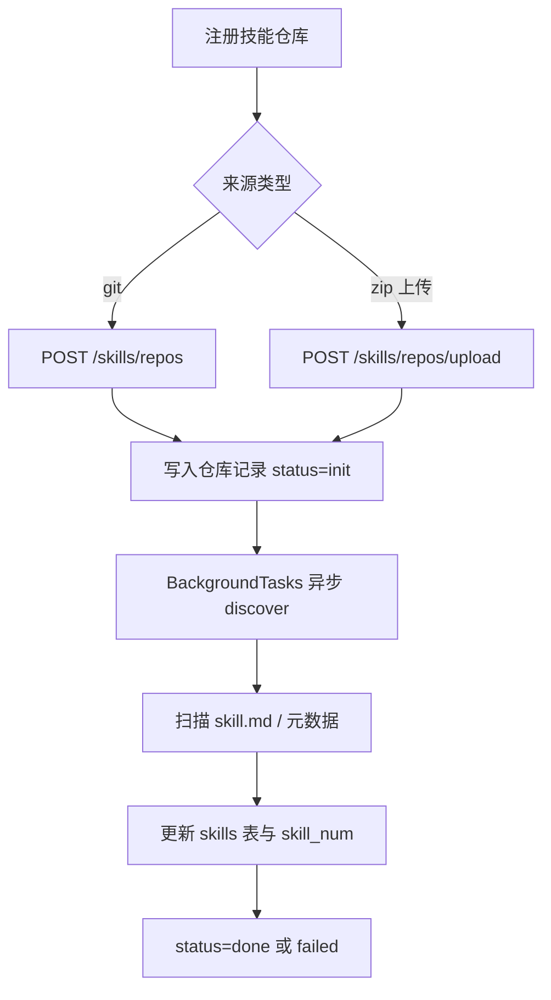
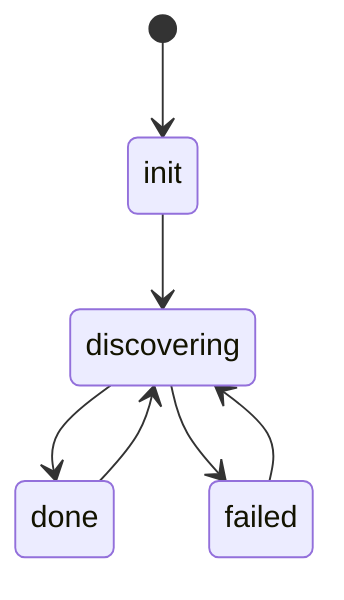

# Witty-Service 端到端测试流程

本文档给出当前 `witty-service` 的完整 E2E（End-to-End）测试方式，覆盖：

1. 本地手工联调
2. 自动化 E2E（pytest）
3. 故障排查清单

当前接口基线：
- Agent 生命周期：`/agents/*`
- Session：`/agents/{agent_id}/sessions/*`
- 消息接口：`/agents/{agent_id}/sessions/{session_id}/messages`、`/agents/{agent_id}/sessions/{session_id}/messages/stream`
- 健康检查：`/healthz`

## 1. 开发环境设置

### 1.1 创建虚拟环境（如果还没有）

```bash
uv venv
source .venv/bin/activate
```

### 1.2 安装依赖（包含开发依赖）

```bash
uv pip install -e ".[dev]"
```

### 1.3 启动开发服务器

```bash
uv run uvicorn witty_service.main:create_app --factory --host 0.0.0.0 --port 8000 --reload
```

建议准备：
- `curl`（HTTP 请求）
- WebSocket 客户端（示例里使用 `websocket-client`）

## 2. 构建与部署

### 2.1 构建 pip 包

```bash
uv build
```

构建产物会生成在 `dist/` 目录下：
- `witty_service-0.1.0-py3-none-any.whl` - Wheel 包
- `witty_service-0.1.0.tar.gz` - Source 包

### 2.2 安装包

```bash
uv pip install dist/witty_service-0.1.0-py3-none-any.whl
```

### 2.3 生产环境启动

```bash
uv run witty-service --host 0.0.0.0 --port 8000 --workers 4
```

### 2.4 启动参数说明

| 参数 | 说明 | 默认值 |
|------|------|--------|
| `--host` | 绑定的主机地址 | 127.0.0.1 |
| `--port` | 绑定的端口 | 8000 |
| `--log-level` | 日志级别 | info |
| `--reload` | 开发模式自动重载 | False |
| `--workers` | 工作进程数 | 1 |

健康检查：

```bash
curl -s http://127.0.0.1:8000/healthz
```

期望返回：

```json
{"status":"ok"}
```

## 3. 接口模型（输入/输出）

### 3.1 通用错误模型

所有业务错误统一返回：

```json
{
  "error": {
    "code": "ERROR_CODE",
    "message": "error message",
    "details": {}
  }
}
```

字段说明：
- `code`: 稳定错误码
- `message`: 人类可读错误信息
- `details`: 可选，结构化错误细节

### 3.2 接口总览

| 接口 | 方法 | 描述 |
|---|---|---|
| `/healthz` | `GET` | 服务存活检查 |
| `/agents` | `POST` | 创建 Agent |
| `/agents` | `GET` | 列出所有 Agent |
| `/skills/repos` | `GET` | 查询技能仓库列表 |
| `/skills/repos` | `POST` | 通过 Git 仓库注册技能仓库，并异步触发 discover |
| `/skills/repos/upload` | `POST` | 上传 ZIP 压缩包注册本地技能仓库，并异步触发 discover |
| `/skills/repos/{repo_id}` | `GET` | 查询单个技能仓库详情 |
| `/skills/repos/{repo_id}` | `PATCH` | 更新技能仓库配置 |
| `/skills/repos/{repo_id}` | `DELETE` | 删除技能仓库及其本地归档/解压目录 |
| `/skills/discover` | `POST` | 扫描全部技能仓库，刷新技能索引 |
| `/skills/discover/{repo_id}` | `POST` | 扫描指定技能仓库，刷新技能索引 |
| `/skills/skills` | `GET` | 查询已发现的技能清单 |
| `/agents/{agent_id}` | `GET` | 获取 Agent 详情 |
| `/agents/{agent_id}` | `DELETE` | 删除 Agent |
| `/agents/{agent_id}/pause` | `POST` | 暂停 Agent |
| `/agents/{agent_id}/resume` | `POST` | 恢复 Agent |
| `/agents/{agent_id}/skills/` | `POST` | 为 agent 安装技能，并写入安装记录 |
| `/agents/{agent_id}/skills/installed` | `GET` | 查询已安装技能：查询本地数据库，返回 agent 已安装的技能列表 |
| `/agents/{agent_id}/skills/installed/sync` | `POST` | 从 runtime 拉取已安装技能并同步本地记录 |
| `/agents/{agent_id}/skills/uninstall` | `POST` | 卸载 agent 已安装技能，并清理本地记录 |
| `/agents/{agent_id}/sessions` | `GET` | 列出所有会话 |
| `/agents/{agent_id}/sessions` | `POST` | 创建会话 |
| `/agents/{agent_id}/sessions/{session_id}` | `GET` | 获取会话详情 |
| `/agents/{agent_id}/sessions/{session_id}` | `DELETE` | 删除会话 |
| `/agents/{agent_id}/sessions/{session_id}/messages` | `POST` | 发送消息 |
| `/agents/{agent_id}/sessions/{session_id}/messages/stream` | `POST` | 发送消息并以 SSE 流返回 |
| `/agents/{agent_id}/sessions/{session_id}/messages/stream/reconnect` | `POST` | SSE 流重连：重新连接到已有消息流，通过 WebSocket 接收事件 |
| `/agents/{agent_id}/sessions/{session_id}/events` | `GET` | 查询会话事件回放 |
| `/agents/{agent_id}/sessions/{session_id}/abort` | `POST` | 中止会话：中止正在运行的会话 |
| `/agents/{agent_id}/conversations` | `GET` | 列出会话摘要：查询本地数据库，返回会话列表及最新消息摘要 |
| `/agents/{agent_id}/conversations/{session_id}` | `GET` | 获取会话详情：查询本地数据库，支持消息分页（limit/before） |
| `/agents/{agent_id}/conversations/{session_id}` | `PATCH` | 更新会话元数据：修改标题、置顶状态，仅更新本地数据库 |
| `/models` | `POST` | 添加大模型配置 |
| `/models` | `GET` | 获取大模型列表 |
| `/models/{model_id}` | `PUT` | 更新大模型配置 |
| `/models/{model_id}` | `DELETE` | 删除大模型配置 |
| `/mcp-servers` | `POST` | 添加 MCP Server 配置 |
| `/mcp-servers` | `GET` | 获取 MCP Server 列表 |
| `/mcp-servers/{server_id}` | `PUT` | 更新 MCP Server 配置 |
| `/mcp-servers/{server_id}` | `DELETE` | 删除 MCP Server 配置 |
| `/agents/{agent_id}/mcp-servers/{server_id}/enable` | `POST` | 启用 MCP Server：执行 `_setup_mcp`，将配置应用到 runtime |
| `/agents/{agent_id}/mcp-servers/{server_id}/disable` | `POST` | 卸载 MCP Server：执行 `openclaw mcp unset`，从 runtime 移除配置 |

说明：
- `GET /agents/{agent_id}/sessions`
- `POST /agents/{agent_id}/sessions`
- `GET /agents/{agent_id}/sessions/{session_id}`
- `DELETE /agents/{agent_id}/sessions/{session_id}`
- `GET /agents/{agent_id}/sessions/{session_id}/events`

以上接口均支持可选 query 参数 `runtime_agent_id`，用于指定远端 `witty-agent-server` 中的 runtime agent（例如 OpenClaw subagent）。
未显式传入时，`witty-service` 会调用远端 `/agent/list`，优先使用 `defaultId`，若不存在则回退到 `default=true` 的条目。

Agent 接口与 `runtime_agent_id` 的关系：
- `witty-service` 自己的 `agent_id` 表示一个沙箱内的 `witty-agent-server` 进程实例
- 远端 `runtime_agent_id` 表示该进程内的 runtime agent / OpenClaw subagent
- `POST /agents`、`GET /agents`、`GET /agents/{agent_id}`、`DELETE /agents/{agent_id}`、`POST /agents/{agent_id}/pause`、`POST /agents/{agent_id}/resume` 这些 Agent 生命周期接口**不直接接收** `runtime_agent_id`
- `runtime_agent_id` 只影响 session 相关接口的远端路由选择，不改变 `witty-service` 自己的 agent 主键语义

### 3.3 Skills 仓库与技能目录接口

这一组接口由 `src/witty_service/api/skills.py` 提供，统一挂载在 `/skills` 前缀下，并要求 Bearer Token 认证。

#### 1. 技能仓库生命周期

支持两类可注册仓库来源：

| `source_type` | 说明 | 必填字段 |
| --- | --- | --- |
| `git` | 从 Git 仓库拉取技能目录 | `url` |
| `local` | 从本地 ZIP 归档注册技能目录 | `local_path`（通常由上传接口生成） |

说明：
- `builtin`、`clawhub` 会出现在技能记录的来源字段中，但当前不作为 `POST /skills/repos`、`PATCH /skills/repos/{repo_id}` 的可写入来源。
- Git 仓库名会按 `url[@branch]` 归一化后生成，重复注册会返回 `400`。
- 上传 ZIP 时会校验压缩包格式、大小、文件数量和解压后总体积。



#### 2. `GET /skills/repos`

- 接口描述：列出所有已注册技能仓库
- 输出 `200`：`list[SkillRepositoryResponse]`

```json
[
  {
    "repo_id": "repo-uuid",
    "repo_name": "https://github.com/example/skills@main",
    "source_type": "git",
    "branch": "main",
    "url": "https://github.com/example/skills",
    "local_path": "/home/user/witty-service/skill-repositories/skills-repo-uuid",
    "skill_discover_status": "done",
    "skill_num": 12
  }
]
```

#### 3. `POST /skills/repos`

- 接口描述：注册一个 Git 技能仓库，并异步开始扫描
- 输入（`SkillRepositoryRequest`）：

| 字段 | 类型 | 必填 | 说明 |
| --- | --- | --- | --- |
| `source_type` | string | 是 | 固定为 `git` |
| `url` | string | 是 | Git clone 地址，支持 HTTPS / SSH，服务端会做归一化 |
| `branch` | string | 否 | 指定分支；为空时 discover 后会自动回填实际分支 |
| `local_path` | string | 否 | Git 来源下忽略 |

- 输出 `201`：`SkillRepositoryResponse`
- 额外说明：
  - 仅创建仓库记录，不会同步等待扫描结束。
  - 接口返回后由 `BackgroundTasks` 调用 discover，初始状态通常为 `init`。

请求示例：

```json
{
  "source_type": "git",
  "url": "https://github.com/example/skills.git",
  "branch": "main"
}
```

#### 4. `POST /skills/repos/upload`

- 接口描述：上传 ZIP 归档注册本地技能仓库，并异步开始扫描
- 请求类型：`multipart/form-data`
- 表单字段：

| 字段 | 类型 | 必填 | 说明 |
| --- | --- | --- | --- |
| `file` | file | 是 | 仅支持 `.zip` 文件 |

- 输出 `201`：`SkillRepositoryResponse`
- 额外说明：
  - 上传文件大小上限为 `50MB`。
  - 解压预校验上限为 `100MB` 总体积、`1000` 个条目。
  - 成功后 `source_type` 为 `local`，`local_path` 指向保存下来的 ZIP 文件路径。

#### 5. `GET /skills/repos/{repo_id}`

- 接口描述：获取单个技能仓库详情
- 输出 `200`：`SkillRepositoryResponse`
- 异常：
  - 仓库不存在时返回 `404`

#### 6. `PATCH /skills/repos/{repo_id}`

- 接口描述：更新技能仓库配置
- 输入（`SkillRepositoryRequest`）：支持局部更新，但仍会校验来源类型和必填字段约束
- 输出 `200`：`SkillRepositoryResponse`
- 说明：
  - 更新 Git 仓库时可修改 `url`、`branch`
  - 更新本地仓库时可修改 `local_path`

#### 7. `DELETE /skills/repos/{repo_id}`

- 接口描述：删除技能仓库记录，并尽量清理本地归档或 clone 目录
- 输出 `204`：无返回内容
- 说明：
  - 若 `local_path` 指向 ZIP 文件，会同时尝试删除归档和对应解压目录
  - 若 `local_path` 指向 clone 目录，会尝试删除整个目录
  - 清理失败只记日志，不阻止仓库记录删除

#### 8. `POST /skills/discover`

- 接口描述：同步扫描全部技能仓库，刷新 skills 索引
- 输出 `200`：`list[SkillRepositoryResponse]`
- 说明：
  - 会逐个仓库更新 `skill_discover_status`
  - 扫描失败时对应仓库会被标记为 `failed`，并清空该仓库下现有技能记录

#### 9. `POST /skills/discover/{repo_id}`

- 接口描述：同步扫描指定仓库
- 输出 `200`：`SkillRepositoryResponse`
- 特殊返回：
  - 当仓库已经处于 discover 中，接口返回 `202 Accepted`
- 常见状态流转：



#### 10. `GET /skills/skills`

- 接口描述：列出当前已发现的技能清单
- 输出 `200`：`list[SkillResponse]`

```json
[
  {
    "skill_id": "skill-uuid",
    "repo_id": "repo-uuid",
    "skill_name": "terminal-helper",
    "relative_path": "skills/terminal-helper/SKILL.md",
    "metadata": {
      "title": "Terminal Helper"
    },
    "skill_source": "git",
    "skill_md_url": "https://github.com/example/skills/blob/main/skills/terminal-helper/SKILL.md"
  }
]
```

`SkillResponse` 字段说明：

| 字段 | 类型 | 说明 |
| --- | --- | --- |
| `skill_id` | string | 技能唯一标识 |
| `repo_id` | string \| null | 所属仓库 ID；第三方聚合来源可能为空 |
| `skill_name` | string | 技能名 |
| `relative_path` | string \| null | `SKILL.md` 相对路径或绝对路径 |
| `metadata` | object | 技能元数据 |
| `skill_source` | string \| null | 技能来源，如 `git`、`local`、`builtin`、`clawhub` |
| `skill_md_url` | string \| null | 技能说明文档地址 |

### 3.4 Agent 生命周期接口

#### 1. `POST /agents`

- 接口描述：创建新 Agent
- 说明：
  - 该接口不接收 `runtime_agent_id`
  - 创建完成后，`witty-service` 会先调用远端 `/agent/start`
  - 然后使用 `/agent/start` 返回的远端 runtime agent id 创建默认 session
  - 因此 `default_session_id` 对应的远端归属由 `witty-agent-server` 当前解析出的默认/启动目标 agent 决定
- 输入（CreateAgentRequest）：

| 字段 | 类型 | 必填 | 说明 |
|------|------|------|------|
| `name` | string | 是 | Agent 名称，最小长度 1 |
| `description` | string | 否 | Agent 描述，默认空字符串 |
| `sandbox_type` | string | 是 | 沙箱类型：`docker`、`local_process`、`e2b` |
| `adapter_type` | string | 是 | 适配器类型：如 `openclaw` |
| `idle_timeout_seconds` | integer | 是 | 空闲超时时间（秒），必须大于 0 |
| `sandbox_id` | string | 否 | 沙箱 ID |
| `has_scheduled_tasks` | boolean | 否 | 是否有定时任务，默认 `false` |
| `model_id` | string | 否 | 模型 ID，关联 `/models` 中配置的模型 |
| `mcp_server_list` | array | 否 | MCP Server ID 列表，关联 `/mcp-servers` 中配置的 MCP Server |

- 输出 `201`（AgentResponse）：

```json
{
  "id": "agent-uuid",
  "name": "my-agent",
  "description": "这是一个测试智能体",
  "sandbox_type": "docker",
  "adapter_type": "openclaw",
  "status": "running",
  "sandbox_id": null,
  "workspace_path": "/path/to/workspace",
  "idle_timeout_seconds": 3600,
  "has_scheduled_tasks": false,
  "mcp_server_list": ["mcp-server-id-1", "mcp-server-id-2"],
  "created_at": "2026-04-10T12:00:00",
  "updated_at": "2026-04-10T12:00:00",
  "default_session_id": "session-uuid"
}
```

| 字段 | 类型 | 说明 |
|------|------|------|
| `id` | string | Agent 唯一标识 |
| `name` | string | Agent 名称 |
| `description` | string | Agent 描述 |
| `sandbox_type` | string | 沙箱类型 |
| `adapter_type` | string | 适配器类型 |
| `status` | string | Agent 状态：`running`、`paused`、`stopped` |
| `sandbox_id` | string \| null | 沙箱 ID |
| `workspace_path` | string | 工作区路径 |
| `idle_timeout_seconds` | integer | 空闲超时时间 |
| `has_scheduled_tasks` | boolean | 是否有定时任务 |
| `model_id` | string \| null | 模型 ID |
| `mcp_server_list` | array | MCP Server ID 列表 |
| `created_at` | datetime | 创建时间 |
| `updated_at` | datetime | 更新时间 |
| `default_session_id` | string \| null | 默认会话 ID |

补充说明：
- `default_session_id` 是 Agent 创建成功后立即创建的默认 session
- 这个默认 session 的远端 `runtime_agent_id` 不是通过 `POST /agents` 入参传入，而是由内部 `/agent/start` 结果决定
- 如果你需要把后续 session 显式路由到某个 remote runtime agent（例如 `dev`），应在 `POST /agents/{agent_id}/sessions?runtime_agent_id=dev` 时传入

#### 2. `GET /agents`

- 接口描述：列出所有 Agent
- 输入：无
- 输出 `200`：`list[AgentResponse]`

```json
[
  {
    "id": "agent-uuid-1",
    "name": "my-agent",
    "description": "这是一个测试智能体",
    "sandbox_type": "docker",
    "adapter_type": "openclaw",
    "status": "running",
    "sandbox_id": null,
    "workspace_path": "/path/to/workspace",
    "idle_timeout_seconds": 3600,
    "has_scheduled_tasks": false,
    "mcp_server_list": ["mcp-server-id-1"],
    "created_at": "2026-04-10T12:00:00",
    "updated_at": "2026-04-10T12:00:00",
    "default_session_id": "session-uuid"
  }
]
```

#### 3. `GET /agents/{agent_id}`

- 接口描述：获取 Agent 详情
- 输入：

| 字段 | 类型 | 位置 | 说明 |
|------|------|------|------|
| `agent_id` | string | path | Agent 唯一标识 |

- 输出 `200`：`AgentResponse`

```json
{
  "id": "agent-uuid",
  "name": "my-agent",
  "description": "这是一个测试智能体",
  "sandbox_type": "docker",
  "adapter_type": "openclaw",
  "status": "running",
  "sandbox_id": null,
  "workspace_path": "/path/to/workspace",
  "idle_timeout_seconds": 3600,
  "has_scheduled_tasks": false,
  "mcp_server_list": ["mcp-server-id-1"],
  "created_at": "2026-04-10T12:00:00",
  "updated_at": "2026-04-10T12:00:00",
  "default_session_id": "session-uuid"
}
```

#### 4. `DELETE /agents/{agent_id}`

- 接口描述：删除 Agent - 备份运行时 → 停止运行时 → 清理沙箱 → 删除本地记录
- 输入：

| 字段 | 类型 | 位置 | 说明 |
|------|------|------|------|
| `agent_id` | string | path | Agent 唯一标识 |

- 输出 `204`：无返回内容

- 说明：
  1. 备份运行时文件到 `~/witty-service/{agent_id}/runtime_backup/`
  2. 调用 witty-agent-server `/agent/stop`
  3. 清理沙箱（docker stop/rm 或 kill process）
  4. 更新 agent 状态为 deleted
  5. **保留 workspace 目录**（不清除，用于后续 resume）

#### 5. `POST /agents/{agent_id}/pause`

- 接口描述：暂停 Agent，保留沙箱状态和所有资源
- 输入：

| 字段 | 类型 | 位置 | 说明 |
|------|------|------|------|
| `agent_id` | string | path | Agent 唯一标识 |

- 输出 `200`：`AgentResponse`（status 变为 `paused`）

```json
{
  "id": "agent-uuid",
  "name": "my-agent",
  "sandbox_type": "docker",
  "adapter_type": "openclaw",
  "status": "paused",
  "sandbox_id": "container-id",
  "workspace_path": "/path/to/workspace",
  "idle_timeout_seconds": 3600,
  "has_scheduled_tasks": false,
  "mcp_server_list": ["mcp-server-id-1"],
  "created_at": "2026-04-10T12:00:00",
  "updated_at": "2026-04-10T12:30:00",
  "default_session_id": "session-uuid"
}
```

#### 6. `POST /agents/{agent_id}/resume`

- 接口描述：恢复已暂停的 Agent，根据状态分支处理
- 输入：

| 字段 | 类型 | 位置 | 说明 |
|------|------|------|------|
| `agent_id` | string | path | Agent 唯一标识 |

- 输出 `200`：`AgentResponse`（status 变为 `running`）

- 分支逻辑：

| 当前状态 | 恢复流程 |
|----------|----------|
| `paused` | 直接调用 `/agent/start` |
| `deleted` / `stopped` | 1. 恢复运行时备份<br>2. 重新启动沙箱<br>3. 调用 `/agent/start` |

```json
{
  "id": "agent-uuid",
  "name": "my-agent",
  "sandbox_type": "docker",
  "adapter_type": "openclaw",
  "status": "running",
  "sandbox_id": "container-id",
  "workspace_path": "/path/to/workspace",
  "idle_timeout_seconds": 3600,
  "has_scheduled_tasks": false,
  "mcp_server_list": ["mcp-server-id-1"],
  "created_at": "2026-04-10T12:00:00",
  "updated_at": "2026-04-10T12:35:00",
  "default_session_id": "session-uuid"
}
```

### 3.5 Agent 技能安装接口

这一组接口由 `src/witty_service/api/agents.py` 中的 skills 相关路由提供，统一挂载在 `/agents/{agent_id}/skills/*`。

设计上分成两层：

- `/skills/*` 管理“可被发现的技能目录”
- `/agents/{agent_id}/skills/*` 管理“某个 agent 已安装了哪些技能”

```mermaid
flowchart LR
    A[技能仓库 /skills/repos] --> B[discover 扫描]
    B --> C[/skills/skills 技能目录]
    C --> D[POST /agents/{agent_id}/skills/]
    D --> E[调用 runtime 安装]
    E --> F[写入 installed_agent_skills]
    F --> G[GET /agents/{agent_id}/skills/installed]
```

#### 1. `POST /agents/{agent_id}/skills/`

- 接口描述：为指定 agent 安装一个已发现技能
- 输入（`InstallAgentSkillRequest`）：

| 字段 | 类型 | 必填 | 说明 |
| --- | --- | --- | --- |
| `skill_id` | string | 是 | 技能唯一标识 |
| `skill_name` | string | 是 | 技能名；主要用于错误详情和日志 |

- 输出 `202`：`AgentSkillResponse`
- 执行流程：
  1. 按 `skill_id` 校验技能是否存在
  2. 解析技能来源目录 `source_path`
  3. 调用 runtime 执行安装
  4. 安装成功后写入本地安装记录

- 关键行为说明：
  - 若 runtime 已安装成功，但本地安装记录写入失败，会返回业务错误 `SKILL_INSTALL_RECORD_FAILED`
  - `source_path` 的解析规则：
    - `relative_path` 为绝对路径：直接取其父目录
    - Git / 本地 ZIP 技能：由仓库 `local_path` 与 `relative_path` 拼接得到
    - `clawhub` 等无本地目录技能：返回 `None`

请求示例：

```json
{
  "skill_id": "skill-uuid",
  "skill_name": "terminal-helper"
}
```

返回示例：

```json
{
  "agent_id": "agent-uuid",
  "skill_id": "skill-uuid",
  "source_type": "git",
  "repo_id": "repo-uuid",
  "skill_name": "terminal-helper",
  "installed_at": "2026-06-03T10:00:00Z",
  "relative_path": "skills/terminal-helper/SKILL.md",
  "metadata": {
    "title": "Terminal Helper"
  },
  "skill_source": "git",
  "skill_md_url": "https://github.com/example/skills/blob/main/skills/terminal-helper/SKILL.md"
}
```

#### 2. `GET /agents/{agent_id}/skills/installed`

- 接口描述：读取本地数据库中该 agent 的已安装技能记录
- 输出 `200`：`list[AgentSkillResponse]`
- 说明：
  - 这是“本地记录视角”，不主动向 runtime 拉取实时状态
  - 若 agent 不存在，返回 `AGENT_NOT_FOUND`

#### 3. `POST /agents/{agent_id}/skills/installed/sync`

- 接口描述：主动从 runtime 拉取已安装技能并同步到本地，再返回最新结果
- 输出 `200`：`list[AgentSkillResponse]`
- 适用场景：
  - runtime 侧已发生技能变化，但本地记录可能未及时更新
  - 前端进入“已安装技能”页面前，想先做一次对齐

#### 4. `POST /agents/{agent_id}/skills/uninstall`

- 接口描述：卸载 agent 上的某个已安装技能
- 输入（`UninstallAgentSkillRequest`）：

| 字段 | 类型 | 必填 | 说明 |
| --- | --- | --- | --- |
| `skill_id` | string | 是 | 已安装技能 ID |

- 输出 `200`：`AgentSkillResponse`，返回的是被卸载前的安装记录
- 执行流程：
  1. 从本地安装记录表查找目标技能
  2. 尝试解析技能目录 `source_path`
  3. 调用 runtime 执行卸载
  4. 删除本地安装记录

- 说明：
  - 若本地安装记录不存在，返回 `SKILL_NOT_FOUND`
  - 若 runtime 卸载成功但本地记录删除失败，返回 `SKILL_UNINSTALL_RECORD_FAILED`

`AgentSkillResponse` 字段说明：

| 字段 | 类型 | 说明 |
| --- | --- | --- |
| `agent_id` | string | 所属 agent |
| `skill_id` | string | 技能 ID |
| `source_type` | string | 安装来源类型 |
| `repo_id` | string \| null | 来源仓库 ID |
| `skill_name` | string | 技能名 |
| `installed_at` | datetime | 安装时间，统一序列化为 UTC ISO8601 |
| `relative_path` | string \| null | 技能文档相对路径 |
| `metadata` | object \| null | 技能元数据 |
| `skill_source` | string \| null | 技能来源 |
| `skill_md_url` | string \| null | 技能说明地址 |

### 3.6 Session 接口

#### 1. `GET /agents/{agent_id}/sessions`

- 接口描述：列出 Agent 的所有会话（以 witty-agent-server 为主，刷新本地缓存）
- 输出 `200`：`list[SessionResponse]`

#### 2. `POST /agents/{agent_id}/sessions`

- 接口描述：创建新会话（透传到 witty-agent-server）
- 输入：空对象 `{}`
- 输出 `201`（SessionResponse）：

```json
{
  "id": "session-uuid",
  "agent_id": "agent-uuid",
  "status": "idle",
  "context_initialized": true,
  "runtime_type": "openclaw",
  "created_at": "2026-04-10T12:00:00",
  "updated_at": "2026-04-10T12:00:00"
}
```

| 字段 | 类型 | 说明 |
|------|------|------|
| `id` | string | 会话唯一标识 |
| `agent_id` | string | 所属 Agent ID |
| `status` | string | 会话运行态：`running`、`idle`、`error` |
| `context_initialized` | boolean | witty-agent-server 是否已完成上下文初始化 |
| `runtime_type` | string | 运行时类型：如 `openclaw` |
| `created_at` | datetime | 创建时间 |
| `updated_at` | datetime | 更新时间 |

- 额外说明：
  - `runtime_agent_id` 是创建前的路由参数。
  - 创建成功后，`witty-service` 会在本地固化 `remote_runtime_agent_id`，后续该 session 的查询、删除、事件回放、消息发送和 WS 连接都会优先使用这个固化值。
  - session 生命周期不再通过 `deleted`、`closed` 之类的状态表达，而是通过“记录是否存在 + 接口行为结果”体现。

#### 3. `GET /agents/{agent_id}/sessions/{session_id}`

- 接口描述：获取会话详情（优先本地，透传 witty-agent-server）
- 输出 `200`：`SessionResponse`

#### 4. `DELETE /agents/{agent_id}/sessions/{session_id}`

- 接口描述：删除会话（透传到 witty-agent-server，删除本地记录）
- 输出 `204`：无返回内容
- 说明：内部会调用远端 `POST /agents/{remote_runtime_agent_id}/sessions/{session_id}/delete`

#### 5. `GET /agents/{agent_id}/sessions/{session_id}/events`

- 接口描述：查询会话事件回放（透传到 witty-agent-server）
- 输入：

| 字段 | 类型 | 位置 | 说明 |
|------|------|------|------|
| `session_id` | string | path | 会话 ID |
| `offset` | integer | query | 分页偏移，默认 0 |
| `limit` | integer | query | 每页数量，默认 50 |

- 输出 `200`（SessionEventPage）：

```json
{
  "items": [
    {
      "id": "event-id",
      "session_id": "session-id",
      "type": "message.delta",
      "source": "assistant",
      "payload": {},
      "timestamp": "2026-03-31T12:34:56.000000Z"
    }
  ],
  "pagination": {
    "offset": 0,
    "limit": 50,
    "total": 1
  }
}
```

### 3.7 消息接口

#### `POST /agents/{agent_id}/sessions/{session_id}/messages`

- 接口描述：witty-service 对外通过 REST 发送消息并返回非流式聚合结果；内部到 `witty-agent-server` 的消息通道仍是 WebSocket
- 输入（SendMessageRequest）：

| 字段 | 类型 | 必填 | 说明 |
|------|------|------|------|
| `content` | string | 是 | 消息内容，最小长度 1 |

```json
{
  "content": "帮我查一下最近的错误日志"
}
```

- 输出 `200`（MessageEventsResponse）：

```json
{
  "sandbox_type": "local_process",
  "events": [
    {
      "type": "message.delta",
      "session_id": "session-id",
      "event_id": "uuid",
      "ts_ms": 1775650000123,
      "runtime_type": "openclaw",
      "payload": {"delta": "当"}
    },
    {
      "type": "message.delta",
      "session_id": "session-id",
      "event_id": "uuid",
      "ts_ms": 1775650000123,
      "runtime_type": "openclaw",
      "payload": {"delta": "前环境"}
    },
    {
      "type": "message.completed",
      "session_id": "session-id",
      "event_id": "uuid",
      "ts_ms": 1775650000123,
      "runtime_type": "openclaw",
      "payload": {"text": "当前工作环境..."}
    }
  ]
}
```

| 字段 | 类型 | 说明 |
|------|------|------|
| `sandbox_type` | string | Agent 的沙箱类型，取值来自 agent 配置的 sandbox backend，例如 `docker`、`local_process`、`e2b` |
| `events` | array | 事件数组，每个事件包含 type、session_id、event_id、ts_ms、runtime_type、payload |

#### `POST /agents/{agent_id}/sessions/{session_id}/messages/stream`

- 接口描述：witty-service 对外通过 REST 提供 SSE 流式返回；内部到 `witty-agent-server` 的消息通道仍是 WebSocket
- 输入（SendMessageRequest）：

| 字段 | 类型 | 必填 | 说明 |
|------|------|------|------|
| `content` | string | 是 | 消息内容，最小长度 1 |

- 响应类型：`text/event-stream`
- 每条 SSE `data:` 的格式：

```text
data: {"sandbox_type":"local_process","event":{"type":"message.delta","session_id":"session-id","event_id":"uuid","ts_ms":1775650000123,"runtime_type":"openclaw","payload":{"delta":"当"}}}
```

- 说明：
  - SSE 中每条 `data:` 对应一个上游事件。
  - `sandbox_type` 取自 Agent 的沙箱类型。
  - `event` 的内容保持上游 envelope 结构，包含来自上游 runtime 的 `runtime_type`，不额外嵌套 `sandbox_type`。
  - session 状态同步规则为：收到运行中事件时更新为 `running`，收到 `message.completed` 后收敛为 `idle`，收到 `client.error` / `stream.error` 或 WS 异常时更新为 `error`。

### 3.8 事件类型

| type | 含义 | payload 关键字段 |
|------|------|------------------|
| `message.delta` | assistant 增量输出 | `delta` |
| `message.completed` | assistant 输出完成 | `text` |
| `tool.call.started` | 工具调用开始 | `tool_name`, `tool_call_id`, `arguments`, `stage` |
| `tool.call.response` | 工具调用结果/过程输出 | `tool_name`, `tool_call_id`, `content`, `is_error`, `stage` |
| `usage.updated` | 用量更新 | `input_tokens`, `output_tokens`, `total_cost` |
| `session.runtime.changed` | runtime session 标识变化 | runtime 原始字段 |
| `stream.error` | 运行时流异常 | `code`, `message` |
| `client.error` | 客户端事件错误 | `code`, `message`, `details` |

### 3.9 大模型配置接口

#### 1. `POST /models`

- 接口描述：添加新的大模型配置
- 输入（CreateModelRequest）：

| 字段 | 类型 | 必填 | 说明 |
|------|------|------|------|
| `name` | string | 是 | 模型名称，如 `gpt-4o`、`claude-3-opus-20240229` |
| `provider` | string | 是 | 模型提供商：`openai`、`anthropic`、`google`、`ollama`、`azure`、`deepseek`、`glm`、`minimax`、`kimi`、`custom` |
| `api_key` | string | 是 | API 密钥 |
| `api_base_url` | string | 否 | API 基础地址，默认根据 provider 自动设置 |
| `description` | string | 否 | 模型描述，默认空字符串 |
| `enabled` | boolean | 否 | 是否启用，默认 `true` |
| `max_tokens` | integer | 否 | 最大输出 tokens 数，默认 4096 |
| `temperature` | number | 否 | 生成温度，范围 0-2，默认 0.7 |
| `is_default` | boolean | 否 | 是否设为默认模型，默认 `false` |

- 输出 `201`（ModelResponse）：

```json
{
  "id": "model-uuid",
  "name": "gpt-4o",
  "provider": "openai",
  "api_base_url": "https://api.openai.com/v1",
  "description": "OpenAI GPT-4 Omni 模型",
  "enabled": true,
  "max_tokens": 4096,
  "temperature": 0.7,
  "is_default": true,
  "created_at": "2026-04-13T10:00:00",
  "updated_at": "2026-04-13T10:00:00"
}
```

| 字段 | 类型 | 说明 |
|------|------|------|
| `id` | string | 模型配置唯一标识 |
| `name` | string | 模型名称 |
| `provider` | string | 模型提供商 |
| `api_base_url` | string | API 基础地址 |
| `description` | string | 模型描述 |
| `enabled` | boolean | 是否启用 |
| `max_tokens` | integer | 最大输出 tokens 数 |
| `temperature` | number | 生成温度 |
| `is_default` | boolean | 是否为默认模型 |
| `created_at` | datetime | 创建时间 |
| `updated_at` | datetime | 更新时间 |

#### 2. `GET /models`

- 接口描述：获取所有大模型配置列表
- 输出 `200`：`list[ModelResponse]`

```json
[
  {
    "id": "model-uuid-1",
    "name": "gpt-4o",
    "provider": "openai",
    "api_base_url": "https://api.openai.com/v1",
    "description": "OpenAI GPT-4 Omni 模型",
    "enabled": true,
    "max_tokens": 4096,
    "temperature": 0.7,
    "is_default": true,
    "created_at": "2026-04-13T10:00:00",
    "updated_at": "2026-04-13T10:00:00"
  },
  {
    "id": "model-uuid-2",
    "name": "claude-3-opus-20240229",
    "provider": "anthropic",
    "api_base_url": "https://api.anthropic.com/v1",
    "description": "Anthropic Claude 3 Opus 模型",
    "enabled": true,
    "max_tokens": 4096,
    "temperature": 0.7,
    "is_default": false,
    "created_at": "2026-04-13T11:00:00",
    "updated_at": "2026-04-13T11:00:00"
  }
]
```

#### 3. `PUT /models/{model_id}`

- 接口描述：更新指定的大模型配置（支持局部更新，仅传入需要修改的字段）
- 输入（`UpdateModelRequest`）：

| 字段 | 类型 | 必填 | 说明 |
|------|------|------|------|
| `model_id` | string | path | 模型配置唯一标识 |
| `name` | string | 否 | 模型名称，如 `gpt-4o` |
| `provider` | string | 否 | 模型提供商，更新时会根据新 provider 自动填充默认 `api_base_url` |
| `api_key` | string | 否 | API 密钥 |
| `api_base_url` | string | 否 | API 基础地址；若不传且 `provider` 有值，则按新 provider 自动设置 |
| `enabled` | boolean | 否 | 是否启用 |
| `max_tokens` | integer | 否 | 最大输出 tokens 数 |
| `temperature` | number | 否 | 生成温度，范围 0-2 |
| `is_default` | boolean | 否 | 是否设为默认模型 |

- 输出 `200`：`ModelResponse`
- 异常：
  - 模型不存在时返回 `404 MODEL_NOT_FOUND`

#### 4. `DELETE /models/{model_id}`

- 接口描述：删除指定的大模型配置
- 输入：

| 字段 | 类型 | 位置 | 说明 |
|------|------|------|------|
| `model_id` | string | path | 模型配置唯一标识 |

- 输出 `204`：无返回内容

**支持的模型提供商及默认 API 地址：**

| Provider | 默认 API Base URL |
|----------|-------------------|
| `openai` | `https://api.openai.com/v1` |
| `anthropic` | `https://api.anthropic.com/v1` |
| `google` | `https://generativelanguage.googleapis.com/v1beta` |
| `ollama` | `http://localhost:11434/v1` |
| `azure` | `https://{resource}.openai.azure.com` |
| `deepseek` | `https://api.deepseek.com/v1` |
| `glm` | `https://open.bigmodel.cn/api/paas/v4` |
| `minimax` | `https://api.minimax.chat/v1` |
| `kimi` | `https://api.moonshot.cn/v1` |
| `custom` | 用户自定义，需通过 `api_base_url` 指定 |

**常见错误码：**

| code | HTTP 状态码 | 说明 |
|------|-------------|------|
| `MODEL_NOT_FOUND` | 404 | 模型配置不存在 |
| `MODEL_DUPLICATE` | 409 | 模型配置已存在 |
| `MODEL_CREATE_FAILED` | 500 | 模型配置创建失败 |
| `MODEL_DELETE_FAILED` | 500 | 模型配置删除失败 |

### 3.10 MCP Server 配置接口

#### 1. `POST /mcp-servers`

- 接口描述：添加新的 MCP Server 配置
- 输入（CreateMcpServerRequest）：

| 字段 | 类型 | 必填 | 说明 |
|------|------|------|------|
| `mcp_server_config` | object | 是 | MCP 配置（JSON 格式），系统自动从配置的 key 中提取 `mcp_server_name` |

- 输出 `201`（McpServerResponse）：

```json
{
  "id": "server-uuid",
  "mcp_server_name": "example-server",
  "mcp_server_config": {
    "example-server": {
      "command": "npx",
      "args": [
        "-y",
        "mcp-server-example"
      ]
    }
  },
  "created_at": "2026-04-13T10:00:00",
  "updated_at": "2026-04-13T10:00:00"
}
```

| 字段 | 类型 | 说明 |
|------|------|------|
| `id` | string | MCP Server 配置唯一标识 |
| `mcp_server_name` | string | MCP Server 名称 |
| `mcp_server_config` | object | MCP 配置（JSON 格式） |
| `created_at` | datetime | 创建时间 |
| `updated_at` | datetime | 更新时间 |

#### 2. `GET /mcp-servers`

- 接口描述：获取所有 MCP Server 配置列表
- 输出 `200`：`list[McpServerResponse]`

```json
[
  {
    "id": "server-uuid-1",
    "mcp_server_name": "example-server",
    "mcp_server_config": {
      "example-server": {
        "command": "npx",
        "args": [
          "-y",
          "mcp-server-example"
        ]
      }
    },
    "created_at": "2026-04-13T10:00:00",
    "updated_at": "2026-04-13T10:00:00"
  }
]
```

#### 3. `PUT /mcp-servers/{server_id}`

- 接口描述：更新指定的 MCP Server 配置（支持局部更新，仅传入需要修改的字段）
- 输入（`UpdateMcpServerRequest`）：

| 字段 | 类型 | 必填 | 说明 |
|------|------|------|------|
| `server_id` | string | path | MCP Server 配置唯一标识 |
| `mcp_server_name` | string | 否 | MCP Server 名称 |
| `mcp_server_config` | object | 否 | MCP 配置（JSON 格式） |

- 输出 `200`：`McpServerResponse`
- 异常：
  - Server 不存在时返回 `404 MCP_SERVER_NOT_FOUND`

#### 4. `DELETE /mcp-servers/{server_id}`

- 接口描述：删除指定的 MCP Server 配置
- 输入：

| 字段 | 类型 | 位置 | 说明 |
|------|------|------|------|
| `server_id` | string | path | MCP Server 配置唯一标识 |

- 输出 `204`：无返回内容

#### 5. `POST /agents/{agent_id}/mcp-servers/{server_id}/enable`

- 接口描述：为指定 Agent 启用 MCP Server，执行 `_setup_mcp` 将配置应用到 runtime
- 输入：

| 字段 | 类型 | 位置 | 说明 |
|------|------|------|------|
| `agent_id` | string | path | Agent 唯一标识 |
| `server_id` | string | path | MCP Server 配置唯一标识 |

- 输出 `200`：`McpServerResponse`
- 执行流程：
  1. 校验 Agent 是否存在且处于运行状态
  2. 根据 `server_id` 查询 MCP Server 配置
  3. 调用 `_setup_mcp` 执行 `openclaw mcp set <mcp_server_name> <config>`
  4. 返回 MCP Server 配置信息

- 说明：
  - 启用失败时仅记录警告日志，不阻断后续操作
  - 若 Agent 未运行，返回 `AGENT_NOT_RUNNING`

#### 6. `POST /agents/{agent_id}/mcp-servers/{server_id}/disable`

- 接口描述：为指定 Agent 卸载 MCP Server，执行 `openclaw mcp unset <mcp_server_name>` 从 runtime 移除配置
- 输入：

| 字段 | 类型 | 位置 | 说明 |
|------|------|------|------|
| `agent_id` | string | path | Agent 唯一标识 |
| `server_id` | string | path | MCP Server 配置唯一标识 |

- 输出 `200`：`McpServerResponse`
- 执行流程：
  1. 校验 Agent 是否存在且处于运行状态
  2. 根据 `server_id` 查询 MCP Server 配置
  3. 调用 `_unset_mcp` 执行 `openclaw mcp unset <mcp_server_name>`
  4. 返回 MCP Server 配置信息

- 说明：
  - 卸载失败时仅记录警告日志，不阻断后续操作
  - 若 Agent 未运行，返回 `AGENT_NOT_RUNNING`

**常见错误码：**

| code | HTTP 状态码 | 说明 |
|------|-------------|------|
| `MCP_SERVER_NOT_FOUND` | 404 | MCP Server 配置不存在 |
| `MCP_SERVER_DUPLICATE` | 409 | MCP Server 配置已存在 |
| `MCP_SERVER_CREATE_FAILED` | 500 | MCP Server 配置创建失败 |
| `MCP_SERVER_DELETE_FAILED` | 500 | MCP Server 配置删除失败 |

### 3.11 常见错误码

| code | HTTP 状态码 | 说明 |
|------|-------------|------|
| `INVALID_AGENT_TRANSITION` | 409 | Agent 状态转换不合法 |
| `AGENT_NOT_FOUND` | 404 | Agent 不存在 |
| `SESSION_NOT_FOUND` | 404 | 会话不存在（两边都查不到） |
| `SESSION_CREATE_FAILED` | 500 | 透传创建会话失败 |
| `SESSION_DELETE_FAILED` | 500 | 透传删除会话失败 |
| `SESSION_LIST_FAILED` | 500 | 透传列出会话失败 |
| `SESSION_AGENT_MISMATCH` | 400 | Session 与 Agent 不匹配 |
| `AGENT_NOT_RUNNING` | 409 | Agent 未运行（可能处于 paused 或 stopped 状态） |
| `SANDBOX_STATE_NOT_FOUND` | 404 | 沙箱状态不存在 |
| `AGENT_CREATE_FAILED` | 500 | Agent 创建失败 |
| `AGENT_PAUSE_FAILED` | 500 | Agent 暂停失败 |
| `AGENT_RESUME_FAILED` | 500 | Agent 恢复失败 |
| `AGENT_DELETE_FAILED` | 500 | Agent 删除失败 |
| `RUNTIME_BACKUP_NOT_FOUND` | 404 | 运行时备份不存在 |
| `RUNTIME_BACKUP_RESTORE_FAILED` | 500 | 恢复备份失败 |
| `RUNTIME_START_FAILED` | 500 | 启动运行时失败 |
| `SKILL_NOT_FOUND` | 404 | 技能不存在，或 agent 上未找到已安装技能记录 |
| `SKILL_SYNC_FAILED` | 500 | 从 runtime 同步已安装技能失败 |
| `SKILL_INSTALL_RECORD_FAILED` | 500 | runtime 已安装成功，但本地安装记录持久化失败 |
| `SKILL_UNINSTALL_RECORD_FAILED` | 500 | runtime 已卸载成功，但本地安装记录删除失败 |

**HTTP 状态码映射规则：**
- 以 `_NOT_FOUND` 结尾 → `404`
- 以 `_NOT_SUPPORTED` 或 `_MISMATCH` 结尾 → `400`
- 以 `INVALID_` 开头 → `409`
- 以 `_FAILED` 结尾 → `500`
- 其他 → `400`

## 4. 手工 E2E 流程（按沙箱场景）

### 4.1 Docker 场景

创建 Agent（`sandbox_type=docker`）：

```bash
AGENT_ID=$(
  curl -s -X POST http://127.0.0.1:8000/agents \
    -H 'content-type: application/json' \
    -H 'authorization: Bearer YOUR_TOKEN' \
    -d '{
      "name": "e2e-docker-agent",
      "description": "Docker 场景测试智能体",
      "sandbox_type": "docker",
      "adapter_type": "openclaw",
      "idle_timeout_seconds": 3600
    }' | jq -r '.id'
)
```

创建 Session：

```bash
SESSION_ID=$(
  curl -s -X POST "http://127.0.0.1:8000/agents/${AGENT_ID}/sessions?runtime_agent_id=dev" \
    -H 'content-type: application/json' \
    -H 'authorization: Bearer YOUR_TOKEN' \
    -d '{}' | jq -r '.id'
)
```

说明：
- 若不传 `runtime_agent_id`，会使用远端默认 runtime agent。
- 若希望显式打到某个 subagent（例如 `dev`），请通过 query 参数传入。

非流式消息接口（`/messages`）：

```bash
curl -s -X POST "http://127.0.0.1:8000/agents/${AGENT_ID}/sessions/${SESSION_ID}/messages" \
  -H 'content-type: application/json' \
  -H 'authorization: Bearer YOUR_TOKEN' \
  -d '{"content": "say hi from docker"}' | jq
```

流式消息接口（`/messages/stream`）：

```bash
curl -N -X POST "http://127.0.0.1:8000/agents/${AGENT_ID}/sessions/${SESSION_ID}/messages/stream" \
  -H 'content-type: application/json' \
  -H 'authorization: Bearer YOUR_TOKEN' \
  -d '{"content": "stream hi from docker"}'
```

清理：

```bash
curl -s -X DELETE "http://127.0.0.1:8000/agents/${AGENT_ID}" \
  -H 'authorization: Bearer YOUR_TOKEN'
```

### 4.2 Local Process 场景

先配置本地 `witty-agent-server` 代码目录：

```bash
export WITTY_AGENT_SERVER_APP_DIR=/path/to/witty-agent-server
```

创建 Agent（`sandbox_type=local_process`）：

```bash
AGENT_ID=$(
  curl -s -X POST http://127.0.0.1:8000/agents \
    -H 'content-type: application/json' \
    -H 'authorization: Bearer YOUR_TOKEN' \
    -d '{
      "name": "e2e-local-agent",
      "description": "Local Process 场景测试智能体",
      "sandbox_type": "local_process",
      "adapter_type": "openclaw",
      "idle_timeout_seconds": 3600
    }' | jq -r '.id'
)
```

创建 Session：

```bash
SESSION_ID=$(
  curl -s -X POST "http://127.0.0.1:8000/agents/${AGENT_ID}/sessions" \
    -H 'content-type: application/json' \
    -H 'authorization: Bearer YOUR_TOKEN' \
    -d '{}' | jq -r '.id'
)
```

非流式消息接口（`/messages`）：

```bash
curl -s -X POST "http://127.0.0.1:8000/agents/${AGENT_ID}/sessions/${SESSION_ID}/messages" \
  -H 'content-type: application/json' \
  -H 'authorization: Bearer YOUR_TOKEN' \
  -d '{"content": "say hi from local"}' | jq
```

流式消息接口（`/messages/stream`）：

```bash
curl -N -X POST "http://127.0.0.1:8000/agents/${AGENT_ID}/sessions/${SESSION_ID}/messages/stream" \
  -H 'content-type: application/json' \
  -H 'authorization: Bearer YOUR_TOKEN' \
  -d '{"content": "stream hi from local"}'
```

可选状态操作：

```bash
curl -s -X POST "http://127.0.0.1:8000/agents/${AGENT_ID}/pause" \
  -H 'authorization: Bearer YOUR_TOKEN'
curl -s -X POST "http://127.0.0.1:8000/agents/${AGENT_ID}/resume" \
  -H 'authorization: Bearer YOUR_TOKEN'
```

清理：

```bash
curl -s -X DELETE "http://127.0.0.1:8000/agents/${AGENT_ID}" \
  -H 'authorization: Bearer YOUR_TOKEN'
```

## 5. Sandbox 类型与配置

### 5.1 docker

在 Docker 容器中运行 adaptor service（`witty-agent-server`）。

**启动行为：**
- 在随机 `host_port` 启动容器
- 将本地 `workspace_path` 挂载到容器的 `/witty-workspace`
- 容器内端口固定为 `8080`

**环境变量：**

| 变量名 | 说明 | 默认值 |
|--------|------|--------|
| `WITTY_DOCKER_HOST` | Docker 服务监听地址 | `127.0.0.1` |
| `WITTY_DOCKER_IMAGE` | 镜像名（不含 tag） | `witty-agent-server` |
| `WITTY_DOCKER_IMAGE_TAG` | 镜像 tag | `latest` |
| `WITTY_DOCKER_CONTAINER_PORT` | 容器内服务端口 | `8080` |
| `WITTY_DOCKER_CONTAINER_WORKSPACE_PATH` | 容器内工作区路径 | `/witty-workspace` |
| `WITTY_DOCKER_STOP_TIMEOUT` | 容器停止超时（秒） | `10` |

**注意事项：**
- `workspace_path` 必须为绝对路径
- 工作区目录必须存在

---

### 5.2 local_process

在本地进程中直接启动 `witty-agent-server`（通过 `uvicorn`）。

**环境变量：**

| 变量名 | 说明 | 默认值 |
|--------|------|--------|
| `WITTY_AGENT_SERVER_APP_DIR` | `witty-agent-server` 代码目录（必填） | 空 |

**注意事项：**
- `WITTY_AGENT_SERVER_APP_DIR` 必须指向有效的 `witty-agent-server` 代码目录
- local process 场景下，每个 `witty-service` agent 都会拉起一个独立的 `witty-agent-server` 进程，并占用一个随机端口
- `witty-service.agent_id` 表示这个本地子进程实例；远端 `runtime_agent_id` 表示该进程内的 OpenClaw subagent，两者不是同一个维度

---

### 5.3 e2b

E2B 云沙箱运行时。**当前未实现**，调用会返回 `SANDBOX_NOT_SUPPORTED` 错误。

---

### 5.4 运行时 endpoint

所有 sandbox 启动后，会生成 `AdapterEndpoint`：

```json
{
  "base_url": "http://127.0.0.1:随机端口",
  "health_url": "http://127.0.0.1:随机端口/ping"
}
```

witty-service 通过 WebSocket 连接至 `base_url` 与 adaptor service 通信。

## 6. 认证

所有 `/agents/*` 接口需要 Bearer Token 认证：

```bash
-H 'authorization: Bearer YOUR_TOKEN'
```

环境变量：

| 变量名 | 说明 |
|--------|------|
| `AUTH_TOKEN` | API 认证 token |

## 7. 自动化测试

```bash
uv run pytest tests/unit/ -q
uv run pytest tests/e2e/ -q
```

全量测试：

```bash
uv run pytest tests/ -q
```

## 8. 故障排查

- `AGENT_NOT_FOUND`：Agent 不存在，检查 agent_id 是否正确
- `SESSION_NOT_FOUND`：会话不存在（两边都查不到），检查 session_id 是否正确
- `RUNTIME_AGENT_DEFAULT_NOT_FOUND`：未显式传 `runtime_agent_id`，且远端 `/agent/list` 没有可用默认 agent
- `RUNTIME_AGENT_ID_MISSING`：本地 session 未固化远端 runtime agent id，无法继续路由
- `SESSION_CREATE_FAILED`：创建会话失败，透传到 witty-agent-server 失败，检查 witty-agent-server 是否正常运行
- `SESSION_DELETE_FAILED`：删除会话失败，透传到 witty-agent-server 失败
- `SESSION_LIST_FAILED`：列出会话失败，透传到 witty-agent-server 失败
- `SESSION_AGENT_MISMATCH`：Session 与 Agent 不匹配，确认 session 属于正确的 Agent
- `AGENT_NOT_RUNNING`：Agent 未运行（可能处于 paused 或 stopped 状态），先调用 `/resume`
- `RUNTIME_BACKUP_NOT_FOUND`：运行时备份不存在，可能该 Agent 未执行过 delete 操作
- `RUNTIME_BACKUP_RESTORE_FAILED`：恢复备份失败，检查备份文件是否完整
- 消息发送无响应：确认 witty-agent-server 的 WebSocket 连接正常
- local_process 创建 Agent 返回 500：优先检查 `WITTY_AGENT_SERVER_APP_DIR` 是否正确，以及子进程里的 `witty-agent-server` 是否能正常响应 `/ping`

## 9. 环境变量

| 变量名 | 说明 | 默认值 |
|--------|------|--------|
| `AUTH_TOKEN` | API 认证 token | 空 |
| `WITTY_DOCKER_HOST` | Docker 主机地址 | `127.0.0.1` |
| `WITTY_DOCKER_IMAGE` | Docker 镜像名 | `witty-agent-server` |
| `WITTY_DOCKER_IMAGE_TAG` | Docker 镜像标签 | `latest` |
| `WITTY_DOCKER_CONTAINER_PORT` | 容器端口 | `8080` |
| `WITTY_AGENT_SERVER_APP_DIR` | 本地进程模式 app 目录 | 空 |
