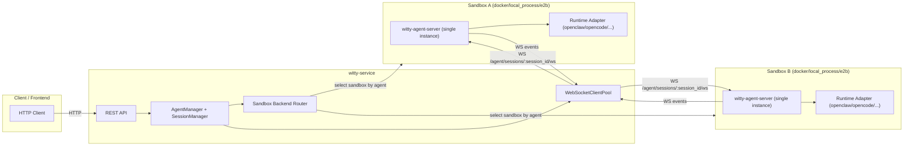
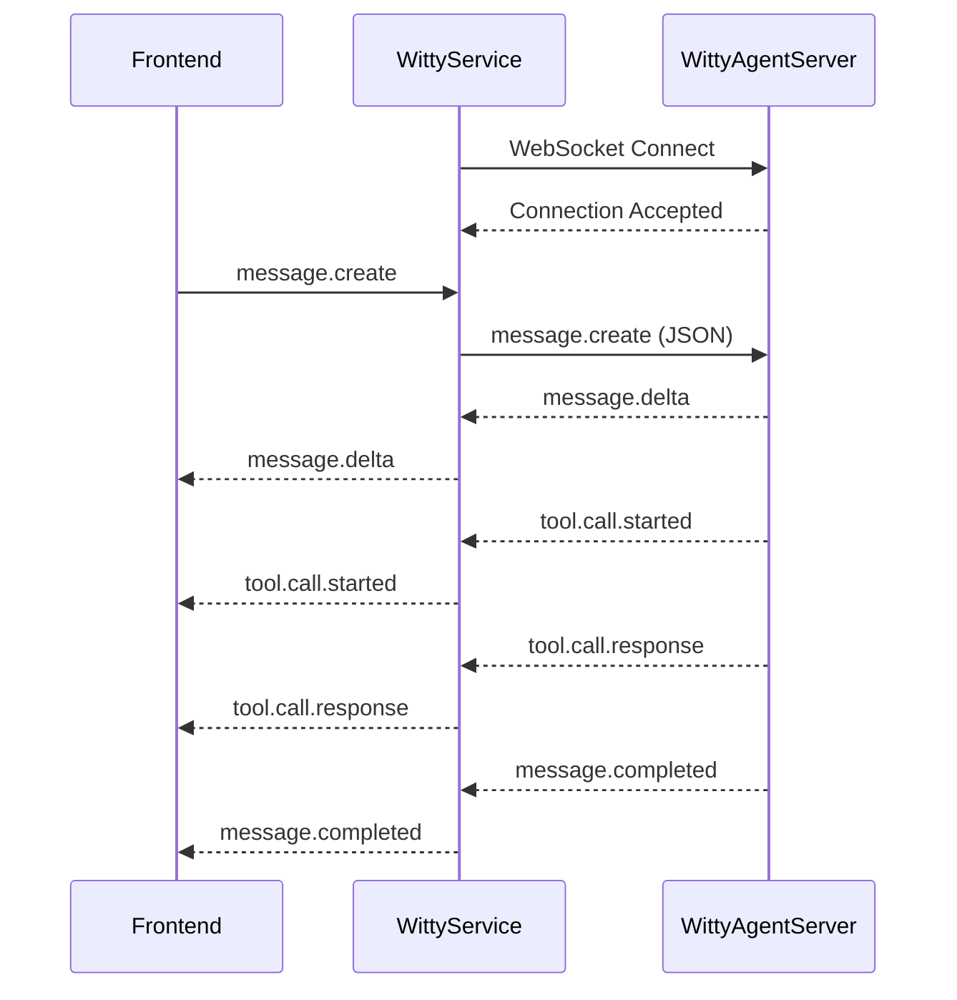

# Witty-Service WebSocket Adaptor 通信设计文档

- 日期：2026-04-13
- 版本：v3.0（Session Proxy 重构 + 运行时备份恢复）
- 状态：待实现
- 对齐：witty-agent-server v2.2

## 1. 概述

### 1.1 目标

将 witty-service 与 adaptor service（witty-agent-server）之间的通信从 HTTP/SSE 改为纯 WebSocket，支持 `docker` / `local_process` / `e2b` 三种沙箱运行方式，并明确 witty-service、沙箱、witty-agent-server、runtime 的部署边界。

### 1.2 设计原则

| 原则 | 说明 |
|------|------|
| 纯 WebSocket | 所有消息通过 WebSocket 传输，不使用 HTTP/SSE 到 witty-agent-server |
| Session Proxy | witty-service 作为 Session 的 Proxy，Session 生命周期全部透传到 witty-agent-server |
| 本地存储 | witty-service 本地存储 session 相关信息（agent_id, status, created_at 等） |
| 双向聚合 | List Sessions 时，本地 + witty-agent-server 聚合结果 |
| 优雅操作 | pause 调用 `/agent/stop` 优雅停止运行时，不清理沙箱 |
| 沙箱与 runtime 解耦 | `sandbox_type` 仅描述部署环境，`runtime_type` 由 witty-agent-server 内部适配 |
| 运行时备份 | delete 时备份运行时文件到本地，resume 时恢复 |

### 1.3 关键变更（相对 v2.2）

1. **Session Proxy 模式**：Session 创建/查询/删除/事件回放全部透传到 witty-agent-server
2. **Pause 流程改进**：只调 `/agent/stop`，不清理沙箱，保持 `paused` 状态
3. **Delete 流程新增**：备份运行时文件 → 调 `/agent/stop` → 清理沙箱
4. **Resume 分支逻辑**：
   - `paused` → 直接调 `/agent/start`
   - `deleted` → 恢复备份 → 重新启动沙箱 → 调 `/agent/start`
5. **目录结构变更**：`LocalWorkspaceStore` base_path 改为 `~/witty-service/`

---

## 2. 架构设计

### 2.1 系统架构图



### 2.2 消息流



### 2.3 部署视图关系（4层）

1. `witty-service` 负责 Agent 生命周期、会话管理、沙箱路由和 WS 转发。
2. 每个沙箱内只运行一个 `witty-agent-server` 实例（单沙箱单 Agent + Adapter）。
3. `witty-agent-server` 内部按 `runtime_type` 选择运行时适配器（`openclaw`、`opencode` 等）。
4. 消息事件结构由 `witty-agent-server` 统一定义，`witty-service` 不改写 `tool.*` 事件语义。

### 2.4 local_process 场景部署关系

| 关系 | 说明 |
|------|------|
| Agent ↔ Process | **1:1** - 每个 Agent 对应一个独立的 witty-agent-server 进程 |
| Agent ↔ Port | **1:1** - 每个 Agent 占用一个独立的随机端口 |
| Agent ↔ Workspace | **1:1** - 每个 Agent 拥有独立的工作区目录 |
| WebSocket 连接 | 每个 Agent 通过独立的 WebSocket 连接与对应的 witty-agent-server 通信 |

**进程启动流程：**

```
Agent 创建请求
     ↓
LocalProcessSandboxBackend.start(agent_id, workspace_path)
     ↓
subprocess.Popen(["uv", "run", "uvicorn", "witty_agent_server.app:create_app", ...])
     ↓
witty-agent-server 进程启动，随机端口监听 (如 127.0.0.1:50001)
     ↓
WebSocketClientPool 建立连接 → /agent/sessions/{session_id}/ws
```

**多 Agent 隔离示例：**

| Agent | Process PID | Port | WebSocket Endpoint |
|-------|-------------|------|-------------------|
| agent-A | 12345 | 50001 | ws://127.0.0.1:50001/agent/sessions/{session_id}/ws |
| agent-B | 12346 | 50002 | ws://127.0.0.1:50002/agent/sessions/{session_id}/ws |
| agent-C | 12347 | 50003 | ws://127.0.0.1:50003/agent/sessions/{session_id}/ws |

---

## 3. 组件设计

### 3.1 WebSocket 客户端接口

```python
# src/adapter/websocket_protocol.py

from typing import Any, TypedDict


class InboundEvent(TypedDict):
    """来自 adaptor service 的事件"""
    type: str
    session_id: str
    runtime_type: str
    event_id: str
    ts_ms: int
    payload: dict[str, Any]


class OutboundMessage(TypedDict, total=False):
    """发给 adaptor service 的消息"""
    type: str
    payload: dict[str, Any]


class WebSocketAdapterClient(Protocol):
    """WebSocket 适配器客户端接口"""

    @property
    def is_connected(self) -> bool:
        """检查连接状态"""
        ...

    async def connect(self, session_id: str) -> None:
        """连接到 adaptor service 的 WebSocket 端点"""
        ...

    async def disconnect(self) -> None:
        """断开连接"""
        ...

    async def send(self, message: OutboundMessage) -> None:
        """发送消息到 adaptor service"""
        ...

    async def recv(self) -> Iterator[InboundEvent]:
        """接收来自 adaptor service 的事件流"""
        ...

    async def close(self) -> None:
        """关闭连接"""
        ...
```

### 3.2 WebSocket 客户端池

```python
# src/adapter/websocket_client_pool.py

from dataclasses import dataclass
from typing import Callable


@dataclass(frozen=True)
class AdaptorEndpoint:
    """Adaptor 服务端点信息"""
    base_url: str          # ws://host:port
    session_id: str        # 当前会话 ID
    runtime_type: str      # openclaw / opencode


class WebSocketClientPool:
    """
    管理多个 WebSocket 客户端连接
    支持多个 adaptor service 实例
    """

    def __init__(self) -> None:
        self._clients: dict[str, WebSocketAdapterClient] = {}

    def get_client(
        self,
        agent_id: str,
        endpoint: AdaptorEndpoint,
        factory: Callable[[str], WebSocketAdapterClient],
    ) -> WebSocketAdapterClient:
        """获取或创建到特定 adaptor service 的 WebSocket 客户端"""
        ...

    def remove_client(self, agent_id: str) -> None:
        """移除指定 agent 的 WebSocket 客户端"""
        ...

    def close_all(self) -> None:
        """关闭所有客户端连接"""
        ...
```

### 3.3 RuntimeBackend 接口扩展

```python
# src/runtime/base.py (现有)

@dataclass(slots=True, frozen=True)
class AdapterEndpoint:
    base_url: str
    health_url: str | None = None
```

扩展添加 `ws_url` 属性：

```python
    @property
    def ws_url(self) -> str:
        """构建 WebSocket 连接 URL 模板"""
        if self.base_url.startswith("https"):
            scheme = "wss"
        else:
            scheme = "ws"
        host = self.base_url.split("://")[-1]
        return f"{scheme}://{host}/agent/sessions/{{session_id}}/ws"

    def ws_endpoint(self, session_id: str) -> str:
        """获取特定会话的 WebSocket URL"""
        if self.base_url.startswith("https"):
            scheme = "wss"
        else:
            scheme = "ws"
        host = self.base_url.split("://")[-1]
        return f"{scheme}://{host}/agent/sessions/{session_id}/ws"
```

### 3.4 AgentManager 集成（非流式 + SSE 流式）

```python
# src/application/agent_manager.py (修改)

async def send_message(
    self,
    agent_id: str,
    session_id: str,
    content: str,
) -> list[dict[str, Any]]:
    # ... 现有验证逻辑 ...

    # 获取 WebSocket 客户端
    ws_client = self._ws_client_pool.get_client(
        agent_id=agent_id,
        endpoint=self._get_adaptor_endpoint(agent_id, session_id),
        factory=lambda url: WebSocketClient(base_url=url),
    )

    # 确保连接
    if not ws_client.is_connected:
        await ws_client.connect(session_id)

    # 发送消息
    await ws_client.send({
        "type": "message.create",
        "payload": {"message": content},
    })

    # 接收事件（迭代器）
    events = []
    async for event in ws_client.recv():
        events.append(event)
        if event["type"] == "message.completed":
            break

    return {
        "sandbox_type": agent.sandbox_type,
        "events": events,
    }

async def send_message_stream(
    self,
    agent_id: str,
    session_id: str,
    content: str,
) -> AsyncIterator[dict[str, Any]]:
    # ...与 send_message 共享前置校验和 message.create 发送...
    async for event in ws_client.recv():
        yield {
            "sandbox_type": agent.sandbox_type,
            "event": event,
        }
        if event["type"] == "message.completed":
            break

def _get_adaptor_endpoint(self, agent_id: str, session_id: str) -> AdaptorEndpoint:
    """获取 adaptor WebSocket 端点"""
    runtime_state = self._get_runtime_state(agent_id)
    base_url = runtime_state.adapter_base_url
    # http://host:port -> ws://host:port
    if base_url.startswith("https"):
        scheme = "wss"
    elif base_url.startswith("http"):
        scheme = "ws"
    else:
        scheme = "ws"
    host = base_url.split("://")[-1]
    ws_base_url = f"{scheme}://{host}"

    return AdaptorEndpoint(
        base_url=ws_base_url,
        session_id=session_id,
        runtime_type=self._get_agent(agent_id).runtime_type,
    )
```

---

## 4. 协议设计

与 witty-agent-server v2.2 保持一致。

### 4.1 入站消息（Client → Adaptor）

**仅支持 `message.create`**：

```json
{
  "type": "message.create",
  "payload": {
    "message": "帮我查一下最近的错误日志"
  }
}
```

> **注意**：v2.2 移除了 `approval.resolve` 等入站事件。witty-service 无需处理任何审批相关的消息。

### 4.2 出站事件（Adaptor → Client）

`witty-service` 接收并透传的上游统一 envelope：

```json
{
  "type": "message.delta",
  "session_id": "session-id",
  "runtime_type": "openclaw",
  "event_id": "uuid-event-id",
  "ts_ms": 1712650000123,
  "payload": {}
}
```

约束：

1. `events[]` 内单条事件 envelope 保持上游原样（含 `runtime_type`）。
2. 事件内不再包含 `sandbox_type`（不兼容移除）。
3. `sandbox_type` 仅由 witty-service 在 API 响应层补充。

### 4.3 事件类型（与 witty-agent-server 对齐）

| type | 含义 | payload 关键字段 |
|------|------|------------------|
| `message.delta` | assistant 增量输出 | `delta` |
| `message.completed` | assistant 输出完成 | `text` |
| `tool.call.started` | 工具调用开始 | `tool_name`, `tool_call_id`, `arguments`, `stage` |
| `tool.call.response` | 工具结果 | `name`, `tool_call_id`, `content`, `is_error`, `stage` |
| `usage.updated` | 用量更新 | `input_tokens`, `output_tokens`, `total_cost` |
| `thinking` | 思考内容（可选） | `thinking`, `signature` |
| `session.runtime.changed` | runtime session 标识变化 | `runtime_session_id` 等 runtime 字段 |
| `stream.error` | 运行时流异常 | `code`, `message` |
| `client.error` | 客户端事件错误 | `code`, `message`, `details` |

### 4.4 OpenClaw 事件映射

| OpenClaw 原始事件 | 标准事件 | 说明 |
|------------------|----------|------|
| `agent(stream=assistant)` | `message.delta` | assistant 流式 token |
| `chat(state=final/error)` | `message.completed` | 一轮消息结束 |
| `session.message(delta)` | `message.delta` | session 维度增量 |
| `session.message(message)` | `usage.updated`/`tool.*`/`message.completed` | 从 message 内容抽取 |
| `session.tool` | `tool.call.started`/`tool.call.response` | 由 runtime 事件归一化后输出 |
| `session.usage` | `usage.updated` | 直接映射 |
| `sessions.changed` | `session.runtime.changed` | 运行时 session 标识更新 |

> **注意**：v2.2 移除了 `exec.approval.*` 事件的映射。runtime 层不再透传审批相关事件。

### 4.5 非流式接口响应（保留）

`POST /api/v1/agents/{agent_id}/sessions/{session_id}/messages`

```json
{
  "sandbox_type": "docker",
  "events": [
    {
      "type": "message.delta",
      "session_id": "session-id",
      "runtime_type": "openclaw",
      "event_id": "uuid",
      "ts_ms": 1775650000123,
      "payload": {
        "delta": "hello"
      }
    }
  ]
}
```

### 4.6 SSE 流式接口响应（新增）

`POST /api/v1/agents/{agent_id}/sessions/{session_id}/messages/stream`

- 请求体：与 `POST /messages` 相同，沿用 `SendMessageRequest`
- 响应头：`Content-Type: text/event-stream`
- 每条 SSE 的 `data:` 为 JSON，格式如下：

```json
{
  "sandbox_type": "docker",
  "event": {
    "type": "message.delta",
    "session_id": "session-id",
    "runtime_type": "openclaw",
    "event_id": "uuid",
    "ts_ms": 1775650000123,
    "payload": {
      "delta": "hello"
    }
  }
}
```

结束规则：

1. 收到 `message.completed` 后发送最后一条 SSE 并关闭连接。
2. 参数校验或首事件前业务异常，直接返回 HTTP 4xx/5xx JSON（不进入 SSE 流）。
3. `event` 内容保持上游 envelope（含 `runtime_type`），witty-service 不改写事件字段。

### 4.7 当前实现补充（v2.2）

1. `POST /messages` 与 `POST /messages/stream` 均复用 `WebSocketClientPool`，内部到 witty-agent-server 的消息通道统一为 WebSocket。
2. `MessageEventsResponse` 顶层返回 `sandbox_type`；`events[]` 内不再返回 `sandbox_type`。
3. SSE 输出格式为 `data: {sandbox_type, event}`，其中 `event` 即上游标准事件 envelope。

### 4.8 接口映射表

#### 4.8.1 通信架构

| 组件 | 协议 | 角色 |
|------|------|------|
| witty-service | HTTP REST | API网关，对外暴露 |
| witty-agent-server | WebSocket | Agent运行时服务 |

#### 4.8.2 核心接口映射

**witty-agent-server HTTP API 概览：**

| 端点 | 方法 | 说明 |
|------|------|------|
| `/v1/ping` | GET | 健康检查 |
| `/v1/server/capabilities` | GET | 服务器能力 |
| `/v1/agent/start` | POST | 启动 Agent runtime（内部调用） |
| `/v1/agent/stop` | POST | 停止 Agent runtime（内部调用） |
| `/v1/agent/status` | GET | 获取 Agent 状态（内部调用） |
| `/v1/sessions/{session_id}/ws` | WebSocket | 消息通信 |

**witty-service → witty-agent-server 接口映射：**

| witty-service HTTP API | witty-agent-server 接口 | 说明 |
|------------------------|------------------------|------|
| `GET /healthz` | NA | 服务存活检查，witty-service 自检 |
| `POST /api/v1/agents` | **docker**: Docker Container 启动<br>**local_process**: subprocess.Popen 启动进程 | 创建 Agent：启动沙箱 → 沙箱内部调用 `/v1/agent/start` |
| `GET /api/v1/agents` | NA | 列出所有 Agent，仅查本地数据库 |
| `GET /api/v1/agents/{agent_id}` | NA | 获取 Agent 详情，仅查本地数据库 |
| `DELETE /api/v1/agents/{agent_id}` | 1. 调用 `/v1/agent/stop`<br>2. 备份运行时文件<br>3. 清理沙箱 | 删除 Agent：优雅停止 → 备份 → 清理沙箱 |
| `POST /api/v1/agents/{agent_id}/pause` | 调用 `/v1/agent/stop` | 暂停 Agent：优雅停止运行时，沙箱保持 |
| `POST /api/v1/agents/{agent_id}/resume`<br>（paused 状态） | 调用 `/v1/agent/start` | 恢复 Agent（paused）：直接启动运行时 |
| `POST /api/v1/agents/{agent_id}/resume`<br>（deleted 状态） | 1. 恢复运行时备份<br>2. 重新启动沙箱<br>3. 调用 `/v1/agent/start` | 恢复 Agent（deleted）：备份恢复 → 重新启动沙箱 → 启动运行时 |
| `GET /api/v1/agents/{agent_id}/sessions` | 调用 `GET /v1/agent/sessions` | 列出会话：以 witty-agent-server 为主，刷新本地缓存 |
| `POST /api/v1/agents/{agent_id}/sessions` | 调用 `POST /v1/agent/sessions` | 创建会话：透传到 witty-agent-server，存储到本地缓存 |
| `GET /api/v1/agents/{agent_id}/sessions/{session_id}` | 以 witty-agent-server 为主，透传 `GET /v1/agent/sessions/{session_id}` | 获取会话详情：存储到本地缓存 |
| `DELETE /api/v1/agents/{agent_id}/sessions/{session_id}` | 调用 `DELETE /v1/agent/sessions/{session_id}` | 删除会话：透传删除，删除本地缓存记录 |
| `GET /api/v1/agents/{agent_id}/sessions/{session_id}/events` | 调用 `GET /v1/agent/sessions/{session_id}/events` | 事件回放：透传到 witty-agent-server |
| `POST /api/v1/agents/{agent_id}/sessions/{session_id}/messages` | WebSocket `/v1/sessions/{session_id}/ws`<br>发送: `{"type": "message.create", "payload": {"message": "..."}}` | 非流式消息，通过 WebSocket 通信 |
| `POST /api/v1/agents/{agent_id}/sessions/{session_id}/messages/stream` | WebSocket `/v1/sessions/{session_id}/ws`<br>发送: `{"type": "message.create", "payload": {"message": "..."}}` | SSE 流式消息，通过 WebSocket 通信 |

**说明：**
- witty-service 通过 **SandboxBackend 抽象层** 管理 witty-agent-server 的生命周期
- Session 接口全部透传到 witty-agent-server，本地仅做缓存和聚合
- **docker 场景**：使用 Docker SDK 启动容器，容器内部自行调用 `/v1/agent/start`
- **local_process 场景**：使用 `subprocess.Popen` 直接运行 witty-agent-server 进程，进程内部自行调用 `/v1/agent/start`
- **pause**：调用 `/v1/agent/stop` 优雅停止，沙箱保持运行
- **delete**：调用 `/v1/agent/stop` → 备份运行时文件 → 清理沙箱
- **resume**：
  - `paused` 状态：直接调 `/v1/agent/start`
  - `deleted` 状态：恢复备份 → 重新启动沙箱 → 调 `/v1/agent/start`

#### 4.8.3 事件接收映射（WebSocket → HTTP响应）

| witty-agent-server 事件 | witty-service HTTP响应 | 说明 |
|------------------------|----------------------|------|
| `message.delta` | 非流: `events[].payload.delta` / 流: SSE `data.event.payload.delta` | assistant增量输出 |
| `message.completed` | 结束标志 | assistant输出完成 |
| `tool.call.started` | `events[].payload` | 工具调用开始 |
| `tool.call.response` | `events[].payload` | 工具调用结果 |
| `usage.updated` | `events[].payload` | 用量更新 |
| `session.runtime.changed` | `events[].payload` | runtime session变化 |
| `stream.error` | SSE错误关闭 | 运行时流异常 |
| `client.error` | SSE错误关闭 | 客户端事件错误 |

#### 4.8.4 sandbox_type 与 runtime_type 区分

| 概念 | 所属层 | 说明 |
|------|--------|------|
| `sandbox_type` | witty-service | 部署环境：`docker`/`local_process`/`e2b` |
| `runtime_type` | witty-agent-server | 运行时：`openclaw`/`opencode` |

---

## 5. Session Proxy 模式

### 5.1 设计原则

witty-service 作为 Session 的 Proxy，以 witty-agent-server 为主数据源，本地数据库作为缓存：

1. **创建会话**：透传到 witty-agent-server，存储 session 到本地缓存
2. **列出会话**：以 witty-agent-server 为主，刷新本地缓存
3. **查询会话**：以 witty-agent-server 为主，存储到本地缓存
4. **删除会话**：透传删除到 witty-agent-server，删除本地缓存记录
5. **事件回放**：透传到 witty-agent-server

### 5.2 Session 创建流程

```
POST /api/v1/agents/{agent_id}/sessions
     │
     ▼
1. witty-service 本地验证 agent 存在且状态为 running
     │
     ▼
2. 透传 POST {witty-agent-server}/agent/sessions
     │
     ▼
3. 存储 session 到本地：id, agent_id, status=active, created_at
     │
     ▼
4. 返回 SessionResponse
```

### 5.3 Session 列表流程

```
GET /api/v1/agents/{agent_id}/sessions
     │
     ▼
1. 透传到 witty-agent-server（GET /agent/sessions）
     │
     ▼
2. 以返回结果为主数据源
     │
     ▼
3. 刷新本地数据库缓存（upsert）
     │
     ▼
4. 返回 list[SessionResponse]
```

### 5.4 Session 删除流程

```
DELETE /api/v1/agents/{agent_id}/sessions/{session_id}
     │
     ▼
1. 透传到 witty-agent-server 删除会话
     │
     ▼
2. 删除本地 session 记录
     │
     ▼
3. 返回 204
```

### 5.5 SessionResponse 新增字段

```json
{
  "id": "session-uuid",
  "agent_id": "agent-uuid",
  "status": "active",
  "context_initialized": true,
  "runtime_type": "openclaw",
  "created_at": "2026-04-10T12:00:00",
  "updated_at": "2026-04-10T12:00:00"
}
```

新增字段：
- `context_initialized`: bool - witty-agent-server 创建时返回
- `runtime_type`: string - witty-agent-server 创建时返回

---

## 6. Agent 生命周期（v3.0）

### 6.1 Agent 状态说明

| 状态 | 沙箱 | 运行时 | 说明 |
|------|------|--------|------|
| `creating` | 已创建 | 未启动 | Agent 正在创建 |
| `running` | 运行中 | 运行中 | Agent 正常运行 |
| `paused` | 运行中 | 已停止 | 运行时暂停，沙箱保持 |
| `deleted` | 已清理 | 已停止 | 沙箱已清理，有备份 |
| `error` | 不确定 | 不确定 | 操作失败 |

### 6.2 Pause 流程

```
POST /api/v1/agents/{agent_id}/pause
     │
     ▼
1. 验证 agent 状态为 running
     │
     ▼
2. 调用 witty-agent-server /agent/stop（优雅停止运行时）
     │
     ▼
3. 更新 agent 状态为 paused
     │
     ▼
4. 保持沙箱运行（不清理 docker 容器或 subprocess）
     │
     ▼
5. 返回更新后的 AgentResponse
```

### 6.3 Delete 流程

```
DELETE /api/v1/agents/{agent_id}
     │
     ▼
1. 备份运行时文件
   源：~/.openclaw
   目标：~/witty-service/{agent_id}/runtime_backup/.openclaw
     │
     ▼
2. 调用 witty-agent-server /agent/stop（如果运行时还在运行）
     │
     ▼
3. 清理沙箱
   docker: docker stop/rm
   local_process: kill process
     │
     ▼
4. 更新 agent 状态为 deleted
     │
     ▼
5. 保留 workspace 目录（不清除，用于后续 resume）
     │
     ▼
6. 返回 204
```

> **注意**：Delete 后 workspace 目录保留，用于后续 resume 时继续使用。

### 6.4 Resume 流程（分支逻辑）

```
POST /api/v1/agents/{agent_id}/resume
     │
     ▼
检查 agent 状态：
     │
     ├─── "paused" ────────────────────
     │    │
     │    ▼
     │    1. 验证沙箱是否仍在运行
     │    │
     │    ▼
     │    2. 调用 witty-agent-server /agent/start
     │    │
     │    ▼
     │    3. 更新 agent 状态为 running
     │
     │
     └─── "deleted" ───────
          │
          ▼
     1. 检查运行时备份是否存在
     2. 恢复运行时备份（如果存在）
     3. 重新启动沙箱（挂载 workspace）
     4. 等待沙箱就绪（健康检查）
     5. 调用 witty-agent-server /agent/start
     6. 更新 agent 状态为 running
```

#### 6.4.1 deleted 场景详细说明

**前置条件**：
- Agent 状态为 `deleted`
- Workspace 目录保留在 `~/witty-service/agent-workspaces/{agent_id}/workspace/`
- 运行时备份在 `~/witty-service/{agent_id}/runtime_backup/`

**恢复步骤**：

| 步骤 | 操作 | 说明 |
|------|------|------|
| 1 | 检查备份 | 确认 `runtime_backup` 目录存在 |
| 2 | 恢复运行时 | 将 `runtime_backup/.openclaw` 覆盖到 `~/.openclaw` |
| 3 | 启动沙箱 | docker: `docker run` 重新创建容器，挂载 workspace<br>local_process: `subprocess.Popen` 重新启动进程 |
| 4 | 健康检查 | 轮询 `/v1/ping`，确认沙箱就绪 |
| 5 | 启动运行时 | 调用 `/agent/start` |
| 6 | 更新状态 | 更新 agent 状态为 `running`，sandbox_id 更新 |

**沙箱启动参数**：

| 沙箱类型 | workspace 挂载 | agent_id |
|----------|----------------|----------|
| `docker` | 挂载 `~/witty-service/agent-workspaces/{agent_id}/workspace` → `/witty-workspace` | 新生成 |
| `local_process` | `cwd=workspace_path` | **复用原有 agent_id** |

**异常处理**：

| 场景 | 处理方式 |
|------|----------|
| 备份不存在 | 直接抛异常 `RUNTIME_BACKUP_NOT_FOUND`，状态保持 deleted |
| 沙箱启动失败 | 抛出 `SANDBOX_START_FAILED`，状态保持 deleted |
| 健康检查超时 | 抛出 `SANDBOX_NOT_READY`，状态保持 deleted |
| /agent/start 失败 | 抛出 `RUNTIME_START_FAILED`，状态保持 deleted |

**agent_id 复用**：
- `local_process` 场景下，resume 时使用原有的 `agent_id`
- `agent_id` 不变，workspace 目录不变，只重新启动进程和运行时

#### 6.4.2 paused 场景详细说明

**前置条件**：
- Agent 状态为 `paused`
- 沙箱（docker 容器或 subprocess）仍在运行
- 运行时已停止（通过 `/agent/stop`）

**恢复步骤**：

| 步骤 | 操作 | 说明 |
|------|------|------|
| 1 | 验证沙箱 | 检查 docker 容器或进程是否仍在运行 |
| 2 | 健康检查 | 轮询 `/v1/ping`，确认沙箱就绪 |
| 3 | 启动运行时 | 调用 `/agent/start` |
| 4 | 更新状态 | 更新 agent 状态为 `running` |

**异常处理**：

| 场景 | 处理方式 |
|------|----------|
| 沙箱已停止 | 降级到 deleted 场景，按 deleted 流程处理 |
| 健康检查超时 | 抛出 `SANDBOX_NOT_READY`，状态保持 paused |
| /agent/start 失败 | 抛出 `RUNTIME_START_FAILED`，状态保持 paused |

### 6.5 运行时备份与恢复

**备份时机**：Delete Agent 时

**备份内容**：运行时核心文件，如 openclaw 的 `~/.openclaw` 目录

**备份路径**：`~/witty-service/{agent_id}/runtime_backup/`

**恢复时机**：Resume Agent 时（状态为 deleted）

**恢复逻辑**：
1. 如果备份存在，将备份恢复到运行时默认位置
2. 重新启动沙箱
3. 调用 `/agent/start`

---

## 7. 沙箱与 Runtime 支持

### 7.1 沙箱类型（witty-service 负责）

| sandbox_type | 说明 | 支持状态 |
|--------------|------|----------|
| `local_process` | 本地进程启动 witty-agent-server | 现有支持 |
| `docker` | Docker 容器中运行 witty-agent-server | 现有支持 |
| `e2b` | E2B 云沙箱中运行 witty-agent-server | 目标支持（待补齐实现） |

### 7.2 Runtime 类型（witty-agent-server 负责）

| runtime_type | 说明 | 支持状态 |
|--------------|------|----------|
| `openclaw` | 当前默认 runtime | 现有支持 |
| `opencode` | 扩展 runtime | 规划支持 |

### 7.3 多实例连接

通过 `WebSocketClientPool` 支持同时连接多个 witty-agent-server 实例，每个 agent 拥有独立的 WebSocket 连接。

---

## 8. 接口兼容策略

### 8.1 保留接口

1. 保留 `POST /messages` 作为非流式聚合响应接口。
2. 保留 `POST /messages/stream` 作为 SSE 流式响应接口。

### 8.2 不兼容变更

1. `events[]` 内移除 `sandbox_type` 字段。
2. `sandbox_type` 只在非流式响应顶层返回一次；SSE 场景在每条 `data` 外层返回。
3. `tool` 事件命名与 payload 结构以 witty-agent-server 为准（例如 `tool.call.response`）。
4. `AGENT_NOT_RUNNING` 当前错误映射为 `HTTP 409`。

---

## 9. 目录结构

### 9.1 代码目录结构

```
witty-service/src/
├── adapter/
│   ├── __init__.py
│   ├── exceptions.py               # 适配器异常类
│   ├── websocket_protocol.py       # 协议类型定义
│   ├── websocket_client.py         # WebSocket 客户端实现
│   ├── websocket_client_pool.py    # 客户端连接池
│   └── http_client.py               # 新增：HTTP 客户端（调用 witty-agent-server API）
├── application/
│   ├── agent_manager.py            # 修改：Pause/Resume/Delete 流程改造
│   └── session_manager.py           # 修改：Session 透传
├── runtime/
│   ├── base.py                     # 添加 ws_url 属性
│   ├── local_process.py
│   ├── docker.py
│   ├── e2b.py
│   └── factory.py
├── storage/
│   ├── workspace_store.py          # 修改：base_path 改为 ~/witty-service/
│   └── runtime_backup.py           # 新增：运行时备份/恢复逻辑
├── domain/
│   ├── models.py
│   └── enums.py
├── persistence/
│   └── repositories.py             # 修改：Session 持久化调整
├── api/
│   ├── agents.py                   # 修改：Session 路由调整
│   └── schemas.py                  # 修改：SessionResponse 新增字段
└── main.py
```

### 7.2 数据目录结构

```
~/witty-service/
├── db/                             # 数据库
│   └── witty_service.sqlite3
├── agent-workspaces/{agent_id}/    # 工作区（保持不变）
│   └── workspace/
│       ├── .agent
│       ├── code
│       ├── input
│       └── output
└── {agent_id}/                     # Agent 运行时数据（新增）
    └── runtime_backup/              # 运行时备份
        └── .openclaw/               # openclaw 运行时备份
```

**说明：**
- `LocalWorkspaceStore` 的 base_path 改为 `~/witty-service/`
- workspace 仍放在 `~/witty-service/agent-workspaces/{agent_id}/workspace/`
- 运行时备份放在 `~/witty-service/{agent_id}/runtime_backup/`
- openclaw 运行时备份为 `~/.openclaw` 目录

---

## 8. 错误处理

### 8.1 连接错误

| 错误场景 | 处理策略 |
|----------|----------|
| 连接被拒绝 | 重试 3 次，间隔 1s/2s/4s 指数退避 |
| 连接超时 | 抛出 `AdaptorConnectionTimeout` |
| 连接断开 | 自动重连 |

### 8.2 消息错误

| 错误场景 | 处理策略 |
|----------|----------|
| 发送失败 | 抛出 `AdaptorSendFailed` |
| 接收失败 | 抛出 `AdaptorReceiveError` |
| 解析失败 | 记录错误，断开连接 |

### 8.3 异常类

```python
# src/adapter/exceptions.py

class AdaptorConnectionError(DomainError):
    """连接失败"""
    code = "ADAPTOR_CONNECTION_ERROR"

class AdaptorConnectionTimeout(DomainError):
    """连接超时"""
    code = "ADAPTOR_CONNECTION_TIMEOUT"

class AdaptorSendFailed(DomainError):
    """发送消息失败"""
    code = "ADAPTOR_SEND_FAILED"

class AdaptorReceiveError(DomainError):
    """接收消息失败"""
    code = "ADAPTOR_RECEIVE_ERROR"
```

---

## 9. 配置

### 9.1 环境变量

| 变量名 | 说明 | 默认值 |
|--------|------|--------|
| `WITTY_WS_CONNECT_TIMEOUT` | WebSocket 连接超时（秒） | 30 |
| `WITTY_WS_READ_TIMEOUT` | WebSocket 读取超时（秒） | 300 |
| `WITTY_WS_RETRY_ATTEMPTS` | 重试次数 | 3 |
| `WITTY_WS_RETRY_BASE_DELAY` | 重试基础延迟（秒） | 1 |

---

## 12. 数据库设计

### 10.1 概述

witty-service 使用 SQLite 作为本地持久化存储，数据库文件默认路径为 `~/witty-service/db/witty_service.sqlite3`。

**技术选型：**
- ORM：SQLAlchemy 2.0（declarative style）
- 数据库：SQLite（支持 foreign key 约束）
- 连接管理：sessionmaker factory

**数据库配置：**
- 环境变量 `WITTY_DATABASE_URL`：可自定义数据库连接 URL
- 默认值：`sqlite:///~/witty-service/db/witty_service.sqlite3`

### 10.2 表关系

| 关系 | 说明 |
|------|------|
| `agents` → `sessions` | 1:N，级联删除 |
| `agents` → `messages` | 1:N，级联删除 |
| `agents` → `message_events` | 1:N，级联删除 |
| `agents` → `agent_runtime_state` | 1:1，级联删除 |
| `agents` → `agent_locks` | 1:1，级联删除 |
| `sessions` → `messages` | 1:N，级联删除 |
| `sessions` → `message_events` | 1:N，级联删除 |
| `messages` → `message_events` | 1:N，SET NULL（保留事件历史） |

### 10.3 表结构

#### 10.3.1 `agents` - Agent 元信息表

| 字段 | 类型 | 约束 | 说明 |
|------|------|------|------|
| `id` | VARCHAR(36) | PRIMARY KEY | UUID |
| `name` | VARCHAR(255) | NOT NULL | Agent 名称 |
| `sandbox_type` | VARCHAR(32) | NOT NULL | 沙箱类型：`docker`、`local_process`、`e2b` |
| `adapter_type` | VARCHAR(32) | NOT NULL | 适配器类型：如 `openclaw` |
| `status` | VARCHAR(32) | NOT NULL | Agent 状态：`creating`、`running`、`paused`、`deleted` |
| `sandbox_id` | VARCHAR(255) | NULL | 沙箱 ID（容器 ID 或进程 ID） |
| `workspace_path` | TEXT | NOT NULL | 工作区绝对路径 |
| `idle_timeout_seconds` | INTEGER | NOT NULL | 空闲超时时间（秒） |
| `has_scheduled_tasks` | BOOLEAN | NOT NULL, DEFAULT FALSE | 是否有定时任务 |
| `last_active_at` | DATETIME | NULL | 最后活跃时间 |
| `created_at` | DATETIME | NOT NULL | 创建时间 |
| `updated_at` | DATETIME | NOT NULL | 更新时间 |

#### 10.3.2 `sessions` - 会话表

| 字段 | 类型 | 约束 | 说明 |
|------|------|------|------|
| `id` | VARCHAR(36) | PRIMARY KEY | UUID |
| `agent_id` | VARCHAR(36) | FK → agents.id, NOT NULL, INDEX | 所属 Agent ID |
| `status` | ENUM | NOT NULL, DEFAULT 'active' | 会话状态：`active`、`closed` |
| `created_at` | DATETIME | NOT NULL | 创建时间 |
| `updated_at` | DATETIME | NOT NULL | 更新时间 |

#### 10.3.3 `messages` - 消息表

| 字段 | 类型 | 约束 | 说明 |
|------|------|------|------|
| `id` | VARCHAR(36) | PRIMARY KEY | UUID |
| `agent_id` | VARCHAR(36) | FK → agents.id, NOT NULL, INDEX | 所属 Agent ID |
| `session_id` | VARCHAR(36) | FK → sessions.id, NOT NULL, INDEX | 所属会话 ID |
| `role` | VARCHAR(16) | NOT NULL | 角色：`user`、`assistant` |
| `content` | TEXT | NOT NULL | 消息内容 |
| `metadata_json` | JSON | NOT NULL, DEFAULT {} | 元数据 |
| `created_at` | DATETIME | NOT NULL | 创建时间 |

#### 10.3.4 `message_events` - 消息事件表

| 字段 | 类型 | 约束 | 说明 |
|------|------|------|------|
| `id` | VARCHAR(36) | PRIMARY KEY | UUID |
| `agent_id` | VARCHAR(36) | FK → agents.id, NOT NULL, INDEX | 所属 Agent ID |
| `session_id` | VARCHAR(36) | FK → sessions.id, NOT NULL, INDEX | 所属会话 ID |
| `message_id` | VARCHAR(36) | FK → messages.id, SET NULL, INDEX | 关联的消息 ID |
| `event_type` | VARCHAR(32) | NOT NULL | 事件类型：`message.delta`、`message.completed` 等 |
| `payload_json` | JSON | NOT NULL, DEFAULT {} | 事件载荷 |
| `seq_no` | INTEGER | NOT NULL | 事件序号（同一 session 内递增） |
| `created_at` | DATETIME | NOT NULL | 创建时间 |

**唯一约束：**
- `(session_id, seq_no)` 唯一，保证同一会话内事件序号不冲突

#### 10.3.5 `agent_runtime_state` - Agent 运行时状态表

| 字段 | 类型 | 约束 | 说明 |
|------|------|------|------|
| `agent_id` | VARCHAR(36) | FK → agents.id, PRIMARY KEY | Agent ID |
| `runtime_payload_json` | JSON | NOT NULL, DEFAULT {} | 运行时负载信息（如 sandbox_id、workspace_path） |
| `adapter_base_url` | VARCHAR(255) | NULL | Adaptor 服务 base URL（如 `http://127.0.0.1:50001`） |
| `adapter_ready` | BOOLEAN | NOT NULL, DEFAULT FALSE | Adaptor 是否就绪 |
| `last_error` | TEXT | NULL | 最后一次错误信息 |

#### 10.3.6 `agent_locks` - Agent 分布式锁表

| 字段 | 类型 | 约束 | 说明 |
|------|------|------|------|
| `agent_id` | VARCHAR(36) | FK → agents.id, PRIMARY KEY | Agent ID |
| `lock_version` | INTEGER | NOT NULL, DEFAULT 0 | 锁版本号（乐观锁） |

### 10.4 领域模型映射

| ORM 类 | 领域 Record | 说明 |
|--------|-------------|------|
| `AgentORM` | `AgentRecord` | Agent 元信息 |
| `SessionORM` | `SessionRecord` | 会话信息 |
| `MessageORM` | - | 消息记录 |
| `MessageEventORM` | - | 消息事件（有序） |
| `AgentRuntimeStateORM` | `SandboxStateRecord` | 运行时状态 |
| `AgentLockORM` | - | 分布式锁 |

### 10.5 Repository 接口

```python
class SqliteRepository:
    # Agent 操作
    def create_agent(...) -> AgentRecord
    def get_agent(agent_id: str) -> AgentRecord | None
    def list_agents() -> list[AgentRecord]
    def update_agent_status(agent_id: str, status: AgentStatus) -> AgentRecord
    def delete_agent(agent_id: str) -> None

    # Session 操作
    def create_session(agent_id: str, status: SessionStatus) -> SessionRecord
    def get_session(session_id: str) -> SessionRecord | None
    def list_sessions(agent_id: str) -> list[SessionRecord]
    def delete_session(session_id: str) -> None

    # Sandbox State 操作
    def save_sandbox_state(...) -> SandboxStateRecord
    def get_sandbox_state(agent_id: str) -> SandboxStateRecord | None

    # Message 操作
    def create_message(...) -> str  # 返回 message_id
    def create_message_event_with_retry(...) -> tuple[str, int]  # (event_id, seq_no)
    def create_assistant_message_and_bind_events(...) -> str  # 返回 message_id
```

### 10.6 级联删除规则

| 父表 | 子表 | 级联行为 |
|------|------|----------|
| `agents` | `sessions` | ON DELETE CASCADE |
| `agents` | `messages` | ON DELETE CASCADE |
| `agents` | `message_events` | ON DELETE CASCADE |
| `agents` | `agent_runtime_state` | ON DELETE CASCADE |
| `agents` | `agent_locks` | ON DELETE CASCADE |
| `sessions` | `messages` | ON DELETE CASCADE |
| `sessions` | `message_events` | ON DELETE CASCADE |
| `messages` | `message_events` | ON DELETE SET NULL |

> **注意**：`message_events.message_id` 设置为 `SET NULL` 而非 `CASCADE`，是为了保留事件历史，即使消息被删除，事件仍可追溯。

### 10.7 数据库初始化

```python
# src/persistence/db.py

def init_db(engine: Engine) -> None:
    # 开发/测试环境使用，生产环境建议使用 Alembic 迁移
    Base.metadata.create_all(bind=engine)
```

---

## 13. 实现计划

### 13.1 第一阶段：基础设施

1. 新增 `RuntimeBackupStore` - 运行时备份/恢复逻辑
2. 新增 `AdaptorHttpClient` - HTTP 客户端封装（调用 witty-agent-server API）
3. 修改 `LocalWorkspaceStore` base_path 为 `~/witty-service/`

### 13.2 第二阶段：Session Proxy

1. 修改 `SessionManager` - 透传创建/查询/删除到 witty-agent-server
2. 修改 Session API 路由 - 透传 HTTP 请求
3. 更新 `SessionResponse` schema - 新增 `context_initialized`、`runtime_type` 字段
4. 实现 Session 列表聚合 - 本地 + witty-agent-server 双向聚合

### 13.3 第三阶段：Agent 生命周期

1. 修改 `pause_agent` - 只调 `/agent/stop`，不清理沙箱
2. 修改 `delete_agent` - 备份运行时 → 调 `/agent/stop` → 清理沙箱
3. 修改 `resume_agent` - 分支逻辑（paused vs deleted）
4. 实现运行时备份恢复 - 备份目录管理

### 13.4 第四阶段：测试与文档

1. 单元测试覆盖
2. E2E 测试覆盖
3. 文档更新

---

## 14. 附录

### 14.1 参考文档

- [witty-agent-server 4+1 架构设计 (v2.2)](../../../witty-framework/docs/superpowers/specs/2026-04-09-witty-agent-server-4plus1-design.md)
- [agentd-service 详细设计](../agentd-service-design.md)

### 14.2 术语表

| 术语 | 说明 |
|------|------|
| Adaptor Service | 提供 Agent 运行时服务的组件（witty-agent-server） |
| WebSocket Client Pool | 管理多个 WebSocket 连接的管理器 |
| Runtime Backend | 启动和管理 adaptor service 运行时的后端 |
| Session Proxy | witty-service 作为 Session 的 Proxy，透传请求到 witty-agent-server |
| Runtime Backup | Agent 删除时备份的运行时文件，用于 resume 时恢复 |

### 14.3 变更对齐清单（v3.0）

- [x] Session Proxy 模式：Session 生命周期全部透传到 witty-agent-server
- [x] Pause 流程改进：只调 `/agent/stop`，不清理沙箱
- [x] Delete 流程新增：备份运行时 → 调 `/agent/stop` → 清理沙箱
- [x] Resume 分支逻辑：paused 直接启动，deleted 恢复备份后启动
- [x] 目录结构变更：base_path 改为 `~/witty-service/`，新增 runtime_backup 目录
